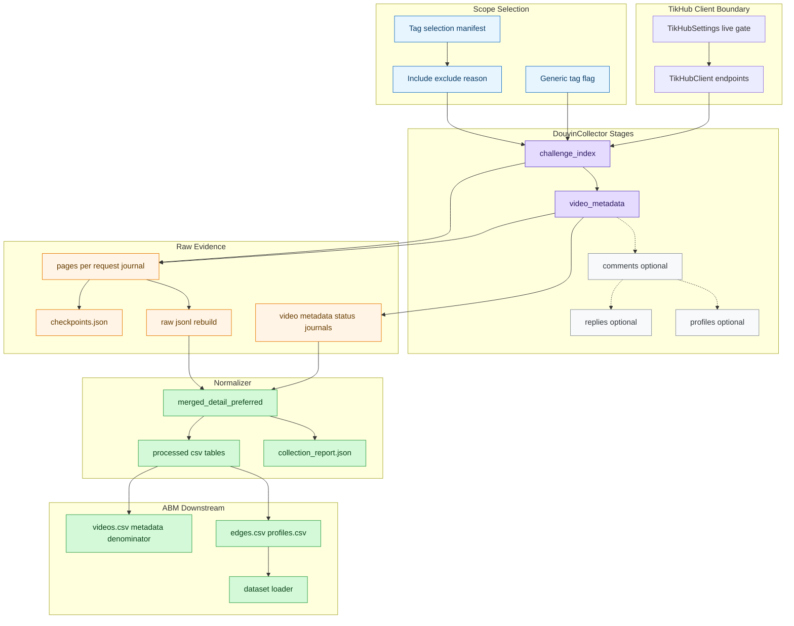
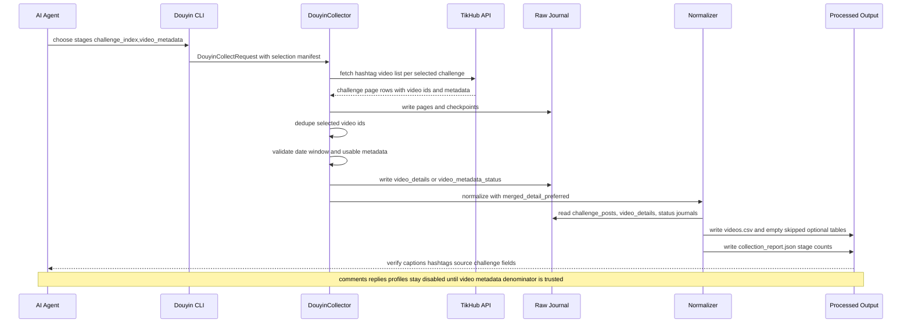

# TikHub / Douyin 数据收集架构

本文是后续 AI Agent 接手锦江酒店 Douyin 数据采集工作的第一入口。目标是让新会话先理解“阶段化采集”和“视频 metadata 优先”的当前架构，再决定是否需要读取代码、运行 live smoke 或继续评论采集。

## 当前结论

当前数据收集体系已经从“一次性把视频、评论、回复、profile 混在一起抓”调整为阶段化模型：

1. `challenge_index`：先从 tag/challenge 页面索引视频 ID 和可用视频摘要。
2. `video_metadata`：再形成视频级 metadata 分母，验证 `caption`、`hashtags`、发布时间、创作者和统计字段。
3. `comments`：后续可选阶段，只能基于已确认的视频 metadata 分母运行。
4. `replies`：后续可选阶段，依赖 `comments`。
5. `profiles`：后续可选阶段，用于用户画像，不阻塞视频 metadata 验证。

对于锦江酒店研究，当前优先级是：先确保 `videos.csv` 的视频级字段完整，再设计评论和用户 profile 的采集策略。

## 架构图

## 时序图

## 阶段职责与产物

| 阶段 | 主要输入 | 主要输出 | 成功标准 | 是否默认主流程 |
|---|---|---|---|---|
| `challenge_index` | selection manifest、challenge ID | `challenge_posts.jsonl`、page journals | `indexed_video_ids` 可解释 | 是 |
| `video_metadata` | indexed video refs | `video_details.jsonl`、`videos.csv` | `videos_with_caption`、`videos_with_hashtags` 达标 | 是 |
| `comments` | 已验证 video IDs | `comments.csv` | 评论 video_id 分母与视频 metadata 分母可解释 | 否 |
| `replies` | comment IDs | `comments.csv` 中 `comment_level=reply` | 回复依赖一级评论 | 否 |
| `profiles` | creator/commenter IDs | `users.csv`、`profiles.csv` | 不泄露昵称、bio 等明细 | 否 |

## 视频 metadata 合约

`videos.csv` 当前应包含：

| 字段 | 用途 |
|---|---|
| `video_id` | 视频唯一 ID，也是后续 comments 的分母连接键 |
| `source_challenge_id` | 来源 tag/challenge ID |
| `source_challenge_name` | 来源 tag/challenge 名称 |
| `source_challenge_rank` | 来源 top tag 排名 |
| `raw_detail_status` | `detail`、`promoted_from_challenge` 或终态说明 |
| `metadata_source` | `app_v3_detail` 或 `challenge_page` 等 provenance |
| `video_url` | 可回溯定位信息 |
| `publish_time` | 时间窗口过滤依据 |
| `caption` | 文案；为空时可从 `desc/title` 回退生成 |
| `hashtags` | 从 `hashtags/cha_list/text_extra` 和 caption 中的 `#tag` 汇总 |
| `creator_user_id` | 创作者聚合 ID |
| `like_count/comment_count/share_count/collect_count` | 互动统计字段 |

## 当前验证基线

最新 metadata-only 验证 run：

- run_id: `jinjiang-top10-non-generic-video-metadata-1y-20260617T035450Z`
- processed: `data/processed/jinjiang_douyin/jinjiang-top10-non-generic-video-metadata-1y-20260617T035450Z/`
- report: `docs/04-开发验证/jinjiang-douyin-video-metadata-validation-20260617T035450Z.md`

已验证：

| 指标 | 值 |
|---|---:|
| `indexed_video_ids` | 18 |
| `videos.csv` rows | 8 |
| `videos_with_caption` | 8 |
| `videos_with_hashtags` | 8 |
| `comments_collected` | false |
| `profiles_collected` | false |

## 后续 AI Agent 接手顺序

1. 先读本文件，确认阶段模型。
2. 再读 `data/README.md`，理解 raw/processed/run 目录语义。
3. 如果任务涉及锦江酒店研究口径，读 `docs/04-开发验证/jinjiang-douyin-research-standard.md`。
4. 如果任务涉及现有 top10 tags，读 `docs/04-开发验证/jinjiang-douyin-existing-topic-distribution.md` 和 `configs/jinjiang_top10_non_generic_video_metadata_selection.json`。
5. 如果任务涉及实现细节，再读 `src/llm_abm_sim/data_sources/` 与对应测试。
6. 除非用户明确要求并满足 live gate，不要继续大规模抓评论。
