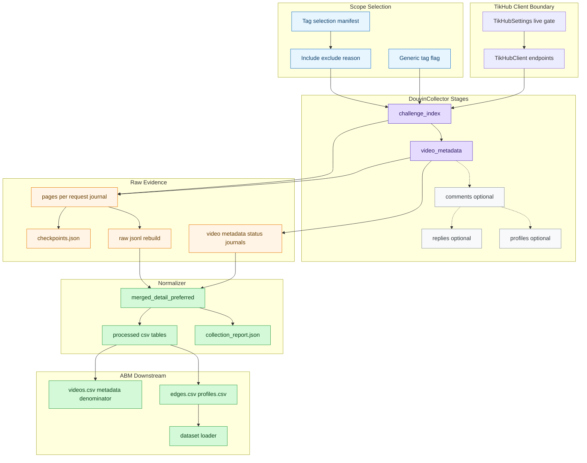
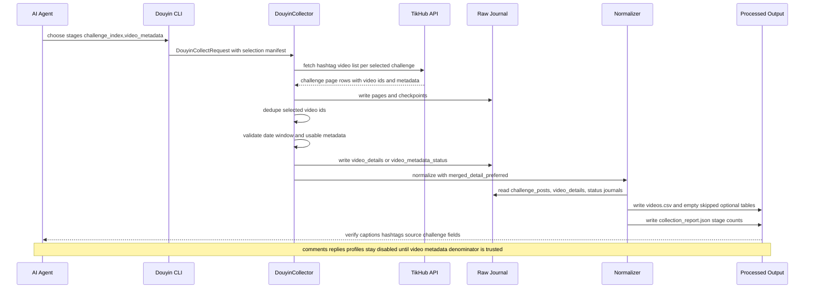
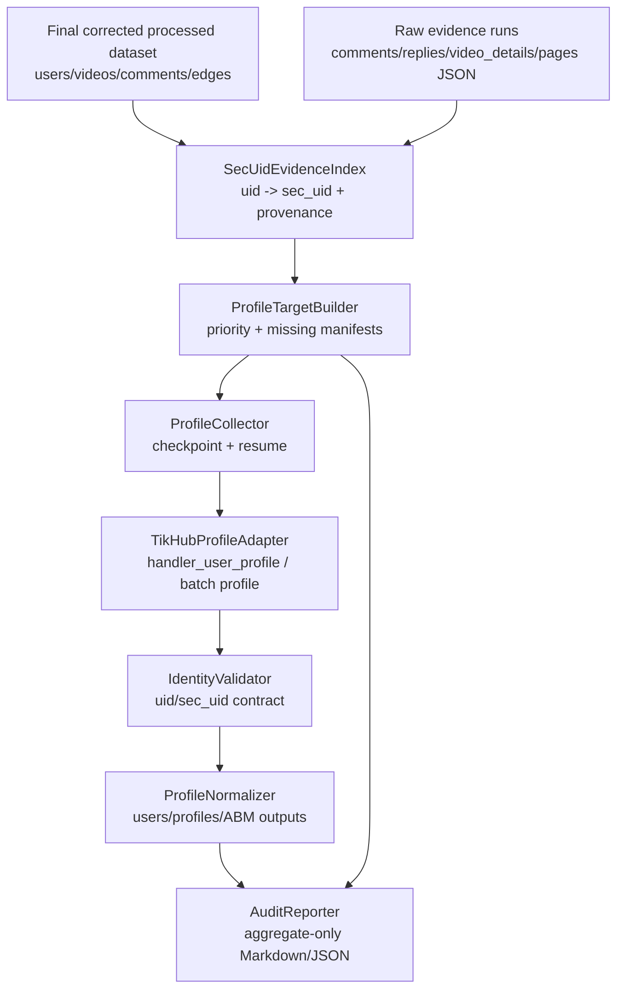
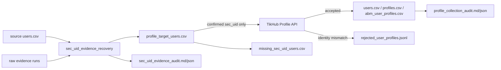
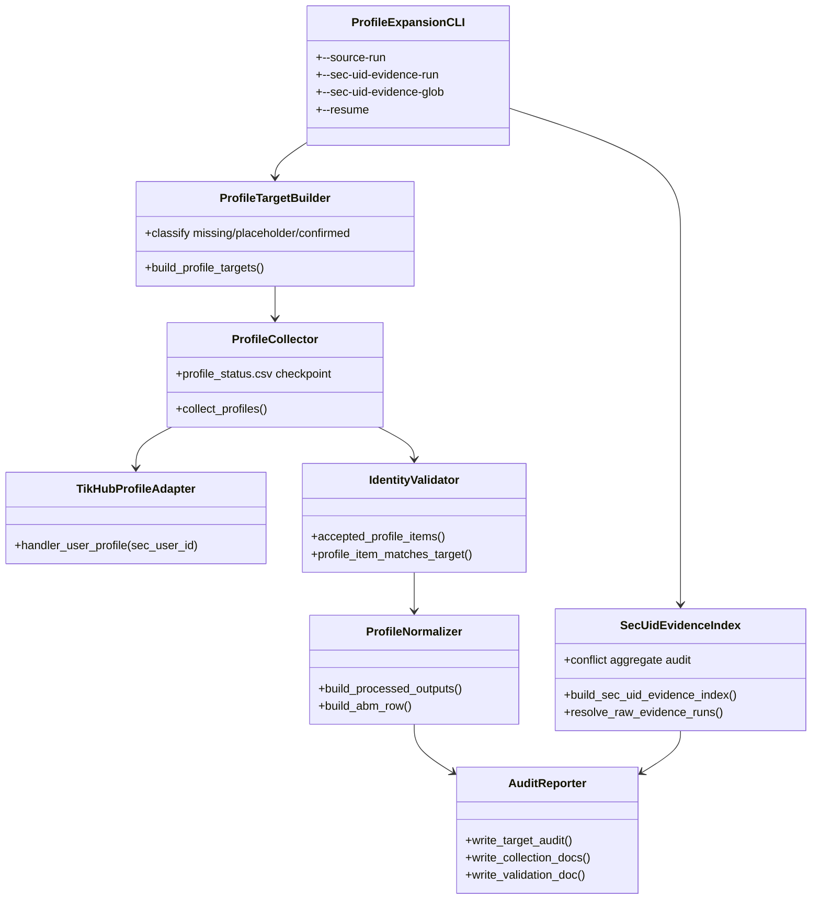

# TikHub / Douyin 数据收集架构

本文是后续 AI Agent 接手锦江酒店 Douyin 数据采集工作的第一入口。目标是让新会话先理解“阶段化采集”和“视频 metadata 优先”的当前架构，再决定是否需要读取代码、运行 live smoke 或继续评论采集。

## 当前结论

当前数据收集体系已经从“一次性把视频、评论、回复、profile 混在一起抓”调整为阶段化模型：

1. `challenge_index`：先从 tag/challenge 页面索引视频 ID 和可用视频摘要。
2. `video_metadata`：再形成视频级 metadata 分母，验证 `caption`、`hashtags`、发布时间、创作者和统计字段。
3. `comments`：后续可选阶段，只能基于已确认的视频 metadata 分母运行。
4. `replies`：后续可选阶段，依赖 `comments`。
5. `profiles`：后续可选阶段，用于用户画像，不阻塞视频 metadata 验证。

对于锦江酒店研究，当前优先级是：先确保 `videos.csv` 的视频级字段完整，再设计评论和用户 profile 的采集策略。

## 架构图



## 时序图



## 阶段职责与产物

| 阶段 | 主要输入 | 主要输出 | 成功标准 | 是否默认主流程 |
|---|---|---|---|---|
| `challenge_index` | selection manifest、challenge ID | `challenge_posts.jsonl`、page journals | `indexed_video_ids` 可解释 | 是 |
| `video_metadata` | indexed video refs | `video_details.jsonl`、`videos.csv` | `videos_with_caption`、`videos_with_hashtags` 达标 | 是 |
| `comments` | 已验证 video IDs | `comments.csv` | 评论 video_id 分母与视频 metadata 分母可解释 | 否 |
| `replies` | comment IDs | `comments.csv` 中 `comment_level=reply` | 回复依赖一级评论 | 否 |
| `profiles` | creator/commenter IDs | `users.csv`、`profiles.csv` | 不泄露昵称、bio 等明细 | 否 |


## 用户 Profile 扩展架构（sec_uid evidence recovery）

用户 profile 扩展不是把 TikHub provider 细节直接写入业务表，而是在 `users.csv` 与 Profile API 之间增加 `sec_uid_evidence_recovery` 阶段：先从限定 raw evidence runs 中恢复显式 `uid -> sec_uid/sec_user_id` 证据，再构建 `profile_target_users.csv`，最后只对 confirmed `sec_uid` 调用 TikHub profile API。成本敏感的默认策略是 `--profile-api cost-safe`（解析为 `handler_user_profile` 单用户入口）；`fetch_batch_user_profile_v2` 只能显式 opt-in，用于小规模 canary 或人工确认后的高吞吐场景。两种入口都必须逐用户执行 identity validation。

### C4 / Container 视图



### Profile 数据流程



### 组件 / 类图



### Profile 抓取时序

```mermaid
sequenceDiagram
    participant CLI as ProfileExpansionCLI
    participant Index as SecUidEvidenceIndex
    participant Target as ProfileTargetBuilder
    participant Collector as ProfileCollector
    participant API as TikHubProfileAdapter
    participant Validator as IdentityValidator
    participant Output as ProfileNormalizer/AuditReporter

    CLI->>Index: scan source raw + --sec-uid-evidence-run/glob
    Index-->>CLI: confirmed uid/sec_uid + aggregate conflicts
    CLI->>Target: build profile_target_users.csv
    Target-->>Collector: confirmed sec_uid targets only
    loop each target checkpoint
    Collector->>API: cost-safe handler_user_profile(sec_user_id) by default; batch only if explicit
        API-->>Collector: profile response or quota/error
        Collector->>Validator: uid/sec_uid identity validation
        Validator-->>Collector: accept or reject
        Collector->>Output: append raw jsonl / rejected / status
    end
    Output-->>CLI: profiles/users/abm outputs + aggregate audits
```

### PEA 四维说明

| 维度 | 决策 |
|---|---|
| Module | `SecUidEvidenceIndex` 是 deep module：小接口隐藏 raw JSONL/page JSON 扫描、去重、冲突统计和 provenance 规则。 |
| Boundary | `TikHubProfileAdapter` 是外部 API adapter；业务输出只依赖 confirmed target 与 normalized profile，不依赖 provider payload 细节。 |
| Contract | Profile response 必须通过 identity validation：若返回 `uid`，必须匹配目标 `user_id`；否则至少 `sec_uid/sec_user_id` 匹配请求值。mismatch 写入 rejected raw journal，不计 success。HTTP 400 是 provider bad request/transient，不等同 quota；HTTP 402 是余额/付费额度停止；HTTP 429 是 rate-limit 停止。 |
| Governance | raw/processed 数据保持 git ignored；Markdown 只写聚合统计；`sec_uid_evidence_audit` 不展示 nickname/bio/signature/raw payload；quota/rate-limit 必须 partial reporting。profile endpoint 对 HTTP 400/402/429 不做默认重试；batch HTTP 402/429 立即停止，batch HTTP 400 默认降级 handler，避免递归拆批造成额度空耗。 |

### Profile cost / quota guard

- 默认 `--profile-api cost-safe`，等价于 `handler_user_profile`；`--limit-profile unbounded` 不会自动启用 batch。
- `--profile-api batch` 是显式 opt-in；batch HTTP 400 默认不递归拆批，除非显式提高 `--max-batch-http400-splits`。
- `profile_status.csv` 保留 `endpoint`、`http_status`、`error_category`，其中 `quota_stopped` 不再在处理层被压平成普通 `failed`。
- `profile_collection_report.json` / Markdown 只输出聚合审计：`endpoint_call_counts`、`http_status_counts`、`rejected_by_endpoint_status`、`current_run_success_delta`、`quota_stopped_profiles`、`cost_guard_triggered`、`recommended_resume_mode`。
- 推荐充值后续跑仍使用 handler + 低 QPS + `TIKHUB_MAX_RETRIES=0`，并通过 `--resume` 跳过已成功用户。

### TEA 测试矩阵

| 风险 | 测试层 | 保护面 |
|---|---|---|
| raw sec_uid 提取、去重、provenance、冲突 | unit | `build_sec_uid_evidence_index` / `build_profile_targets` public seam |
| 多 run / glob / page journal 扫描 | unit | CLI evidence-run 解析与 raw-root 限定 |
| fake TikHub profile 到 CSV 输出 | integration | `collect_profiles` + `build_processed_outputs` |
| identity mismatch | contract/smoke | `accepted_profile_items` 与 rejected journal |
| resume / quota partial / cost guard | integration | `profile_status.csv` checkpoint、endpoint/status/error_category 与 report counts |
| privacy gate | static/report scan | Markdown/JSON reports 不包含 secret 或用户明细 |
| corrected scope | data validation | safety video IDs absent，`#锦江宾馆` / `#临空锦江宾馆` 不回流 |

## 视频 metadata 合约

`videos.csv` 当前应包含：

| 字段 | 用途 |
|---|---|
| `video_id` | 视频唯一 ID，也是后续 comments 的分母连接键 |
| `source_challenge_id` | 来源 tag/challenge ID |
| `source_challenge_name` | 来源 tag/challenge 名称 |
| `source_challenge_rank` | 来源 top tag 排名 |
| `raw_detail_status` | `detail`、`promoted_from_challenge` 或终态说明 |
| `metadata_source` | `app_v3_detail` 或 `challenge_page` 等 provenance |
| `video_url` | 可回溯定位信息 |
| `publish_time` | 时间窗口过滤依据 |
| `caption` | 文案；为空时可从 `desc/title` 回退生成 |
| `hashtags` | 从 `hashtags/cha_list/text_extra` 和 caption 中的 `#tag` 汇总 |
| `creator_user_id` | 创作者聚合 ID |
| `like_count/comment_count/share_count/collect_count` | 互动统计字段 |

## 当前验证基线

最新 metadata-only 验证 run：

- run_id: `jinjiang-top10-non-generic-video-metadata-1y-20260617T035450Z`
- processed: `data/processed/jinjiang_douyin/jinjiang-top10-non-generic-video-metadata-1y-20260617T035450Z/`
- report: `docs/04-开发验证/jinjiang-douyin-video-metadata-validation-20260617T035450Z.md`

已验证：

| 指标 | 值 |
|---|---:|
| `indexed_video_ids` | 18 |
| `videos.csv` rows | 8 |
| `videos_with_caption` | 8 |
| `videos_with_hashtags` | 8 |
| `comments_collected` | false |
| `profiles_collected` | false |

## 后续 AI Agent 接手顺序

1. 先读本文件，确认阶段模型。
2. 再读 `data/README.md`，理解 raw/processed/run 目录语义。
3. 如果任务涉及锦江酒店研究口径，读 `docs/04-开发验证/jinjiang-douyin-research-standard.md`。
4. 如果任务涉及现有 top10 tags，读 `docs/04-开发验证/jinjiang-douyin-existing-topic-distribution.md` 和 `configs/jinjiang_top10_non_generic_video_metadata_selection.json`。
5. 如果任务涉及实现细节，再读 `src/llm_abm_sim/data_sources/` 与对应测试。
6. 除非用户明确要求并满足 live gate，不要继续大规模抓评论。
