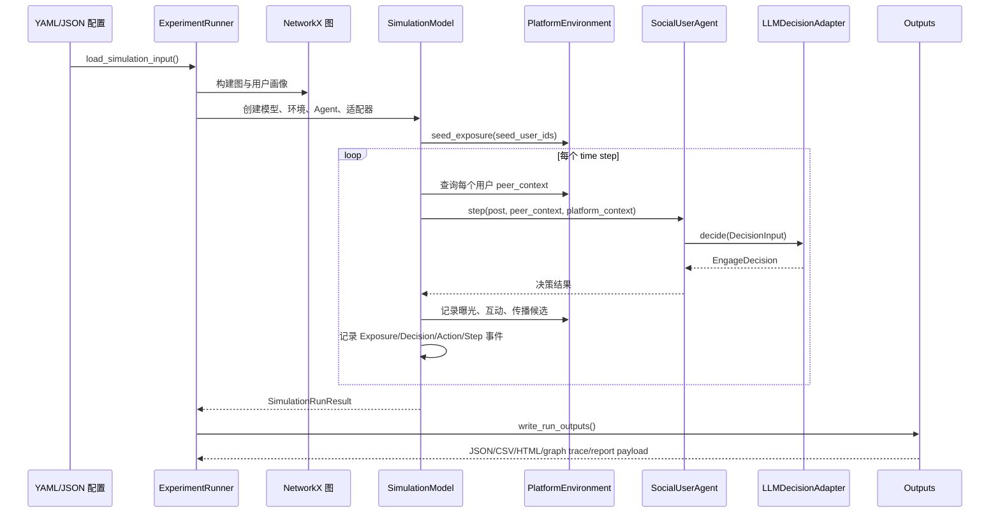

# 仿真流程

一次仿真从配置开始，最终输出事件、指标和本地报告。



## 数据流拆解

1. **读取配置**：`ExperimentRunner.from_config_file()` 读取 YAML/JSON，并解析相对路径。
2. **构建网络**：内联 `graph_edges` 或 `dataset.edge_list_path` 生成 NetworkX 图。
3. **构建用户画像**：内联 `profiles` 或 `dataset.profile_path` 生成 `UserProfile`。
4. **初始化曝光**：种子用户首先曝光，成为扩散起点。
5. **逐步推进**：每个 time step 计算 peer context，Agent 调用 decision adapter。
6. **吸收式互动**：MVP 中用户一旦 engage，就持续作为后续扩散影响源。
7. **记录事件**：曝光、决策、动作和 step summary 被保留下来。
8. **生成指标与报告**：输出 metrics、events、run result、HTML 报告、图追踪等。

## 决策输入输出

输入主要由四类信息组成：

```text
post content + individual preference + peer influence + platform context
```

输出固定为结构化决策：

```text
engage: bool
probability: 0.0 到 1.0
reason: 简短理由
confidence: 0.0 到 1.0
action: like / comment / share / ignore
```

## 运行产物

常见输出文件：

```text
config.json
run_result.json
events.json
metrics_summary.json
step_records.csv
report.html
report_payload.json
graph_trace.json
input-builder.html
dataset_validation.json   # 数据集驱动运行才有
web_run_metadata.json     # Web 控制台运行才有
```
