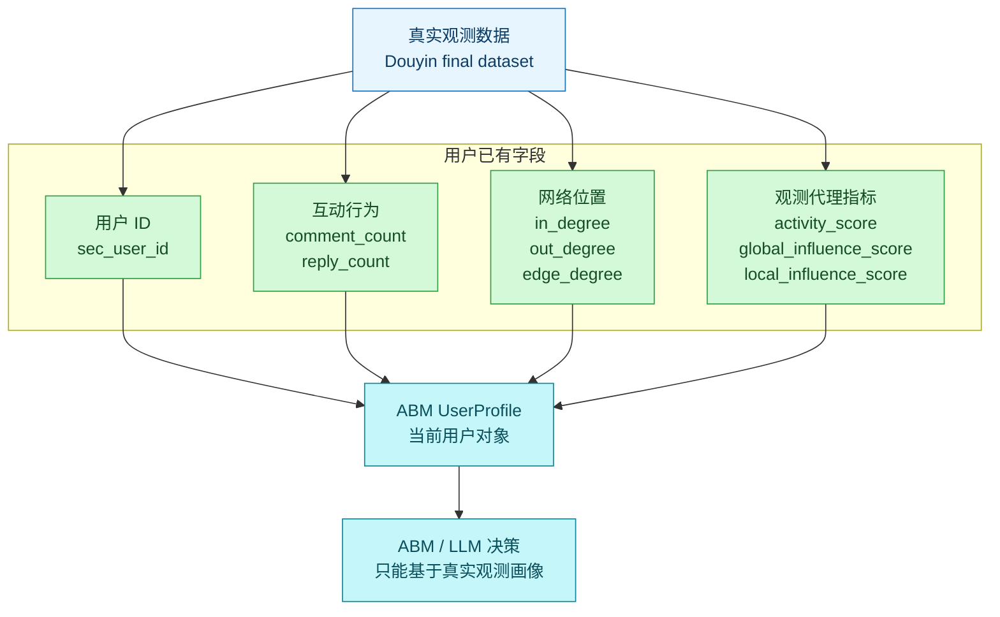
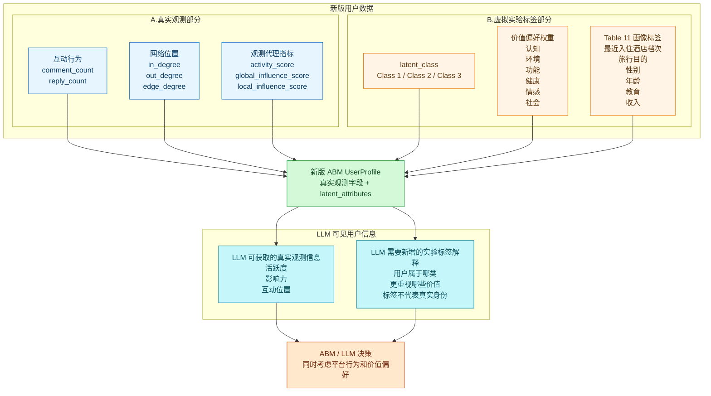

# 锦江用户数据结构简图

## 核心理解

后续用户数据可以简单分成两部分：

| 部分 | 含义 | 来源 | 用途 |
|---|---|---|---|
| 真实观测数据 | 用户在 Douyin 数据中真实出现过的行为和网络指标 | 现有 final dataset | 表示用户是否活跃、是否有影响力、处在什么互动位置 |
| 虚拟实验标签 | 为仿真实验生成的 latent class、价值偏好和画像标签 | 用户潜在属性研究表格 | 表示用户在实验中被设定为何种消费价值偏好类型 |

也就是说，新版本不是替换真实数据，而是在真实用户对象上增加一层“虚拟实验标签”。

## 图一：当前版本

当前版本只有真实观测数据。



当前问题：

- 能知道用户在 Douyin 里是否活跃、是否中心、是否有覆盖力。
- 不能知道用户对锦江秸秆产品的价值偏好。
- LLM 只能看到“平台行为画像”，缺少“消费价值偏好画像”。

## 图二：修改后的目标版本

目标版本把用户数据分为两部分：真实观测数据 + 虚拟实验标签。



## LLM 版本怎么理解

LLM 版本和用户数据结构是一致的，也分成两部分：

| LLM 看到的部分 | 内容 | 注意 |
|---|---|---|
| 真实观测信息 | 用户活跃度、互动网络位置、影响力代理指标 | 来自 Douyin 数据，可以说是观测到的行为 |
| 新增实验标签解释 | latent class、价值偏好摘要、最近入住锦江酒店类型等 | 是仿真实验设定，不能说成真实用户身份 |

示例：

```text
真实观测信息：
该用户在锦江相关评论数据中有一定互动记录，activity_score 较高，处在一定互动网络位置。

新增实验标签解释：
该用户在本次仿真实验中属于 Class 1。
在锦江酒店秸秆产品语境下，该类用户相对更重视环境价值和健康价值。
这些标签是实验设定，不代表真实 Douyin 用户画像。
```

## 最终要改成什么样

```text
当前：
UserProfile = 真实观测数据

目标：
UserProfile = 真实观测数据 + 虚拟实验标签
```

更具体地说：

```text
真实观测数据：
- comment_count
- reply_count
- in_degree
- out_degree
- edge_degree
- activity_score
- global_influence_score
- local_influence_score

虚拟实验标签：
- latent_class
- six value weights
- latent_hotel_class
- latent_travel_purpose
- latent_gender
- latent_age
- latent_education
- latent_monthly_income
```

其中：

- 真实观测数据用于说明用户在 Douyin 平台上的行为状态。
- 虚拟实验标签用于说明用户在 ABM 实验中的消费价值偏好设定。
- LLM 决策时也按这两部分读取：一部分是真实观测画像，一部分是实验标签解释。
- Table 11 的画像标签第一版主要用于分组分析和解释，不直接当成真实人口属性。
