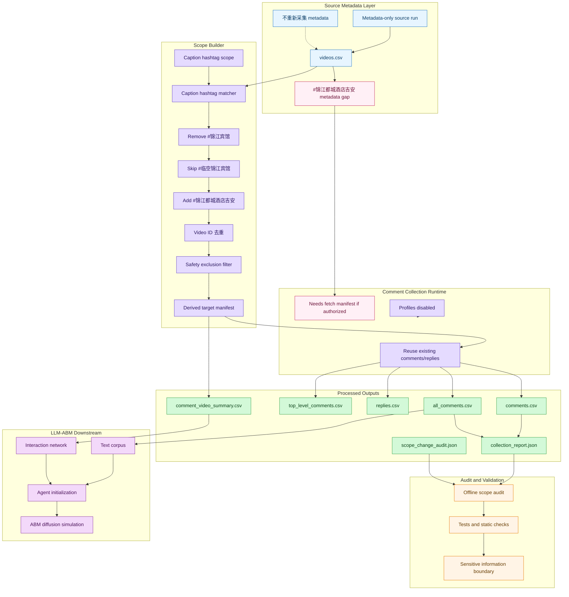
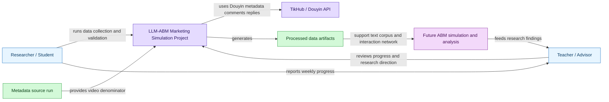
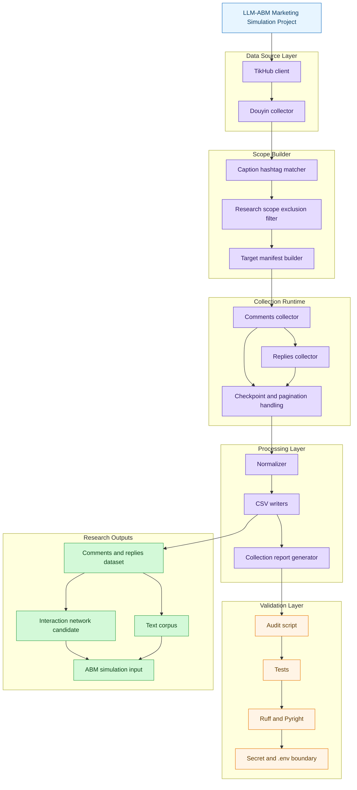

# 本周工作进展报告：锦江酒店 Douyin 评论与回复数据集构建

## 1. 本周工作目标

本周工作的重点不是完成最终 LLM-ABM 模型，而是完成锦江酒店 Douyin 数据基础建设：明确视频样本口径、采集一级评论与回复、形成可复用的数据产物，并通过自动化验证确认数据质量。

该数据集将作为后续 LLM-ABM 营销传播模拟的基础，支撑：

- 视频内容与评论文本分析；
- 用户互动网络构建；
- 舆情与主题特征提取；
- 后续 ABM agent 初始化；
- peer influence 与传播路径建模。

## 2. 数据采集口径修正

本周一个关键进展是修正了评论采集口径。

最初曾考虑只抓取 4 个高评论候选视频，但该口径过窄，容易把研究样本限制在少数异常高互动视频上，难以代表锦江酒店相关 Douyin 内容的整体互动结构。因此，本轮正式口径修正为：

> 基于 metadata-only source run 中“Caption hashtag 统计”表覆盖的 top10 caption hashtags，从 source `videos.csv` 中重新匹配、去重，并排除 2 个女性安全/偷拍主题视频后，抓取这些目标视频的一级评论和 replies。

因此，本轮正式数据集不是“4 个高评论候选视频”，而是 caption hashtag 覆盖视频集合。

### 2.1 口径二次修正：剔除 #锦江宾馆，补充 #锦江都城酒店吉安

在进一步核对研究对象边界后，发现 `#锦江宾馆` 与本次“锦江酒店”研究对象不属于同一企业范围，因此不应继续纳入本轮核心样本。`#临空锦江宾馆` 同样属于“宾馆”相关口径，本次不纳入。相应地，top12 `#锦江都城酒店吉安` 更符合锦江都城酒店相关研究对象，应作为补充范围。

这次调整是**研究对象边界修正**，不是数据质量失败，也不是随意删数据。修正规则是：

- 以旧 manifest 的 `matched_caption_hashtags` 为主，剔除带有 `#锦江宾馆` 的视频；
- 即使同一视频同时带有其他合格锦江 tag，只要带 `#锦江宾馆`，本轮也剔除；
- 不补充 top11 `#临空锦江宾馆`；
- 尝试补充 top12 `#锦江都城酒店吉安`，但只复用本地 source metadata，不运行 live API；
- 不抓 profiles；
- 不重新跑 top10 metadata 全量采集。

二次修正后的 caption hashtag 目标列表为：

- #锦江都城酒店
- #锦江之星酒店
- #锦江酒店
- #锦江之星
- #绵阳锦江国际酒店
- #锦江之星品尚
- #锦江酒店华西区
- #锦江之星海口
- #锦江酒店中国区
- #锦江都城酒店吉安

其中 `#锦江宾馆` 已删除，`#临空锦江宾馆` 不加入。

本轮仍保持排除以下两个 video_id：

- `7486704870804770107`
- `7486891790218399034`

排除原因是这两个视频涉及女性安全/偷拍主题。出于研究伦理、样本安全和隐私敏感内容控制，它们不进入 target manifest，也不进入 comments、replies、all_comments 或 summary。

## 3. 数据采集与处理架构

本轮没有重新跑 top10 metadata 全量采集，而是复用已有 metadata-only source run：

```text
SOURCE_RUN_ID=jinjiang-top10-jinjiang-only-video-metadata-unbounded-20260617T095743Z
```

source 数据路径：

```text
data/processed/jinjiang_douyin/jinjiang-top10-jinjiang-only-video-metadata-unbounded-20260617T095743Z/videos.csv
```

原 comments + replies run：

```text
OLD_RUN_ID=jinjiang-top10-caption-hashtag-all-comments-excluding-safety-20260617T140519Z
```

本次口径二次修正派生 run：

```text
DERIVED_RUN_ID=jinjiang-caption-hashtag-comments-excluding-binguan-adding-jian-derived-20260620T064712Z
```

当前派生 run 的状态是：

```text
completion_status=source_metadata_gap_for_top12
partial=true
source_metadata_gap_for_top12=true
```

这表示本地已完成 `#锦江宾馆` 剔除和旧评论/回复复用，但 `#锦江都城酒店吉安` 尚未出现在当前 source `videos.csv` 中，因此不能把 4,011 个视频、50,389 条 comments + replies 称为最终完整新口径。

processed 路径：

```text
data/processed/jinjiang_douyin/jinjiang-caption-hashtag-comments-excluding-binguan-adding-jian-derived-20260620T064712Z/
```

### 图1：本周数据采集与处理架构图



## 4. C4 Context：项目在研究流程中的位置



## 5. C4 Container：数据采集与验证模块结构



## 6. 本周数据结果

### 6.1 原正式 run 结果

原 comments + replies run 产物如下：

```text
data/processed/jinjiang_douyin/jinjiang-top10-caption-hashtag-all-comments-excluding-safety-20260617T140519Z/
```

其原口径核心规模为：target videos 4,427；top-level comments 44,054；replies 22,954；all_comments 67,008；partial false；profiles_collected false。

这些数值只代表“含 #锦江宾馆 的旧 top10 caption hashtag 口径”，不再作为二次修正后新口径的完整结论。

### 6.2 二次修正 derived scope 结果

本次离线派生 run 产物如下：

```text
data/processed/jinjiang_douyin/jinjiang-caption-hashtag-comments-excluding-binguan-adding-jian-derived-20260620T064712Z/
```

离线审计结果如下：

| 指标 | 数量 | 说明 |
|---|---:|---|
| old unique target videos | 4,427 | 旧正式 run 的 unique 视频分母，不能用 manifest 物理行数代替 |
| manifest physical rows | 4,427 | 当前旧 manifest 为一视频一行；后续若出现 multilabel 展开表，仍应以 unique video_id 为准 |
| removed #锦江宾馆 videos | 416 | 按 `matched_caption_hashtags` 剔除 |
| remaining after removal | 4,011 | 剔除 #锦江宾馆 后剩余视频 |
| #锦江都城酒店吉安 in local source metadata | 0 | 当前 source `videos.csv` 未包含该 top12 tag 视频 |
| corrected target videos | 4,011 | 当前只能形成“剔除 #锦江宾馆”的本地 derived target |
| top-level comments | 33,206 | 仅保留新 target video_id 中已有评论数据 |
| replies | 17,183 | 仅保留新 target video_id 中已有 replies 数据 |
| all_comments | 50,389 | 一级评论与 replies 合并后的本地可用文本 |
| partial | true | 因 top12 #锦江都城酒店吉安 缺 source metadata，不能声称新口径完整 |
| incomplete videos | 0 | 对当前本地 4,011 个已覆盖视频，旧评论数据可复用；但 top12 metadata 缺口仍存在 |
| profiles_collected | false | 本轮未抓取用户资料 |

关键输出文件及作用如下：

| 文件 | 作用 |
|---|---|
| `target_video_manifest.csv` | 二次修正后的目标视频清单 |
| `top_level_comments.csv` | 修正口径下可复用的一级评论表 |
| `replies.csv` | 修正口径下可复用的回复表 |
| `comments.csv` / `all_comments.csv` | 修正口径下可复用的评论与回复文本表 |
| `comment_video_summary.csv` | 每个视频的评论与回复状态 |
| `collection_report.json` | 派生口径、阶段状态和汇总计数 |
| `scope_change_audit.json` | 本次口径修正审计 |
| `source_metadata_gap_manifest.csv` | `#锦江都城酒店吉安` 本地 metadata 缺口说明 |

## 7. 数据质量与验证

本次二次修正是离线派生处理：没有运行 live API，没有读取或打印 `.env`，没有抓 profiles，也没有重新跑 top10 metadata 全量采集。

当前审计结论为：

- `#锦江宾馆` 已从 derived target 中剔除；
- `#临空锦江宾馆` 未纳入；
- `#锦江都城酒店吉安` 在当前 source `videos.csv` 中不存在，因此需要先补充 metadata/source scope；
- 原两个 safety excluded video_id 仍不在 derived target 中；
- profiles_collected=false；
- 当前 derived 数据集是“本地可复用评论/回复数据 + top12 metadata 待补”状态，不能称为新口径完整最终数据集。

总体来看，本轮数据不是“全量抖音数据”，而是在明确研究口径下构建的锦江酒店相关 caption hashtag 评论与回复数据集。二次修正提高了研究对象边界的一致性，但也暴露出 top12 `#锦江都城酒店吉安` 需要后续 metadata/source scope 补充。

## 8. profiles 暂不采集的原因

profiles 指用户资料或账号画像字段，例如：

- user_id
- nickname
- bio / signature
- 粉丝数
- 关注数
- 头像
- 认证状态
- 地区、性别等公开字段，如果 API 返回

本周没有抓取 profiles，主要原因是当前研究阶段的核心目标是构建评论文本、回复关系和互动网络，而不是做完整用户画像建模。

当前不抓 profiles 是合理的范围控制，原因包括：

1. 当前阶段重点是评论文本、回复关系和互动结构；
2. 仅使用 user_id、comment/reply 行为和视频作者关系，已经可以构建第一版互动网络；
3. profiles 涉及更强的隐私敏感性；
4. profiles 会显著增加 API 成本、限流和 402 风险；
5. 当前并非用户画像建模阶段。

后续如果确实需要用户画像，不建议全量抓取所有用户 profiles，而应优先对以下对象做小范围补采：

- 视频作者；
- 高互动评论者；
- 网络中心节点；
- 疑似官方账号或品牌相关账号。

这样可以在研究价值、隐私风险和采集成本之间取得更好的平衡。

## 9. 对后续 LLM-ABM 模拟的意义

本周完成的数据集为后续 LLM-ABM 营销传播模拟提供了基础输入。

后续模拟逻辑可以围绕以下几类信息展开：

| ABM 要素 | 本轮数据支撑 |
|---|---|
| post content | 视频 caption、hashtags、评论文本 |
| individual preference | 可由用户评论行为、互动频次、文本主题和情绪倾向初步推断 |
| peer influence | 评论、回复、视频作者关系可形成用户互动网络 |
| decision output | 后续可建模为 engage / probability / reason / confidence / action |

具体而言，本轮数据可以支撑：

1. **用户互动网络构建**  
   通过评论、回复、视频作者关系，构建用户之间的互动边。

2. **评论/回复文本语料构建**  
   当前二次修正后本地可用 50,389 条评论与回复作为文本语料；待补充 `#锦江都城酒店吉安` metadata/comments 后，应重新生成最终语料。

3. **用户节点行为特征提取**  
   从评论次数、回复次数、参与视频数、被回复关系等维度形成用户行为特征。

4. **内容扩散路径分析**  
   通过视频、评论、回复层级关系，观察内容如何引发互动与二次讨论。

5. **ABM agent 初始化**  
   后续可将用户节点转化为 ABM agent，并用文本与互动行为初始化偏好、活跃度和影响力参数。

6. **peer influence 建模**  
   回复关系、共同参与视频、互动频次可以作为同伴影响和局部网络暴露的基础。

## 10. 后续研究路线图

```mermaid
graph LR
    dataset["Step 1: 当前 derived scope audit 完成"]
    backfill["Step 2: top12 metadata/comments 补采授权"]
    network["Step 3: 重新构建用户互动网络"]
    textAnalysis["Step 4: 评论与回复文本分析"]
    structure["Step 5: 识别传播节点和互动结构"]
    agentInit["Step 6: 初始化 ABM agent"]
    simulation["Step 7: 运行传播模拟"]
    comparison["Step 8: 对比真实互动数据和模拟结果"]
    conclusion["Step 9: 输出研究结论"]

    dataset --> backfill
    backfill --> network
    backfill --> textAnalysis
    network --> structure
    textAnalysis --> structure
    structure --> agentInit
    agentInit --> simulation
    simulation --> comparison
    comparison --> conclusion

    classDef doneClass fill:#d3f9d8,stroke:#2f9e44,color:#0b4218
    classDef gapClass fill:#fff0f6,stroke:#c2255c,color:#6b1238
    classDef processClass fill:#e5dbff,stroke:#5f3dc4,color:#2b185f
    classDef futureClass fill:#e7f5ff,stroke:#1971c2,color:#0b3d66
    classDef resultClass fill:#fff4e6,stroke:#e67700,color:#663c00

    class dataset doneClass
    class backfill gapClass
    class network,textAnalysis,structure,agentInit processClass
    class simulation,comparison futureClass
    class conclusion resultClass
```



## 11. 下周计划

下周建议围绕“补齐新口径分母并重新生成下游结构”推进，重点包括：

1. 完成 top12 `#锦江都城酒店吉安` 的 metadata/source scope 补充；如需 live API，需另行授权；
2. 在 metadata 补齐后，完成 top12 新增视频的评论/回复补采；如需 live API，需另行授权；
3. 重新生成新口径 interaction network / text corpus；
4. 从 comments / replies 构建用户互动边；
5. 统计高互动用户、高互动视频和核心评论节点；
6. 开展评论文本主题、情绪和舆情初步分析；
7. 形成 ABM agent 初始化字段草案；
8. 设计真实互动数据与模拟结果的对比指标；
9. 评估是否需要小范围补采 profiles，但不做全量 profiles 抓取。

## 12. 小结

本周完成的是 LLM-ABM 研究前置的数据基础建设和验证工作。核心成果包括：

- 明确从 4 个高评论候选视频修正为 caption hashtag 覆盖视频集合；
- 复用 metadata-only source run，没有重新跑 metadata 全量采集；
- 完成旧口径 4,427 个目标视频的一级评论与 replies 采集；
- 完成二次口径修正：剔除 `#锦江宾馆`，跳过 `#临空锦江宾馆`，将 `#锦江都城酒店吉安` 列为补充目标；
- 离线派生出 4,011 个当前本地可覆盖目标视频、50,389 条 comments + replies；
- 明确 top12 `#锦江都城酒店吉安` 当前缺 source metadata，后续需要在授权后补齐 metadata 与评论/回复；
- 明确禁用 profiles，避免不必要的隐私与成本风险；
- 为后续互动网络、文本分析和 ABM 传播模拟提供了可追溯的数据基础。

因此，本周工作可以概括为：**完成了锦江酒店 Douyin 评论与回复数据集的阶段性构建、研究对象边界二次修正与离线审计，为后续 LLM-ABM 营销传播模拟打下了更清晰的数据基础；下一步需要补齐 `#锦江都城酒店吉安` 的 metadata/comments 后再生成最终新口径网络与语料。**
