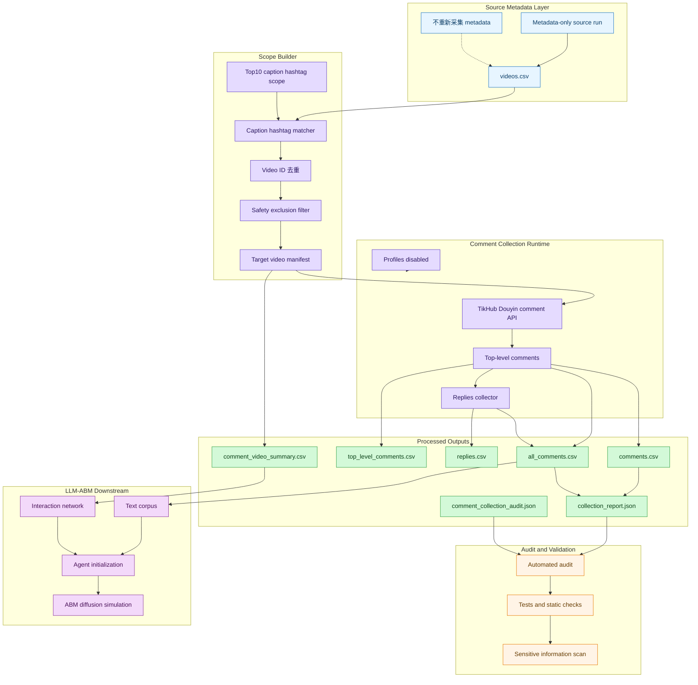
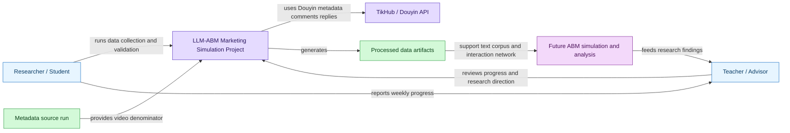
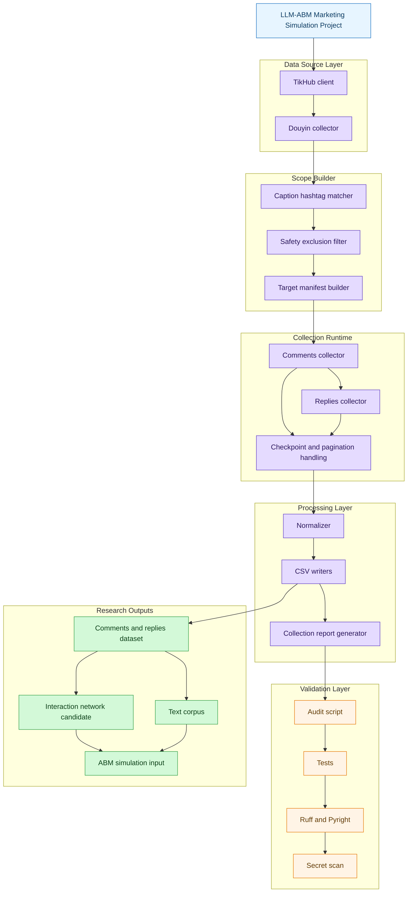

# 本周工作进展报告：锦江酒店 Douyin 评论与回复数据集构建

## 1. 本周工作目标

本周工作的重点不是完成最终 LLM-ABM 模型，而是完成锦江酒店 Douyin 数据基础建设：明确视频样本口径、采集一级评论与回复、形成可复用的数据产物，并通过自动化验证确认数据质量。

该数据集将作为后续 LLM-ABM 营销传播模拟的基础，支撑：

- 视频内容与评论文本分析；
- 用户互动网络构建；
- 舆情与主题特征提取；
- 后续 ABM agent 初始化；
- peer influence 与传播路径建模。

## 2. 数据采集口径修正

本周一个关键进展是修正了评论采集口径。

最初曾考虑只抓取 4 个高评论候选视频，但该口径过窄，容易把研究样本限制在少数异常高互动视频上，难以代表锦江酒店相关 Douyin 内容的整体互动结构。因此，本轮正式口径修正为：

> 基于 metadata-only source run 中“Caption hashtag 统计”表覆盖的 top10 caption hashtags，从 source `videos.csv` 中重新匹配、去重，并排除 2 个女性安全/偷拍主题视频后，抓取这些目标视频的全部一级评论和 replies。

因此，本轮正式数据集不是“4 个高评论候选视频”，而是 top10 caption hashtag 覆盖视频集合。

本轮使用的 10 个 caption hashtags 为：

- #锦江都城酒店
- #锦江之星酒店
- #锦江酒店
- #锦江之星
- #锦江宾馆
- #绵阳锦江国际酒店
- #锦江之星品尚
- #锦江酒店华西区
- #锦江之星海口
- #锦江酒店中国区

需要说明的是，这些 hashtag 的统计数存在跨 tag 重复，因此不能简单加总，而是从 source `videos.csv` 重新匹配、去重后形成最终 target manifest。

本轮排除以下两个 video_id：

- `7486704870804770107`
- `7486891790218399034`

排除原因是这两个视频涉及女性安全/偷拍主题。出于研究伦理、样本安全和隐私敏感内容控制，它们不进入 target manifest，也不进入 comments、replies、all_comments 或 summary。

## 3. 数据采集与处理架构

本轮没有重新跑 top10 metadata 全量采集，而是复用已有 metadata-only source run：

```text
SOURCE_RUN_ID=jinjiang-top10-jinjiang-only-video-metadata-unbounded-20260617T095743Z
```

source 数据路径：

```text
data/processed/jinjiang_douyin/jinjiang-top10-jinjiang-only-video-metadata-unbounded-20260617T095743Z/videos.csv
```

正式 comments + replies run：

```text
NEW_RUN_ID=jinjiang-top10-caption-hashtag-all-comments-excluding-safety-20260617T140519Z
```

processed 路径：

```text
data/processed/jinjiang_douyin/jinjiang-top10-caption-hashtag-all-comments-excluding-safety-20260617T140519Z/
```

### 图1：本周数据采集与处理架构图



## 4. C4 Context：项目在研究流程中的位置



## 5. C4 Container：数据采集与验证模块结构



## 6. 本周数据结果

本轮正式 run 产物如下：

```text
data/processed/jinjiang_douyin/jinjiang-top10-caption-hashtag-all-comments-excluding-safety-20260617T140519Z/
```

核心数据规模如下：

| 指标 | 数量 | 说明 |
|---|---:|---|
| target videos | 4,427 | 从 source metadata run 的 `videos.csv` 按 top10 caption hashtags 匹配、去重、排除 2 个敏感视频后的最终视频集合 |
| top-level comments | 44,054 | 一级评论 |
| replies | 22,954 | 一级评论下的回复 |
| all_comments | 67,008 | 一级评论与 replies 合并后的总量 |
| partial | false | 本轮目标范围内没有因为 API、分页或余额问题留下未完成视频 |
| incomplete videos | 0 | 目标视频中未完成采集的视频数为 0 |
| profiles_collected | false | 本轮未抓取用户资料 |

关键输出文件及作用如下：

| 文件 | 作用 |
|---|---|
| `target_video_manifest.csv` | 最终目标视频清单，包含匹配 caption hashtags 和 metadata comment count |
| `top_level_comments.csv` | 一级评论表 |
| `replies.csv` | 一级评论下的回复表 |
| `comments.csv` / `all_comments.csv` | 合并后的评论与回复文本表 |
| `comment_video_summary.csv` | 每个视频的评论与回复采集状态 |
| `collection_report.json` | 采集配置、阶段状态、汇总计数 |
| `comment_collection_audit.json` | 审计结果，用于验证 target count、excluded IDs、profiles disabled、partial 状态等 |

## 7. 数据质量与验证

本轮数据集已通过自动化审计、测试、静态检查和敏感信息扫描。

验证结果包括：

- 自动化 audit 通过：
  - `expected_target_video_count = 4427`
  - `manifest_video_count = 4427`
  - `comments = 44054`
  - `replies = 22954`
  - `all_comments = 67008`
  - `partial = false`
  - excluded IDs absent
- targeted tests：37 passed
- full pytest：125 passed, 2 deselected
- `py_compile`：passed
- `ruff`：passed
- `pyright`：0 errors
- secret scan：
  - Bearer 无命中
  - Authorization 无命中
  - TIKHUB_API_KEY 无命中
- GitNexus：status up-to-date

总体来看，本轮数据不是“全量抖音数据”，而是在明确研究口径下构建的锦江酒店相关 caption hashtag 评论与回复数据集。它的优势在于：样本边界清晰、视频分母可追溯、评论与回复阶段完整、profiles 明确禁用、敏感样本已排除，并且有自动化审计结果支撑。

## 8. profiles 暂不采集的原因

profiles 指用户资料或账号画像字段，例如：

- user_id
- nickname
- bio / signature
- 粉丝数
- 关注数
- 头像
- 认证状态
- 地区、性别等公开字段，如果 API 返回

本周没有抓取 profiles，主要原因是当前研究阶段的核心目标是构建评论文本、回复关系和互动网络，而不是做完整用户画像建模。

当前不抓 profiles 是合理的范围控制，原因包括：

1. 当前阶段重点是评论文本、回复关系和互动结构；
2. 仅使用 user_id、comment/reply 行为和视频作者关系，已经可以构建第一版互动网络；
3. profiles 涉及更强的隐私敏感性；
4. profiles 会显著增加 API 成本、限流和 402 风险；
5. 当前并非用户画像建模阶段。

后续如果确实需要用户画像，不建议全量抓取所有用户 profiles，而应优先对以下对象做小范围补采：

- 视频作者；
- 高互动评论者；
- 网络中心节点；
- 疑似官方账号或品牌相关账号。

这样可以在研究价值、隐私风险和采集成本之间取得更好的平衡。

## 9. 对后续 LLM-ABM 模拟的意义

本周完成的数据集为后续 LLM-ABM 营销传播模拟提供了基础输入。

后续模拟逻辑可以围绕以下几类信息展开：

| ABM 要素 | 本轮数据支撑 |
|---|---|
| post content | 视频 caption、hashtags、评论文本 |
| individual preference | 可由用户评论行为、互动频次、文本主题和情绪倾向初步推断 |
| peer influence | 评论、回复、视频作者关系可形成用户互动网络 |
| decision output | 后续可建模为 engage / probability / reason / confidence / action |

具体而言，本轮数据可以支撑：

1. **用户互动网络构建**  
   通过评论、回复、视频作者关系，构建用户之间的互动边。

2. **评论/回复文本语料构建**  
   将 67,008 条评论与回复作为文本语料，用于主题分析、情绪分析和舆情识别。

3. **用户节点行为特征提取**  
   从评论次数、回复次数、参与视频数、被回复关系等维度形成用户行为特征。

4. **内容扩散路径分析**  
   通过视频、评论、回复层级关系，观察内容如何引发互动与二次讨论。

5. **ABM agent 初始化**  
   后续可将用户节点转化为 ABM agent，并用文本与互动行为初始化偏好、活跃度和影响力参数。

6. **peer influence 建模**  
   回复关系、共同参与视频、互动频次可以作为同伴影响和局部网络暴露的基础。

## 10. 后续研究路线图

```mermaid
graph LR
    dataset["Step 1: 当前数据集完成"]
    network["Step 2: 构建用户互动网络"]
    textAnalysis["Step 3: 评论与回复文本分析"]
    structure["Step 4: 识别传播节点和互动结构"]
    agentInit["Step 5: 初始化 ABM agent"]
    simulation["Step 6: 运行传播模拟"]
    comparison["Step 7: 对比真实互动数据和模拟结果"]
    conclusion["Step 8: 输出研究结论"]

    dataset --> network
    dataset --> textAnalysis
    network --> structure
    textAnalysis --> structure
    structure --> agentInit
    agentInit --> simulation
    simulation --> comparison
    comparison --> conclusion

    classDef doneClass fill:#d3f9d8,stroke:#2f9e44,color:#0b4218
    classDef processClass fill:#e5dbff,stroke:#5f3dc4,color:#2b185f
    classDef futureClass fill:#e7f5ff,stroke:#1971c2,color:#0b3d66
    classDef resultClass fill:#fff4e6,stroke:#e67700,color:#663c00

    class dataset doneClass
    class network,textAnalysis,structure,agentInit processClass
    class simulation,comparison futureClass
    class conclusion resultClass
```



## 11. 下周计划

下周建议围绕“从数据集到可模拟结构”推进，重点包括：

1. 从 comments / replies 构建用户互动边；
2. 统计高互动用户、高互动视频和核心评论节点；
3. 开展评论文本主题、情绪和舆情初步分析；
4. 形成 ABM agent 初始化字段草案；
5. 设计真实互动数据与模拟结果的对比指标；
6. 评估是否需要小范围补采 profiles，但不做全量 profiles 抓取；
7. 将数据集转化为后续 ABM runtime 可读取的节点、边和内容输入格式。

## 12. 小结

本周完成的是 LLM-ABM 研究前置的数据基础建设和验证工作。核心成果包括：

- 明确从 4 个高评论候选视频修正为 top10 caption hashtag 覆盖视频集合；
- 复用 metadata-only source run，没有重新跑 metadata 全量采集；
- 完成 4,427 个目标视频的一级评论与 replies 采集；
- 形成 67,008 条 comments + replies 文本数据；
- 明确禁用 profiles，避免不必要的隐私与成本风险；
- 通过自动化审计、测试、静态检查和敏感信息扫描；
- 为后续互动网络、文本分析和 ABM 传播模拟提供了可追溯的数据基础。

因此，本周工作可以概括为：**完成了锦江酒店 Douyin 评论与回复数据集的阶段性构建与质量验证，为后续 LLM-ABM 营销传播模拟打下了数据基础。**
