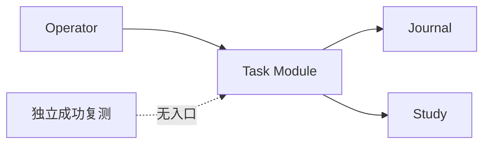
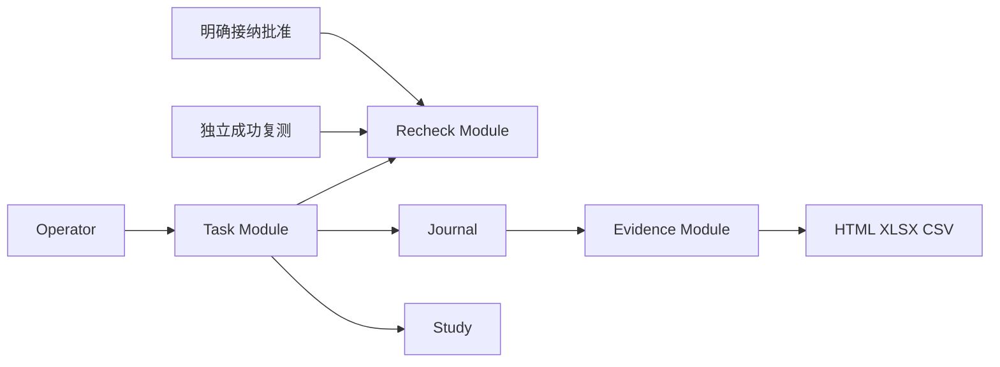
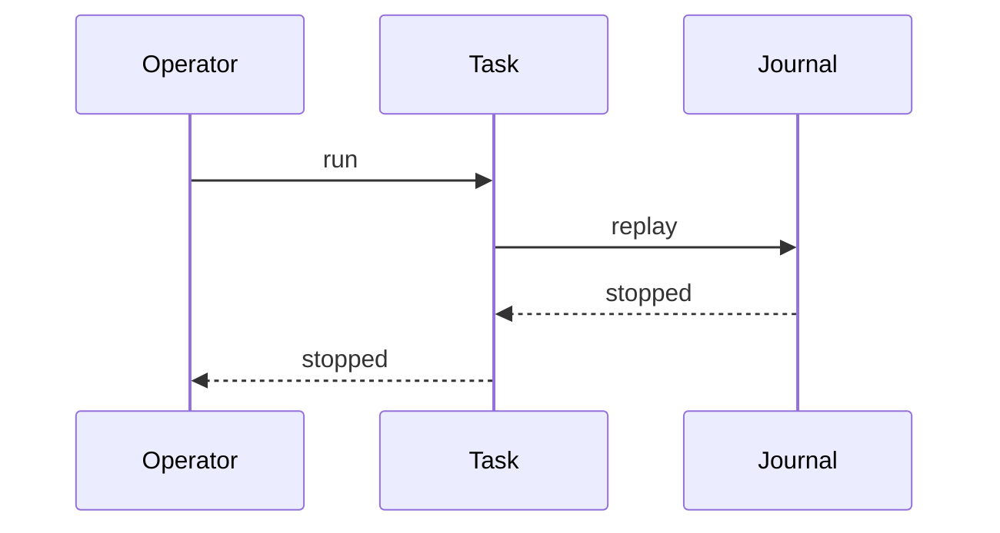
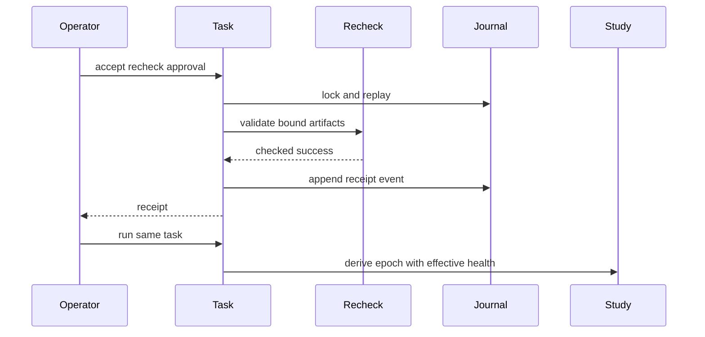
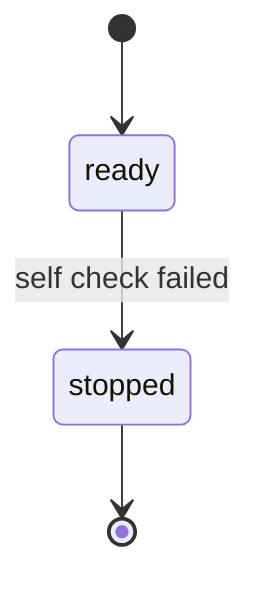
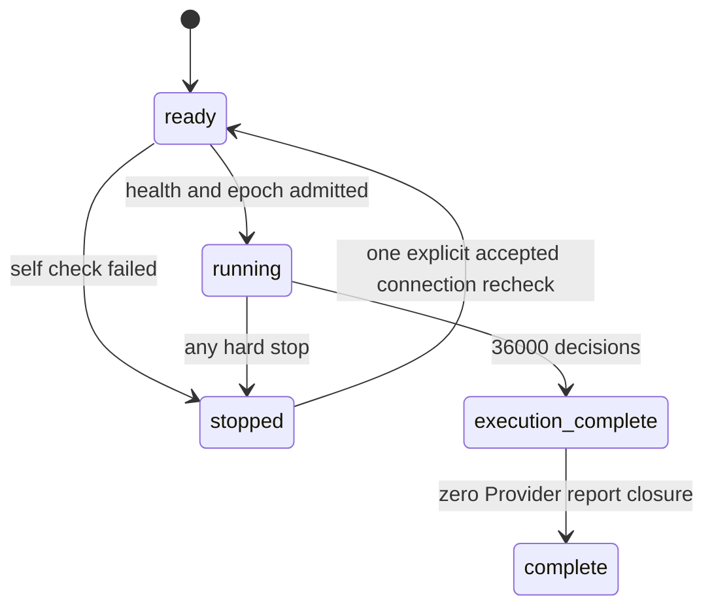
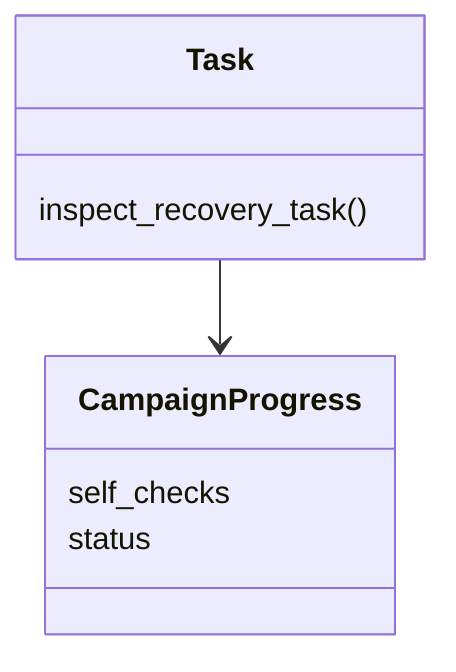
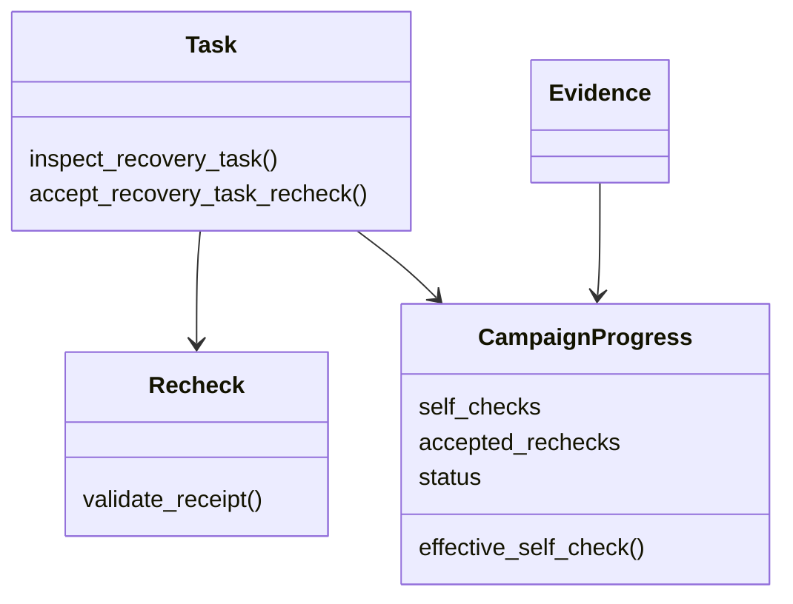

# 一次性接纳明确授权的复测

用户已批准此最小合同变化；真实运行仍属于 #250，36,000 真判断及同源 Evidence/HTML/XLSX/CSV 才算完成。当前 fixed point 为 e96168d8bf140dca14a4269d49063aae28979f1f。

Recovery Task Module 新增 `accept_recovery_task_recheck(plan_path, approval_path, approval_sha256)` Interface；自身持有 source lock，重读来源后追加 `self_check_recheck_accepted` 事件，事件同时作为 create-once readonly receipt。不会调用 Provider。独立 Recheck Module 拥有外部复测证据验证。approval 绑定同一 plan、停止 HEAD、失败 settlement、复测 authorization/intent/result 及明确用户批准。相同 approval 重复调用返回相同 receipt；不追加事件或请求。

仅允许尚无 epoch/Formal dispatch 的任务因单次 self-check connection/0-response 停止且无未决 intent；原失败保留在 self_checks，成功复测单独记账并成为 effective health。一次接纳不发放新自检，后三模型仍各一次。源漂移、unknown、quota、identity、usage、Decision、预算等其他硬停不变。历史 HEAD 是正常 journal append 的前驱，不手工改 HEAD；旧事件与源文件保持原绝对路径/bytes/mode。

新增 receipt/外部引用进入 bundle artifact_facts；Evidence 单列原失败和复测成功的各自 intent/result origin。原 token unknown 和 production_deploy_eligible=false 保留。测试使用 synthetic transports 仅证明实现，不计真实进度。

## 当前架构

## 目标架构

## 当前时序

## 目标时序

## 当前状态

## 目标状态

## 当前类图

## 目标类图

