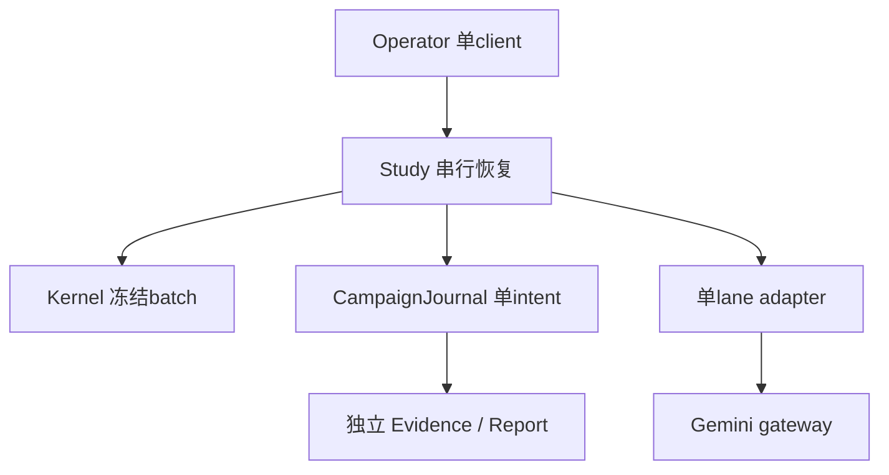
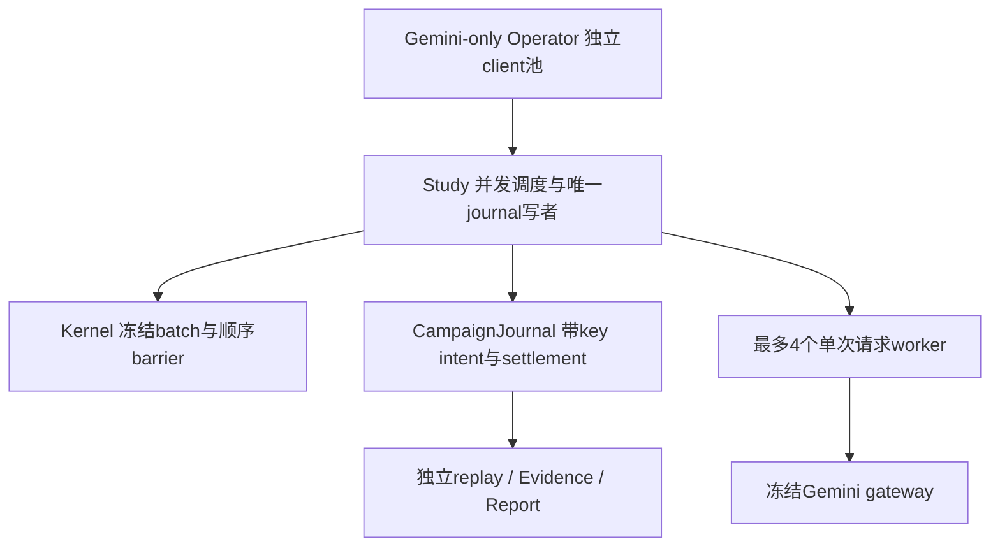
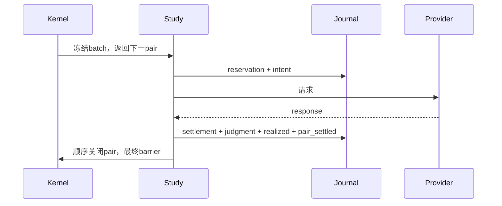
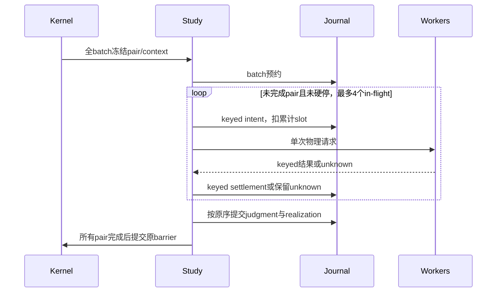
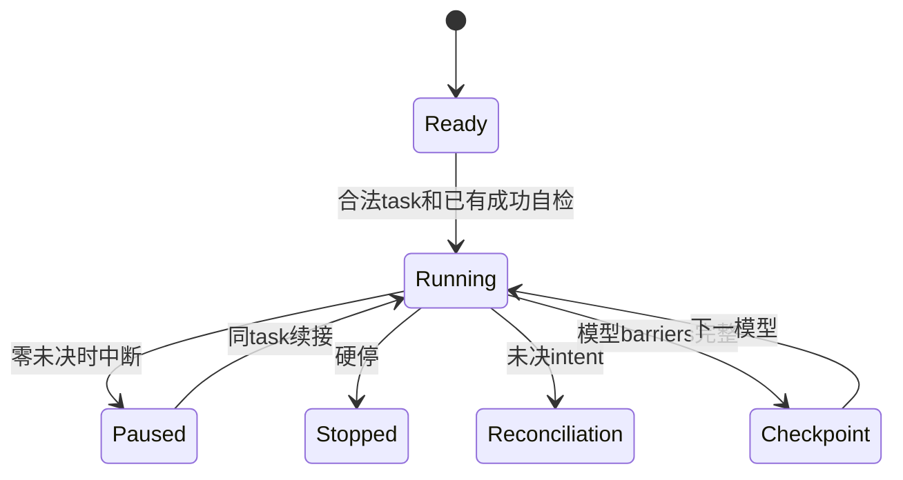
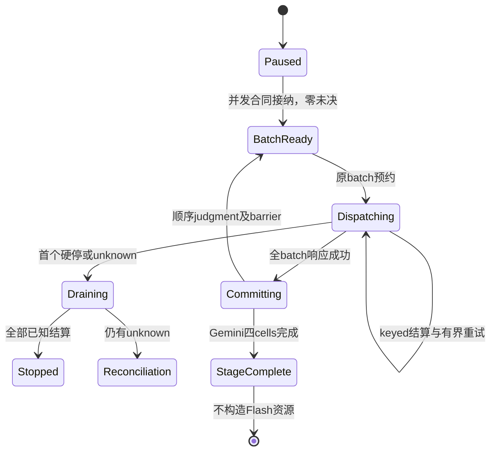
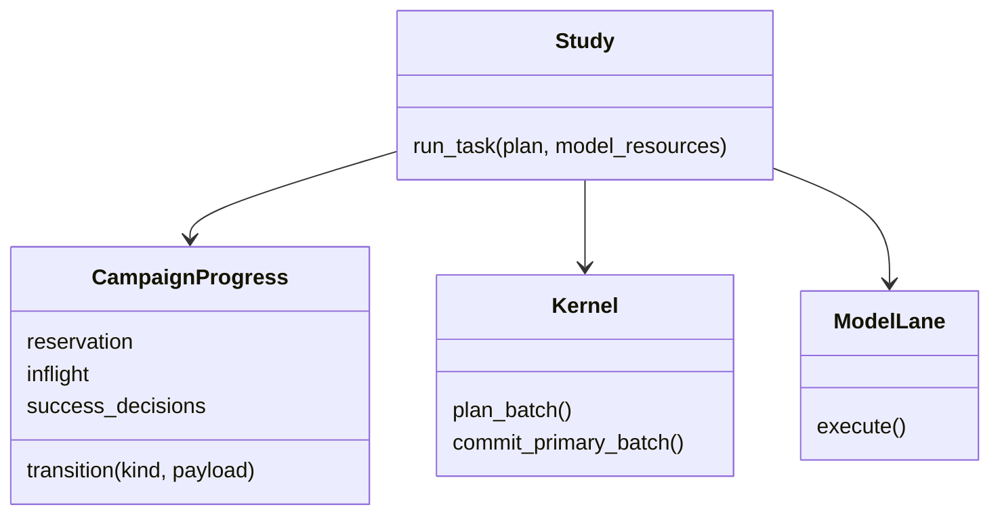
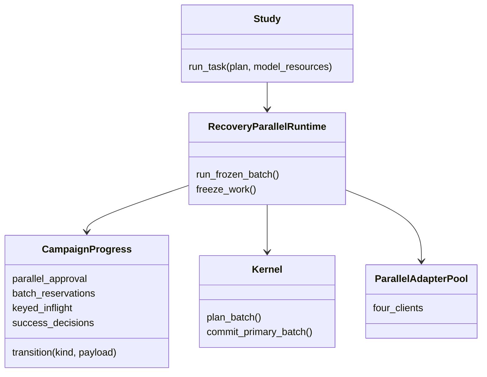

# ADR 0010：同一恢复任务中的有界并发

## Context

恢复任务原来使用一个未决intent。并发物理请求需要改变持久化账本，而不是同时启动多个旧runner。LLM仍只返回Decision；Study仍独占调度、累计预算、重试、恢复和反馈提交。来源：[operational #250](https://github.com/liu-qingyuan/llm-abm-marketing-sim/issues/250)。

## Decision

采用显式批准、同一campaign追加的四路并发扩展，首个合同只允许Gemini3.1并在模型完成后停止。原task/plan、历史失败和预算均不替换；扩展仅可从已有成功自检、完整batch边界且零未决的paused状态接纳。它不释放任何硬停、不续签时效、不增加探针。

每个lane持有独立client/adapter，每个worker只执行一次物理请求。主线程在请求前持久化带pair key的intent，独占预算和有界重试；首个硬停后停止新增派发，仍结算已派发的已知响应。未知provenance保留intent，后续只有显式reconciliation才能处理，不隐式重发或结算。

Kernel先冻结全batch。`_drive_primary_runtime`的可选内部`batch_ready` Seam由恢复runtime用于派发、由独立reader用于全batch坐标与context摘要验证。无此callback的历史行为不变。乱序响应先落盘，Judgment/Realization仍按原序提交；完整barrier才更新下一批推荐反馈。

Task接纳和legal replay共用批准validator；Bundle绑定批准原件，Evidence关联每个显式key的attempt来源。旧missing usage保持unknown，部分模型完成不构成全36k Evidence闭合。

## Alternatives and consequences

不采用多个旧runner：它会拆散唯一预算/源锁和未知请求处理。不共享一个client的可变last_*计量状态。不改变LLM Prompt、wire/visible/thinking合同或增加框架依赖。此设计增加了keyed intent、乱序持久化和drain状态，但保持排序与反馈的单一知识归属。其他模型或其他并发数需要独立明确合同，不能由本次接纳推定。

## 结构对比

以下“当前”指原串行合同，“目标”指上述追加扩展。

## 当前架构

## 目标架构

## 当前时序

## 目标时序

## 当前状态

## 目标状态

## 当前类关系

## 目标类关系

