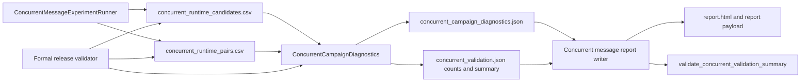
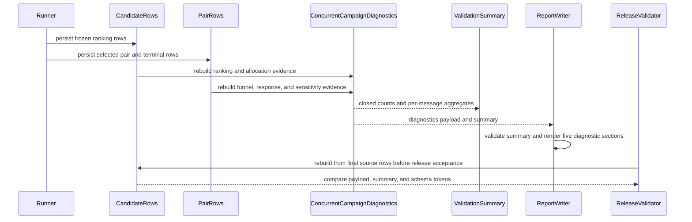
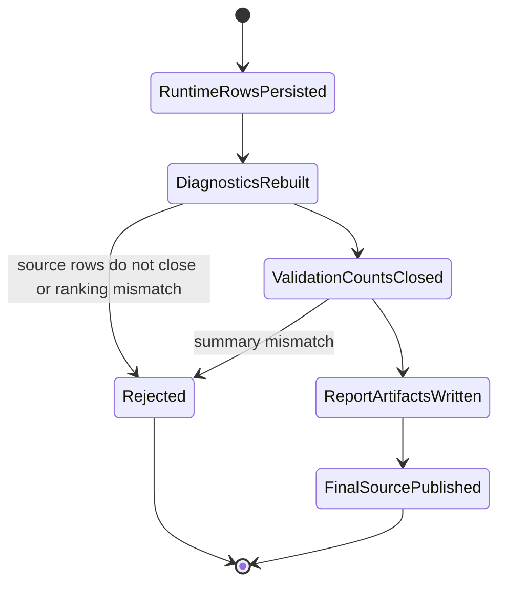
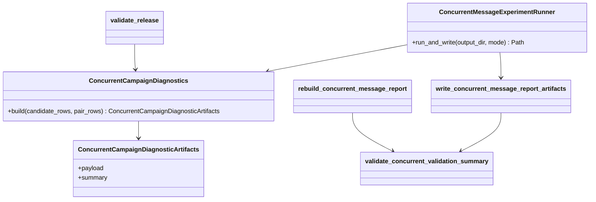

# Concurrent Message Campaign Diagnostics

Status: Implemented validation diagnostics note

本 Note 记录并发三 message validation runtime 中 campaign diagnostics 的当前实现边界、模块关系和可见输出。它只描述离线或已授权 Formal run 的 artifact contract，不授权 live API 或 canonical deploy。

相关设计共识见 [`concurrent-message-competition-experiment.md`](concurrent-message-competition-experiment.md)。

## 当前实现

- `ConcurrentCampaignDiagnostics` 从 persisted candidate / pair rows 重建五组指标，并校验 ranking、pair closure、容量和 source-row consistency；
- runner 在 fresh 和 resume 路径都先把安全化的 candidate / pair rows 交给 builder，再把 `payload`、`summary` 写入 `concurrent_campaign_diagnostics.json` 和 `concurrent_validation.json`；
- report writer 在生成 report payload 前再次运行 `validate_concurrent_validation_summary`，并把五组 diagnostics sections 写入报告；
- release validator 从最终 source directory 重新读取 candidate / pair rows，重建 diagnostics，与 persisted diagnostics、validation summary 和 schema token 逐项比较；
- no-feedback diagnostics 不调用 adapter、不推进 runtime state；demographic reason screening 只做 deterministic lexical evidence，不是完整语义偏差分类器。

## 当前架构与调用关系

## 当前时序

## 当前状态

## 当前类关系

## 数据边界

- source of truth 是同一 run 中 persisted 的 `candidate_rows` 与 `pair_rows`；in-memory rows 只在写出前经过安全化，不构成独立事实来源；
- no-feedback comparison 复用同一批冻结 candidates、相同 full-precision score components 和 `user_id` tie-break，只把 campaign feedback component 置 0；
- reason screening 只匹配已展示 demographic label/value 与预声明 direct-causal phrases，保存 matched span，不改写 reason，不触发重跑；
- report payload、diagnostics artifact、validation summary 和 release validator 必须互相闭合；任一 crossed token、缺失行、重复行、排序或计数不一致都在报告发布前失败关闭；
- 所有 message-level differences 保持 descriptive / non-causal，不生成 winner 或综合评分。
