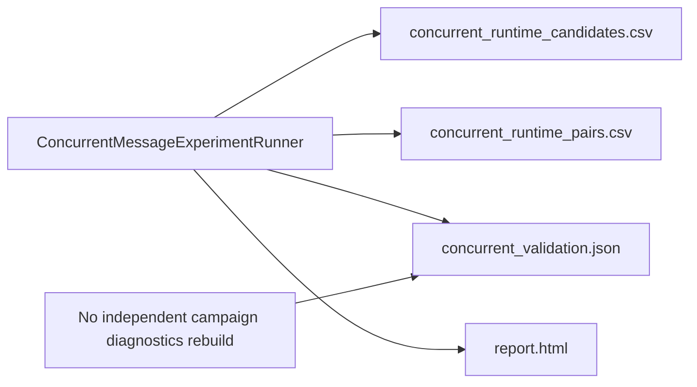
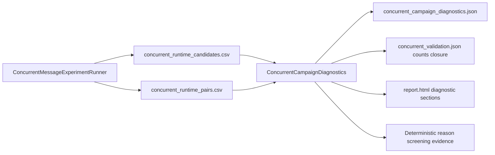
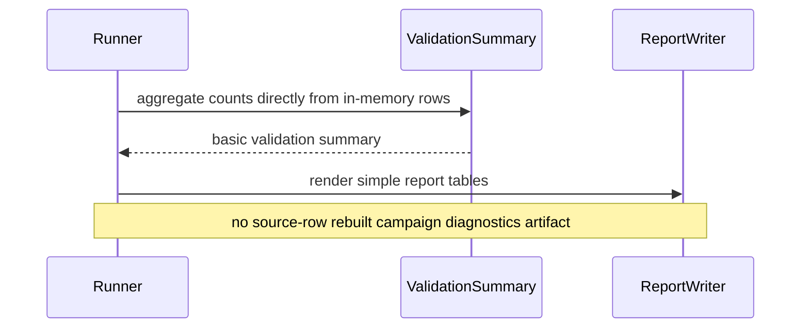
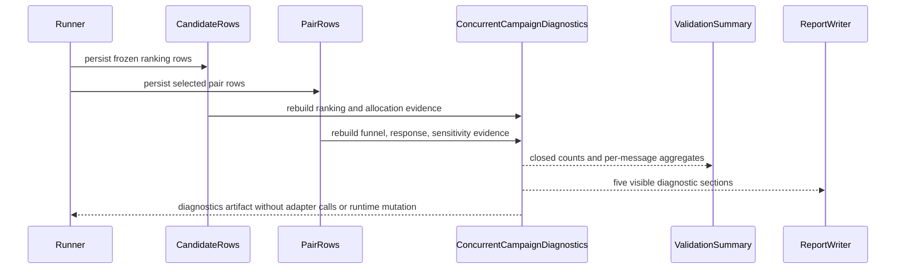
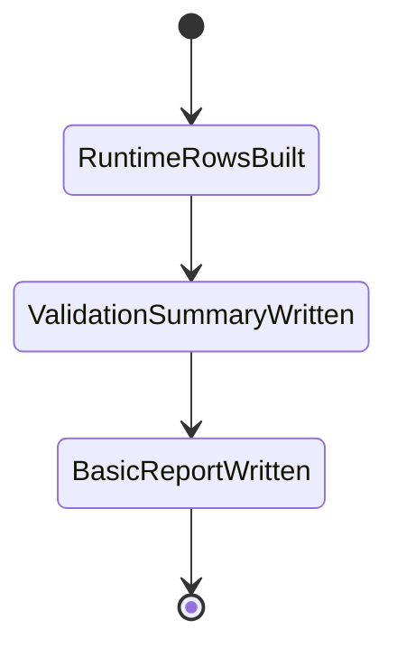
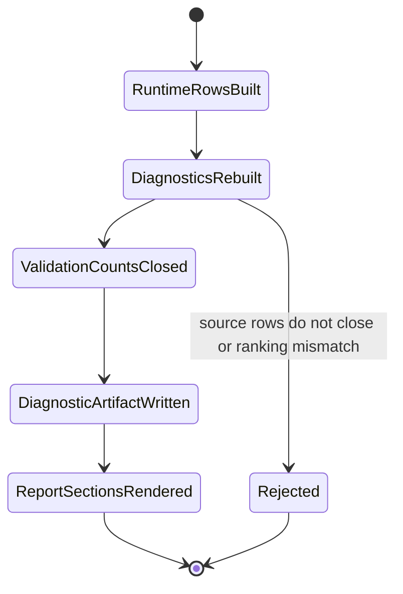
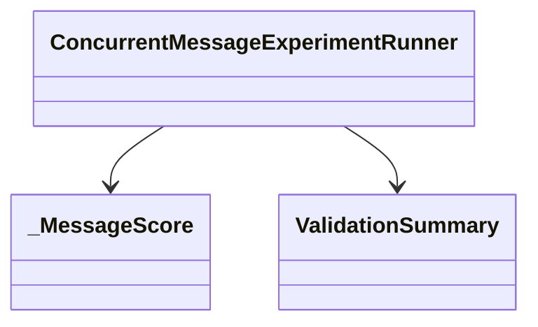
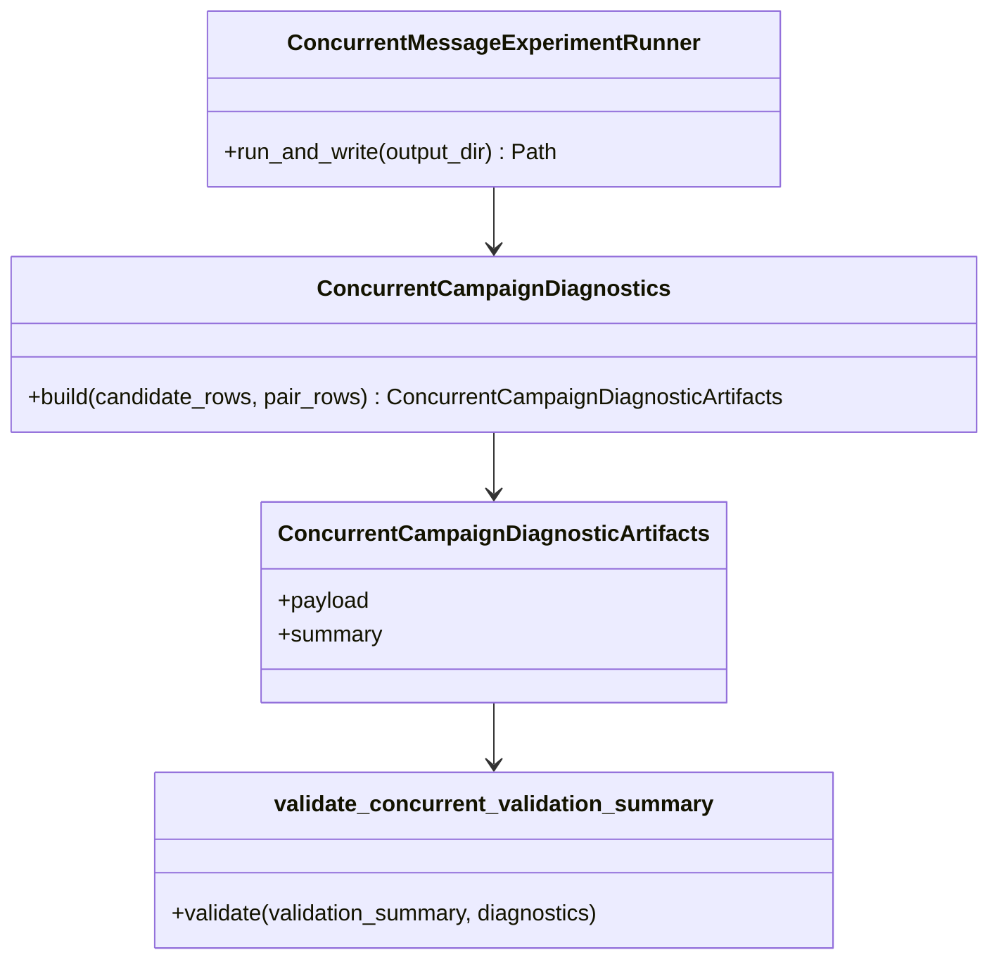

# Concurrent Message Campaign Diagnostics

Status: Implemented validation diagnostics note

本 Note 记录并发三 message validation runtime 中 campaign diagnostics 的当前实现边界、模块关系和可见输出。它只描述离线 validation diagnostics，不授权 live API 或 canonical deploy。

相关设计共识见 [`concurrent-message-competition-experiment.md`](concurrent-message-competition-experiment.md)。

## 变化影响

- 新增纯离线 `ConcurrentCampaignDiagnostics` builder，从 persisted candidate / pair rows 重建五组指标；
- runner 额外写出 `concurrent_campaign_diagnostics.json`，并让 `concurrent_validation.json` 的基础计数闭合到 source-row diagnostics；
- report.html 新增 Campaign Funnel、Message Allocation、Primary Audience Response、Campaign Feedback Effect、Demographic Decision Sensitivity 五个用户可见 sections；
- no-feedback diagnostics 不调用 adapter，不推进 runtime state；
- demographic reason screening 只做 deterministic lexical evidence，不是完整语义偏差分类器。

## 当前架构与调用关系

## 目标架构与调用关系

## 当前时序

## 目标时序

## 当前状态

## 目标状态

## 当前类关系

## 目标类关系

## 边界说明

- source of truth 是 persisted `candidate_rows` 与 `pair_rows`；
- no-feedback comparison 复用同一批冻结 candidates、相同 full-precision score components 和 `user_id` tie-break，只把 campaign feedback component 置 0；
- reason screening 只匹配已展示 demographic label/value 与预声明 direct-causal phrases，保存 matched span，不改写 reason，不触发重跑；
- 所有 message-level differences 保持 descriptive / non-causal，不生成 winner 或综合评分。
