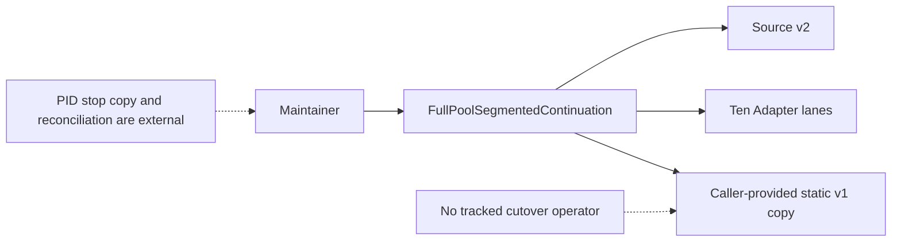
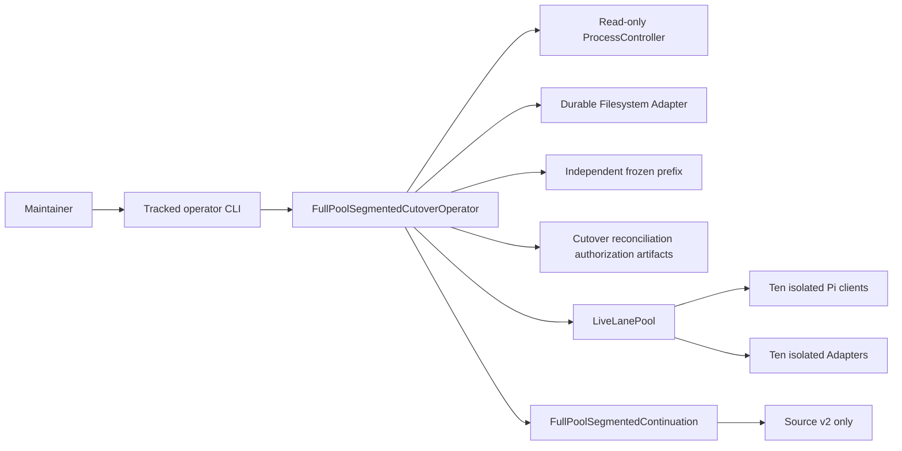
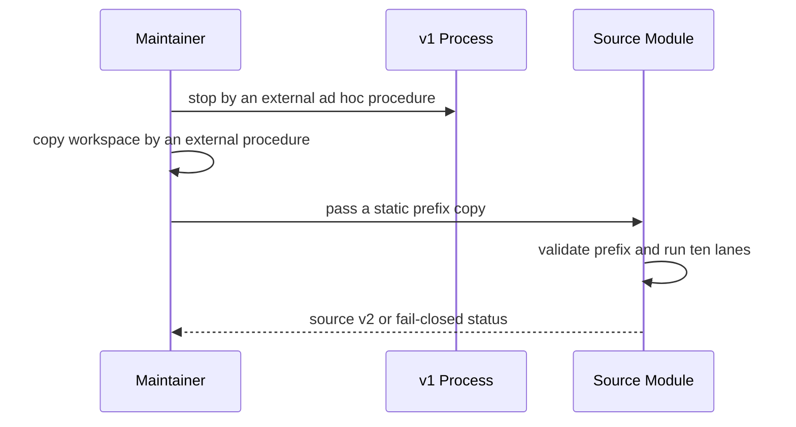
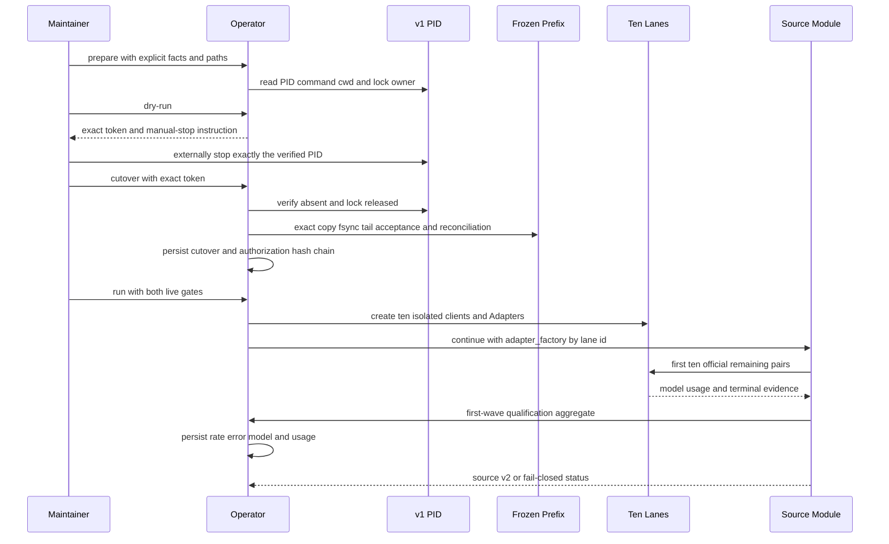
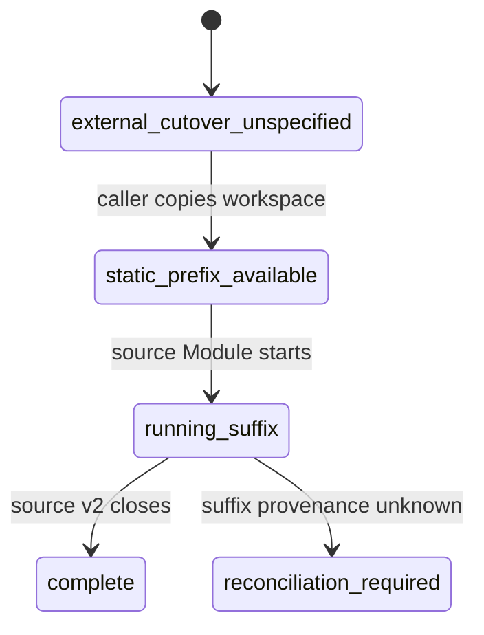
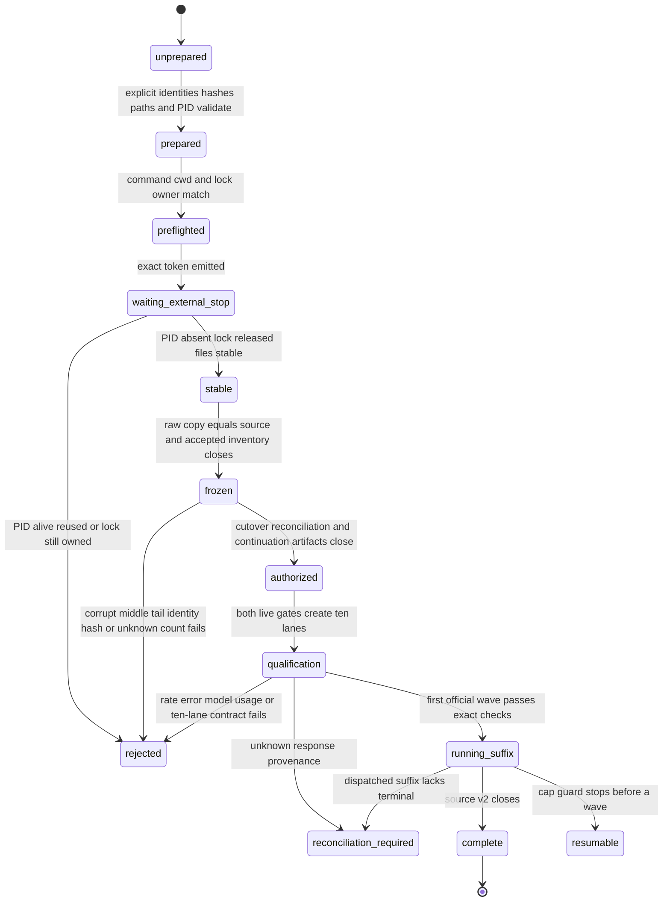
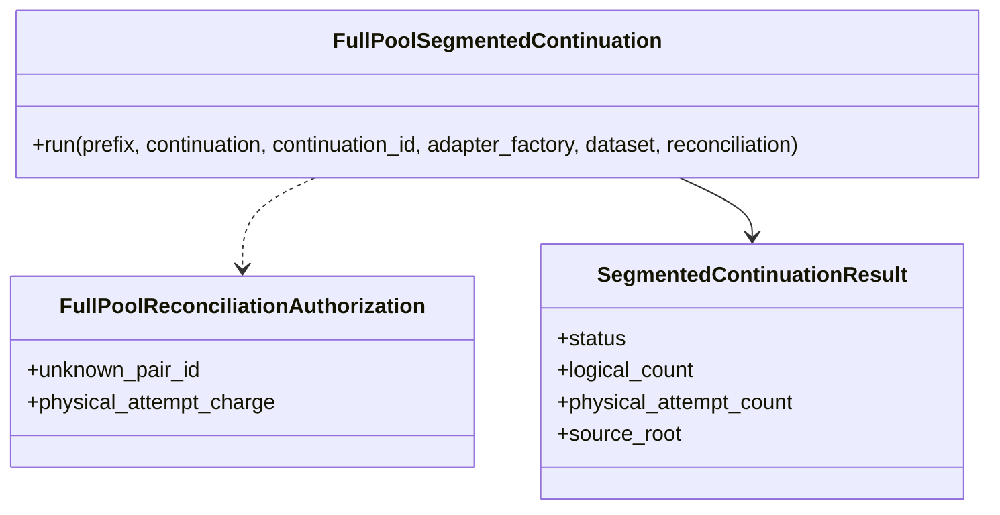
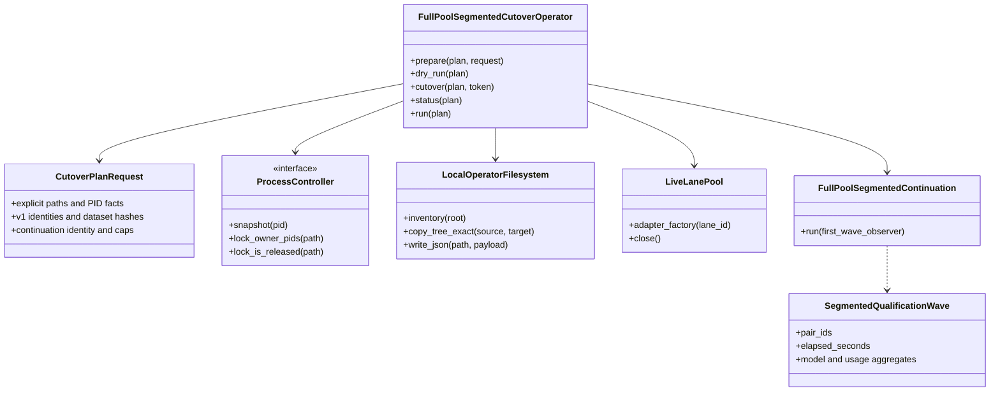

# Full-Pool Segmented Continuation Operator

本 note 描述 Issue #205 的 source-side cutover/operator 纵向切片。它固定采用 **freeze-after-external-stop**：operator 只读核验 PID、command、cwd 与 workspace lock owner，但没有 signal Interface；人工必须只停止已核验的单个 v1 PID，operator 随后等待 PID 消失、lock 释放与文件稳定。该边界避免误杀进程组或不匹配成员。

所有命令都读取显式 plan，不扫描 `latest`。plan 绑定原 v1 identity、recorded paths、PID/pidfile、dataset hashes、`2884bbd...` source implementation commit、实际加载的 40-hex repository commit、当前 operator/source/CLI 的逐文件 SHA-256、Issue #205 segmented authorization comment、独立 frozen-prefix/continuation/artifact paths、109,200/120,120 caps 与十 lane continuation identity；`dry-run`、`cutover`、`run` 都重新核对这些实现 bytes。`status` 只读 artifacts 和指定 PID，不依赖当前 Git HEAD；suffix 运行期间仅从 continuation ledger 的完整换行快照重放 dispatched/durable/physical progress，绝不截断或写回 live ledger。

`cutover` 先把原 workspace byte-for-byte 复制到显式 staging，保存 raw inventory，再只在副本处理末尾未完整 JSONL record。每项截断记录 original bytes/hash、accepted length/hash；中段 corruption 直接失败。runtime durable terminal 若领先 attempt-ledger 尾部，operator 只从同 pair 的 durable `variant_evidence` 导入 allowlisted accounting，并生成 reconciliation artifact；不得丢 terminal 或重调。started-without-terminal 最多一个，migration physical charge 固定为 3。冻结完成后由既有 `FullPoolSegmentedContinuation` 再验证 prefix。

`run` 需要 `LLM_ABM_RUN_LIVE_LLM=1` 与 `LLM_ABM_RUN_FULL_POOL_SEGMENTED_CONTINUATION=1`，并逐字段重闭合 current plan→preflight→cutover→reconciliation→authorization、原 workspace 不变、frozen inventory、dataset hashes、unknown 与 remaining caps。它逐字保持 Formal P0 `jinjiang-concurrent-message-primary-prompt-v1` 及其 canonical request contract，创建十个独立且 ready 的 `PiSubscriptionProviderClient` 和十个 Adapter；不足十条的首波在创建 Adapter 前零调用拒绝。第一波十个正式 remaining pairs 同时作为 bounded qualification，记录 rate/error/model/usage；qualified artifact 的 bytes/hash及exact pair IDs会进入 `source-v2` inventory、manifest、status与v9 facts，replay和production promotion必须重新验证。十 lane 不成立时失败关闭，不降低并发。最终只允许产生 `source-v2`，不实现 Report/Release v9、SSH 或部署。

## 当前：架构 / 调用关系

## 目标：架构 / 调用关系

## 当前：时序

## 目标：时序

## 当前：状态

## 目标：状态

## 当前：类图

## 目标：类图

## 安全边界

- Operator 没有 `terminate`、`kill` 或 process-group Interface；测试只使用 fake `ProcessController` 和临时 filesystem fixture。
- `prepare`、`dry-run`、`cutover`、`status` 都不会创建 Provider client；只有 `run` 在双 env gate 与完整 artifact 验证后创建十 lane。
- 原 v1 workspace 全程只读；lock 只以 no-create/no-follow descriptor 探测，并在稳定检查、复制和 publish 前重复核验 PID absent、owner empty、flock released；所有截断和 ledger import 只发生于副本。
- `status` 不读取 Git HEAD、credential、`.env`、raw Prompt、raw request/response 或 raw provider payload。
- `source-v2` 是本切片终点；Report、Release v9、SSH 与部署不属于该 Module。
