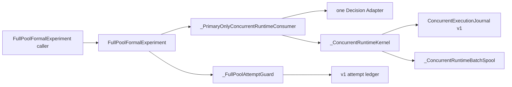
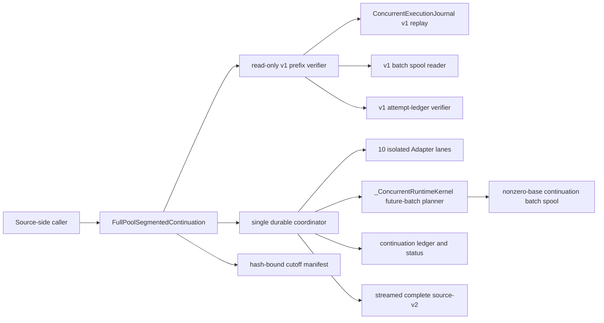
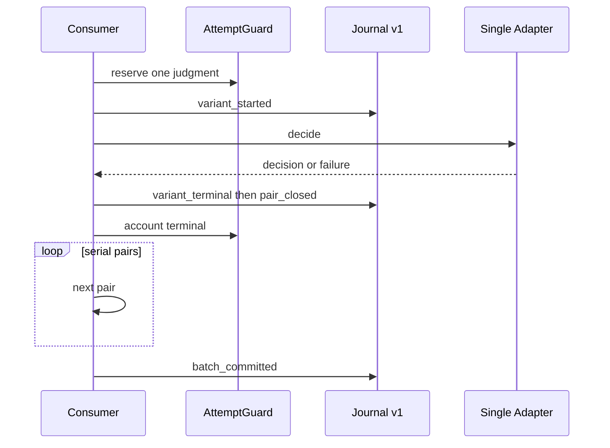
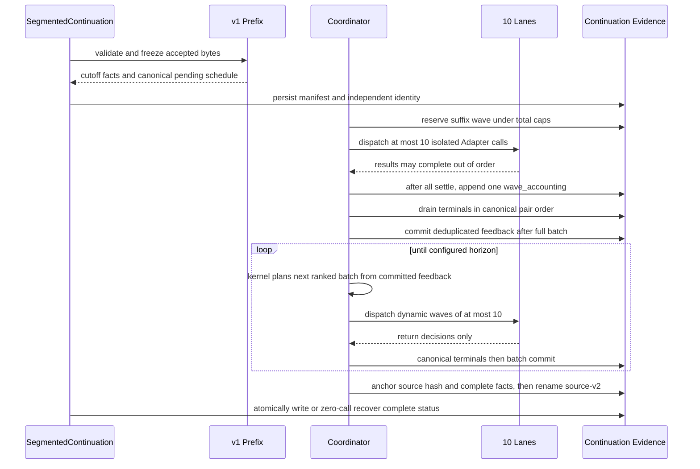
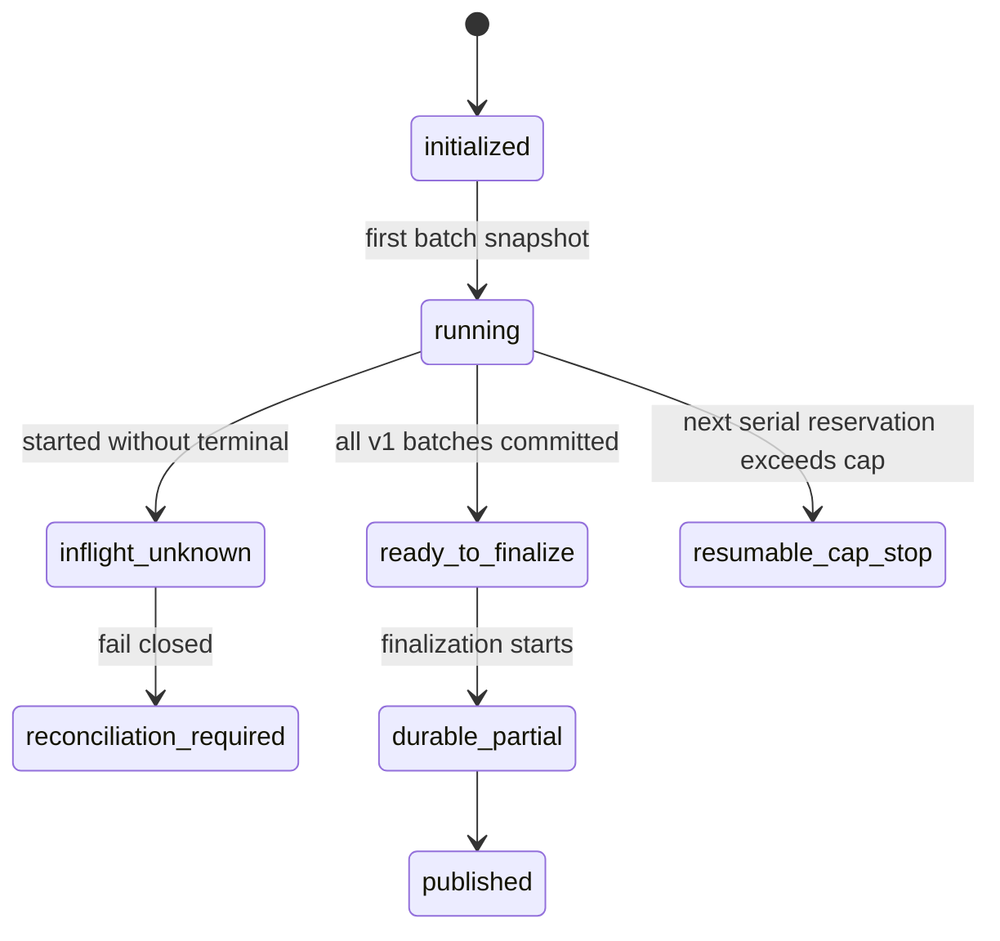
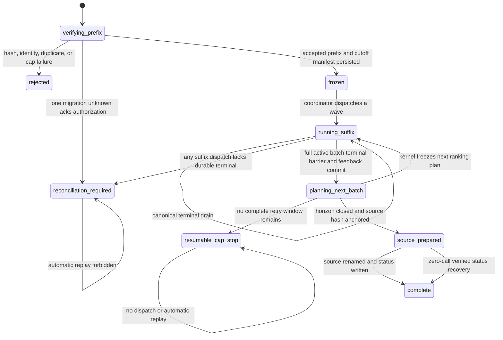
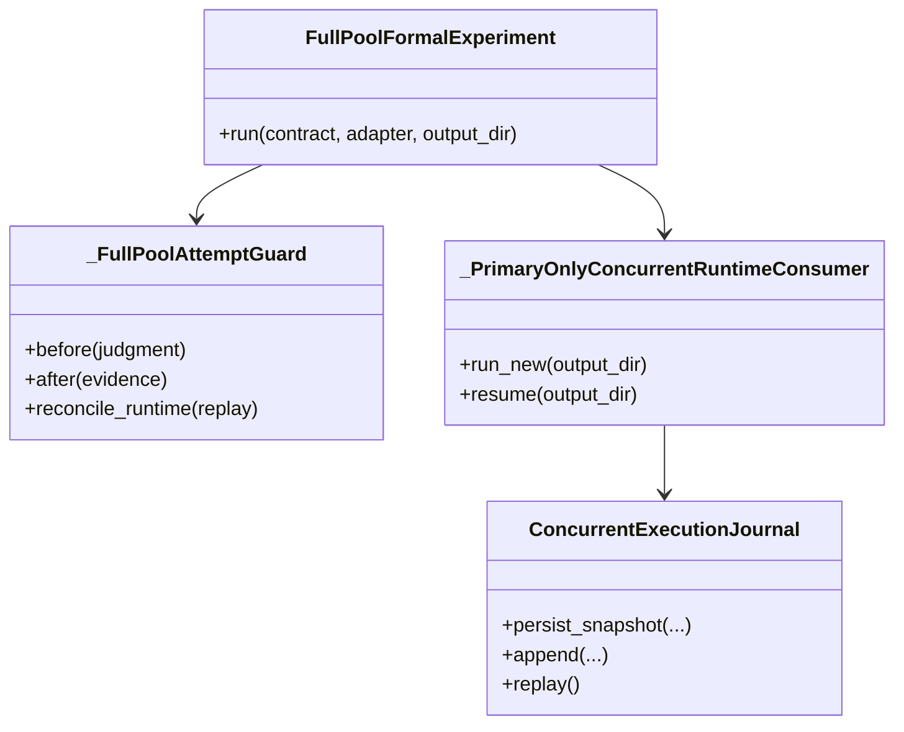

# Full-Pool Segmented Continuation Runtime

本 note 只描述 source-side 的离线可验证增量。它不改变 Full-Pool v1 contract，不执行 live migration，不生成 Report/Release v9，也不声明 production cutover 已发生。

## Module 与 Interface

package-internal `FullPoolSegmentedContinuation` 是唯一高层 Interface。调用方提供一个静态复制的 v1 operational workspace、独立 continuation workspace、可选的显式 dataset path、`adapter_factory(lane_id)`，以及仅在 v1 cutoff 存在一个 unknown 时所需的显式 reconciliation authorization。Module 从 v1 identity 和已验证 dataset 重建 prepared Full-Pool inputs；调用方不预先提供未来 pair 或 `DecisionInput`。

Module 在任何 Adapter 调用前完整验证 v1 journal、snapshot、spool 和 attempt-ledger 接受前缀，生成 exact-field、SHA-256 bound cutoff manifest。v1 prefix 只读且不复制回写；新 identity、ledger、status 和 canonical terminal rows 只写入 continuation workspace。

suffix 固定十条 lane。每条 lane 持有独立 Adapter；worker 只执行既有 Primary Decision Interface 并返回结果。唯一 coordinator 预留 cap、记录 dispatch、缓冲乱序完成，并按 canonical pair schedule 写 terminal evidence。可选 `first_wave_observer` 只接收第一波正式 suffix pairs 的安全聚合 rate/error/model/usage evidence；observer 失败时在任何后续 wave 前停止，已 durable terminals 不重调。完整 active batch 到达 terminal 后，coordinator 才去重并提交 succeeded Primary `like/comment/share` feedback。

总 logical cap 固定 109,200，总 physical cap 固定 120,120。logical denominator 在 cutoff 时闭合；physical retry window 只为下一波最多十个 dispatch 动态预留。每波先冻结各 lane 的 request/external counter baseline，等待全部 futures settle，再用单条 `wave_accounting` 原子记录 per-lane delta 与 actual total；terminal evidence 不重复计入 physical total。临近 cap 时 wave 缩小；不足一个完整 retry window 时返回 resumable cap stop。durable terminal pair 永不再次传给 Adapter。suffix 若留下 started-without-terminal pairs，status 关闭为 `reconciliation_required`，logical progress 覆盖全部 dispatched reservations，后续调用不自动重放。v1 migration unknown 的授权 charge 必须精确等于完整 retry window，并覆盖 attempt-ledger 中已 durable 的 pending attempts。

coordinator 完成 cutoff active batch 后提交整批 feedback，再由既有 `_ConcurrentRuntimeKernel` 使用 prepared inputs 规划下一批；循环持续到 horizon。最终原子物化 source-v2 的全部 candidate、pair、terminal、step rows、accounting 与 hash-bound manifest。rename 前 ledger 绑定 source manifest hash 和 complete-status facts；若 rename 后、status 前崩溃，重入可在完整验证 identity、cutoff、ledger、inventory、hash 与 denominator 后零调用重建 status。只有完整 denominator 闭合时才返回 `complete`。

## 当前：架构 / 调用关系

## 目标：架构 / 调用关系

## 当前：时序

## 目标：时序

## 当前：状态

## 目标：状态

## 当前：类图

## 目标：类图

## Read-only recovery preflight

`FullPoolSegmentedRecoveryPreflight` 是 `reconciliation_required` 之后唯一的授权前 Seam。调用方只提交显式 cutover plan、persisted continuation result、failure audit 的已知 SHA-256，以及全新的 recovery identity/root；Interface 不接收 Adapter、client、Decision、授权布尔值或 live gate。

Module 重新验证 cutover artifact chain、frozen-prefix inventory、exact ten-lane qualification、continuation identity/cutoff manifest、canonical ledger chain、status/result/audit 和已落盘的 batch spool/snapshot bytes。恢复 snapshot 只复制 hash-bound terminal IDs/refs、batch commits、feedback barriers、candidate schedules 和两个有序 unresolved pair 的证据分类，不复制或推断未持久化 action、reason、usage、observed-model evidence 或其他 Decision 内容。

计划账务分别保留 historical logical/physical、每个 unresolved 的完整三次 uncertainty charge、future retry physical attempts 和 `logical_retry_charge=0`。输出只能在独立新路径 create once，生命周期固定为 `recovery_prepared`，并持续声明 configured concurrency `10`、recorded worker state、durable progress、unresolved count、`provider_calls=0` 与 `production_deploy_eligible=false`。失败 continuation、frozen prefix、qualification、result 和 audit 在发布前后重新 inventory；任一变化会删除候选计划并失败关闭。

该 preflight 不创建 human authorization，也不重调 unresolved pair。显式授权消费、retry 与后续 source-v2 closure 属于独立后续 Module。

## 局部边界与后续 seam

本 Module 负责从任意单一 active cutoff 连续运行到 horizon，并关闭完整 source-v2；Report/Evidence adapter 后续只消费 source-v2，不读取运行中 workspace。recovery-preflight 只准备 nondeployable 计划；两者都不执行 Report/Release v9 或部署，也不修改冻结的 v1 prefix 或失败 continuation。
