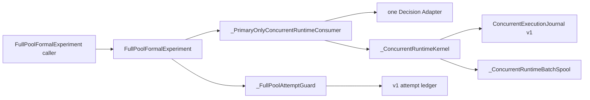
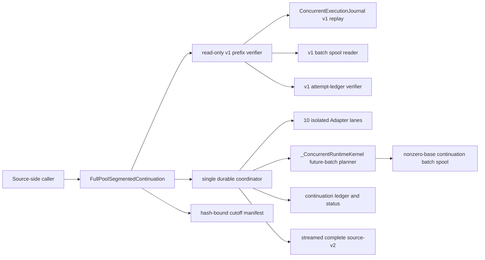
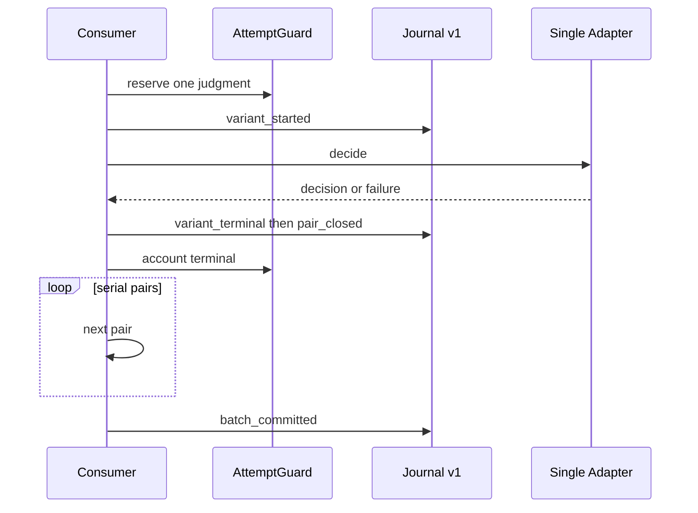
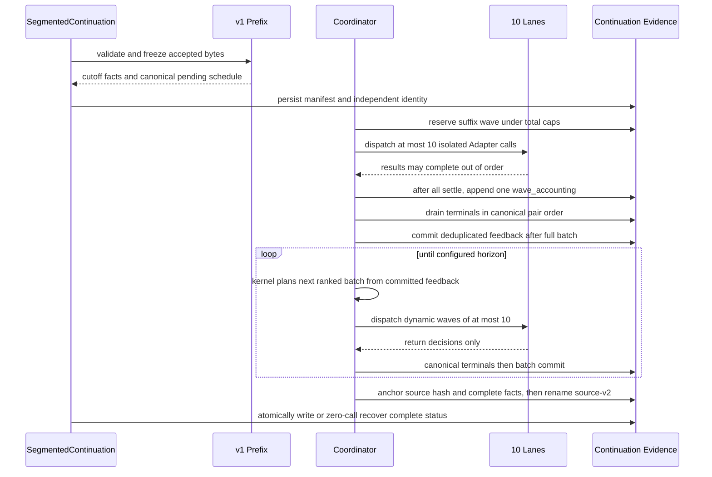
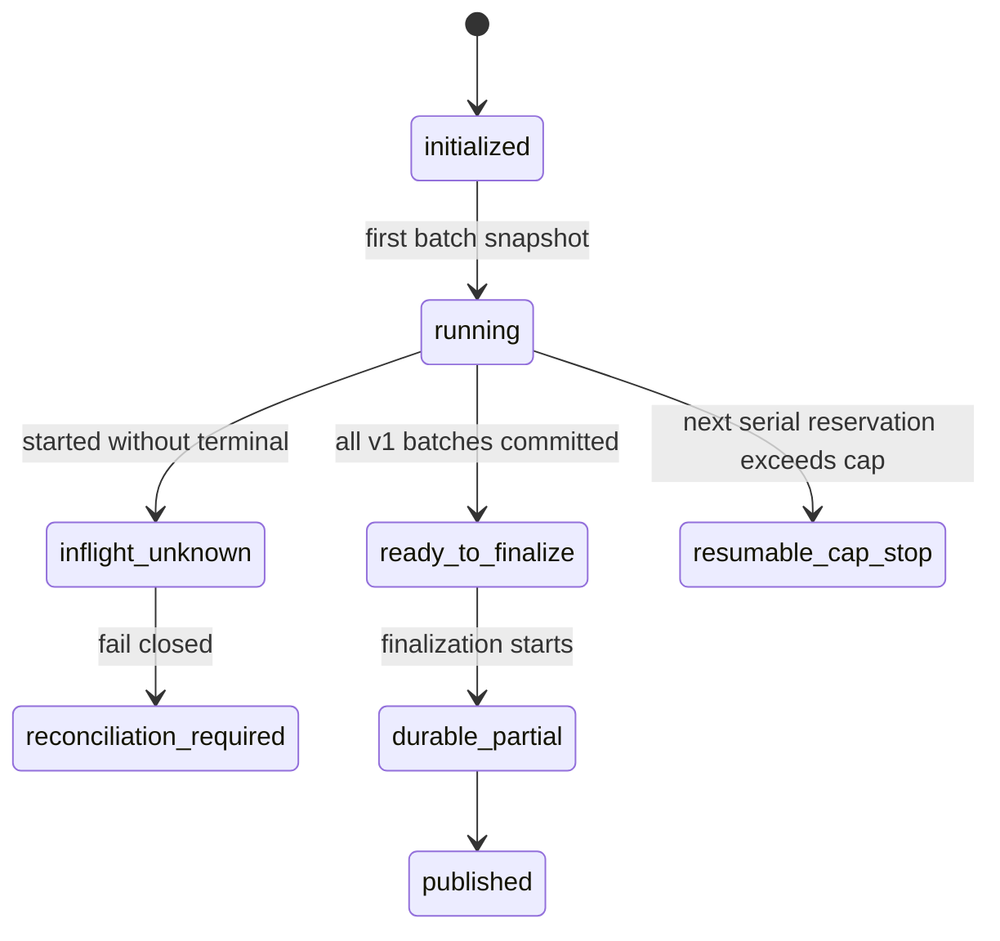
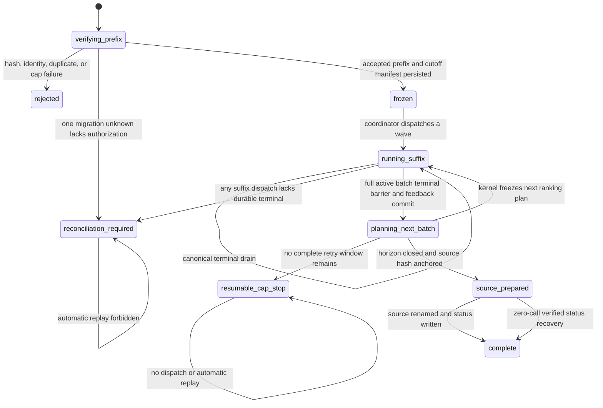
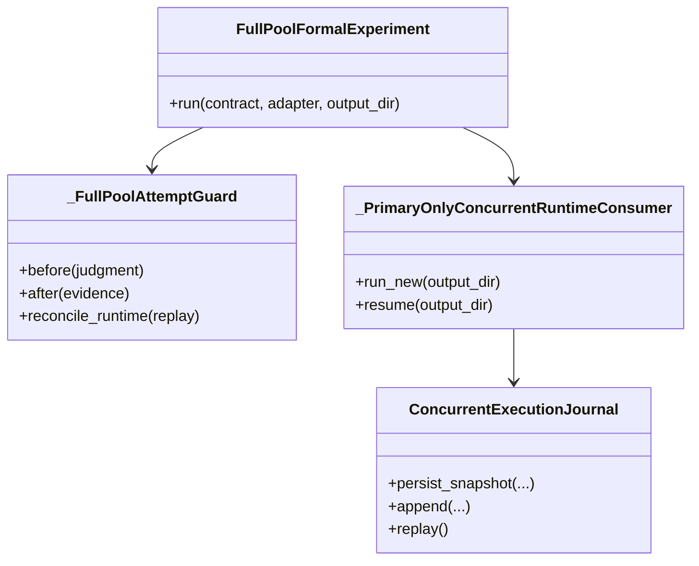
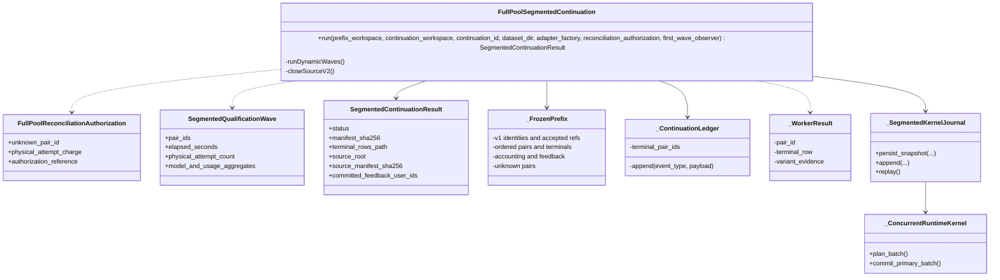

# Full-Pool Segmented Continuation Runtime

本 note 描述 segmented source runtime、显式与自动 recovery、source-v2 到 Report/Evidence/Release v9 的冻结 projection、source-v3 到 Release v10，以及 strict source-v4 到 Report/Evidence/Release v11 的 additive persisted contract。它不改变 Full-Pool v1、source-v2/v3 或 v9/v10 contract；Module 本身不授予 live authorization，也不执行 SSH 或 canonical deployment。

## Module 与 Interface

package-internal `FullPoolSegmentedContinuation` 是唯一高层 Interface。调用方提供一个静态复制的 v1 operational workspace、独立 continuation workspace、可选的显式 dataset path、`adapter_factory(lane_id)`，以及仅在 v1 cutoff 存在一个 unknown 时所需的显式 reconciliation authorization。Module 从 v1 identity 和已验证 dataset 重建 prepared Full-Pool inputs；调用方不预先提供未来 pair 或 `DecisionInput`。

Module 在任何 Adapter 调用前完整验证 v1 journal、snapshot、spool 和 attempt-ledger 接受前缀，生成 exact-field、SHA-256 bound cutoff manifest。v1 prefix 只读且不复制回写；新 identity、ledger、status 和 canonical terminal rows 只写入 continuation workspace。

suffix 固定十条 lane。每条 lane 持有独立 Adapter；worker 只执行既有 Primary Decision Interface 并返回结果。package-internal `DurablePairSettlement` 是 frozen wave dispatch、Future drain、per-pair accounting、typed outcome、crash replay 与 canonical frontier 的唯一 Module Interface。它在 Provider 调用前 durable 写入 `wave_reserved` 与每个 `pair_dispatched`，再按真实 completion order 独立写入 `pair_settled`；一个 provenance unknown 或 `implementation_failed` 不会抹掉同波 sibling terminal。可选 `first_wave_observer` 只接收全部 terminal 的第一波正式 suffix pairs 的安全聚合 rate/error/model/usage evidence。只有完整 active batch 的每个 pair 都是 terminal，coordinator 才按 frozen plan 去重并提交 succeeded Primary `like/comment/share` feedback。

总 logical cap 固定 109,200，总 physical cap 固定 120,120。logical denominator 在 cutoff 时闭合；physical retry window 只为下一波最多十个 dispatch 动态预留。settlement journal v2 对每个 pair 保存 request/external/terminal-evidence delta、actual attempts 与保守 uncertainty charge，并在全部已 dispatch pairs 归约后唯一写入 `wave_closed`。合法 completion-order settlements 由 replay 重建为 typed outcome map，再从 frozen canonical plan 计算最长 terminal frontier；发现 dispatch-without-settlement 时只形成 typed unknown 和完整 retry-window charge，same-identity replay 不再调用 Adapter。unknown 后不派发新 wave，但当前 wave 全部 drain。普通 timeout/parse retry 仍只属于对应 Adapter 的 `max_retries=2` policy。

v2 journal 是 additive workspace artifact。正常 wave 在写入唯一 `wave_closed` 前先完成 source-v2 所需的 canonical ledger v1 compatibility projection；历史 ledger v1、recovery v1、source-v2 readers 与 artifact bytes 不改。新 typed stop 使用 additive continuation status v2，并绑定 settlement journal hash、unknown/implementation-failed identities、actual/uncertain physical accounting 与 canonical frontier。若全部 pair 已 captured、但进程在 durable batch commit 前中断，same-identity replay 返回显式 `resumable` commit-pending result，既不重调 Adapter，也不伪装 source 已闭合。v1 migration unknown 的授权 charge 仍必须精确等于完整 retry window，并覆盖 attempt-ledger 中已 durable 的 pending attempts。

coordinator 完成 cutoff active batch 后提交整批 feedback，再由既有 `_ConcurrentRuntimeKernel` 使用 prepared inputs 规划下一批；循环持续到 horizon。最终原子物化 source-v2 的全部 candidate、pair、terminal、step rows、accounting 与 hash-bound manifest。rename 前 ledger 绑定 source manifest hash 和 complete-status facts；若 rename 后、status 前崩溃，重入可在完整验证 identity、cutoff、ledger、inventory、hash 与 denominator 后零调用重建 status。只有完整 denominator 闭合时才返回 `complete`。

## 当前：架构 / 调用关系

## 目标：架构 / 调用关系

## 当前：时序

## 目标：时序

## 当前：状态

## 目标：状态

## 当前：类图

## 目标：类图

## Read-only recovery preflight

`FullPoolSegmentedRecoveryPreflight` 是 `reconciliation_required` 之后唯一的授权前 Seam。调用方只提交显式 cutover plan、persisted continuation result、failure audit 的已知 SHA-256，以及全新的 recovery identity/root；Interface 不接收 Adapter、client、Decision、授权布尔值或 live gate。

Module 重新验证 cutover artifact chain、frozen-prefix inventory、exact ten-lane qualification、continuation identity/cutoff manifest、canonical ledger chain、status/result/audit 和已落盘的 batch spool/snapshot bytes。恢复 snapshot 只复制 hash-bound terminal IDs/refs、batch commits、feedback barriers、candidate schedules 和两个有序 unresolved pair 的证据分类，不复制或推断未持久化 action、reason、usage、observed-model evidence 或其他 Decision 内容。

计划账务分别保留 historical logical/physical、每个 unresolved 的完整三次 uncertainty charge、future retry physical attempts 和 `logical_retry_charge=0`。输出只能在独立新路径 create once，生命周期固定为 `recovery_prepared`，并持续声明 configured concurrency `10`、recorded worker state、durable progress、unresolved count、`provider_calls=0` 与 `production_deploy_eligible=false`。失败 continuation、frozen prefix、qualification、result 和 audit 在发布前后重新 inventory；任一变化会删除候选计划并失败关闭。

该 preflight 不创建 human authorization，也不重调 unresolved pair。

## 显式双未决 recovery consumer

package-internal `FullPoolSegmentedRecovery` 是 `recovery_prepared` 之后唯一的授权消费 Interface。调用方只提供 persisted recovery plan/hash、外部 create-once human authorization/hash，以及授权中 exact 绑定的新 recovery identity/workspace；Module 不创建授权，也不从 issue label、环境变量或调用方布尔值推定授权。授权在任何 Adapter/client 创建前绑定两个有序 unresolved IDs、十 lanes、Provider/model/P0 request contract、每 pair 三次 retry window、合计六次 uncertainty charge 和 109,200/120,120 caps；missing、tampered、expired 或 crossed artifact 均零调用拒绝。

Module 在新 workspace 中重新验证并只读导入 frozen prefix、失败 continuation、十 lane qualification、全部 durable terminals、committed batch chunks、candidate schedules 与 feedback barriers。恢复先单独 dispatch 两个 unresolved pair，logical retry charge 固定为零；随后回到十条隔离 Adapter lanes、canonical drain、full-batch barrier、next-batch-only feedback 和 dynamic pre-call cap guard。旧 workspace 与 plan/auth artifacts 始终只读，任何已 durable pair 都不会重新进入 Adapter。新的 provenance unknown、多个未决、ledger/identity drift 或不可恢复 crash 关闭为新 identity 下的 `reconciliation_required`，重入只读返回，不自动 retry。

recovered `source-v2` 继续物化完整 candidate、pair、terminal 和 step rows，同时复制 hash-bound recovery plan、human authorization 与既有 concurrency qualification，并在 manifest 分开披露 failed-run/recovery lineage、historical physical、六次 uncertainty charge、retry actual、later actual 和 aggregate accounting。source rename 或 status write 中断只能从 durable source anchor 零调用完成；删除或篡改 recovery/qualification artifact 会失败关闭。该 source 固定 `production_deploy_eligible=false`；v9 persisted consumer、Report/Evidence/Release、真实 Provider run 与部署属于后续 Module 或显式 operational authorization。

## Recovery lineage 的 persisted consumer

versioned source reader 现在 exact 区分普通 segmented source-v2 与 recovered source-v2。recovered 分支从 source 内 hash-bound 的 recovery plan、human authorization、十 lane qualification，以及只读 failed continuation/frozen prefix artifacts 重新闭合 Formal identity；调用方不能传入或覆盖 typed Formal facts。reader 同时验证两个有序 unresolved 的 classification、canonical schedule 与 retry terminal mapping，分别保留 historical physical、六次 uncertainty charge、retry actual、later actual 和 aggregate physical accounting。

Report candidate、Evidence closure 与 Release v9 复用同一 typed recovery lineage/accounting 投影。v9 recovery contract 在安装后重新读取 persisted source 并逐字段 round-trip；Validation/mock/rule-based source 仍保持 `production_deploy_eligible=false`，不能通过 promotion、standalone validator 或 deployment preflight。v8、历史 sources、immutable v7 与旧七张 Mermaid masters 保持原合同和原 bytes。

## Automated nested recovery 与 source-v3

package-internal `FullPoolSegmentedAutomatedRecovery.run/status` 消费显式 nested-plan path/hash、recovery identity 与独立 workspace。Module 在 Adapter factory 前重放 parent recovery lineage、stopped-workspace inventory、24 个 committed batches、active snapshot、90,061 条 durable terminals、七个有序 retry IDs、Provider/request contract 与 caps；调用方不传 human authorization，也不协调 Future、policy event 或 source closure。

workspace 先 create once 持久化 hash-bound `AutomatedRecoveryPolicy`。Policy ledger 为每个 typed unknown 最多原子消费一个 reconciliation slot，并在 Provider 调用前保守预留完整三次 retry window；reconciliation 使用 `DurablePairSettlement` 的独立 per-pair journal，不改写 main typed-unknown settlement，也不重放 sibling。second unknown、slot dispatch 后无 settlement、重复 slot、policy/workspace drift、cap 不足或 `implementation_failed` 都 fail closed；只有 terminal-complete wave 才按 canonical 顺序进入 kernel 与 full-batch barrier。

七个 retry 的 logical charge 固定为 0；historical physical、21 次 uncertainty charge、retry actual、reconciliation actual 与 fresh continuation actual 分栏累计。same-identity replay 从 policy ledger、main settlement journal、per-pair reconciliation journals、kernel ledger 与 spool 恢复；已 captured pair 不再进入 Adapter。完整 closure 必须同时满足 109,200 logical terminals、30 committed batches、ten isolated lanes、109,200/120,120 caps 与完整 nested lineage。

成功 closure 通过独立 staging 原子生成 additive `source-v3`，复制 frozen nested plan、automated policy/ledger、settlement v2 与 reconciliation journals，并保留 original run、first recovery、second recovery 和分栏 accounting。`automation_exhausted`、`implementation_failed` 或 incomplete 结果不产生 source-v3；Validation/mock source-v3 即使 denominator 完整也始终 nondeployable。source-v2、recovery v1 与 Release v9 的 schema、reader 和 artifact bytes 不变。

## Source-v3 persisted consumer 与结果交付

package-internal source version dispatcher 对 `full-pool-segmented-source-v3` 只路由 `SourceV3Consumer`。调用方只提供显式 source path 与 manifest SHA-256；Consumer 从 persisted nested plan、parent artifact refs、workspace identity/status、automated policy/ledger、main/reconciliation settlement journals 和 terminal/batch bytes重闭合 original、first recovery、second recovery、terminal mapping、model/usage 与 logical/physical accounting。Implementation commit 和 Module hashes从绑定 Git blob验证，而不是由调用方注入 Formal facts。

`FullPoolResultProjection` 从同一 closed source 的 terminal rows 按 `user_id` 连接 source-bound `users.csv` latent-v1 membership，一次生成固定列与 Segment → Message → Run 顺序的九行 aggregation。`Exposure` 包含 `ignore`；like/comment/share 只统计 `terminal_status=succeeded` 的对应 action。HTML fragment、UTF-8 `full-pool-segment-results.csv` 和 `full-pool-segment-lineage.md` 共用同一 rows identity，并作为 Report candidate 的稳定 downloads；36,400-user source 必须精确闭合 15,616 / 15,070 / 5,714 三个 segment denominators和109,200总 Exposure。

Evidence v10只从 source-v3、execution receipt、automation manifest、Report closure和冻结历史 artifacts重建 typed facts。Release dispatcher 对 source-v3 只接受 `abm-report-release-contract-v10`，并绑定 nested lineage、policy、settlement v2、result projection、execution manifest和 physical snapshot；v9 reader/validator继续只接受 source-v2。Validation/mock、incomplete、`implementation_failed`或`automation_exhausted`不能进入 production evidence。合法 Formal v10随后继续使用既有 immutable release、candidate health、snapshot、atomic `current` switch、rollback与逐 artifact public hash合同。

## Strict fresh replay 与 source-v4

package-internal `StrictFullPoolFormalReplay.run(request, adapter_factory)` 是从 Batch 0 启动 fresh trajectory 的唯一 runtime 最高 Interface。冻结 request 绑定 dataset/messages/config、P0 Provider contract、109,200/120,120 caps、十 lane topology和被拒绝 source-v3 的显式 manifest path/hash/reason；调用方不编排 Future、kernel、policy、journal、spool 或 source writer。Run identity 固定从 batch/logical/physical/pair schedule position 0 开始，旧 source-v3 不提供 terminal、snapshot、ranking 或 feedback。

Module 复用既有 `_ConcurrentRuntimeKernel`、`DurablePairSettlement` 和 batch spool。每个 frozen batch 先按 wave 独立 durable capture siblings；`provider_failed` 或 provenance unknown 只能通过 `StrictPairPolicy` 的单个原子 slot-plus-dispatch event在同一 pair context reconciliation。只有全部 selected pairs 都拥有 final `succeeded` terminal，才按 canonical order注册并提交本批；任一 typed strict stop都阻止当前及后续 batch commit，也不暴露 source-v4。Same-identity replay从 settlement、policy、journal和spool恢复，captured pair不重新调用；settlement完成但commit前只补commit，已提交batch不重复feedback。

完整 runtime 只在每个 logical pair恰有一个 final successful response、exact `gpt-5.6-sol` observed-model evidence、完整 usage、30 个 batch commits和不超过physical cap的持久化账务时关闭 additive `source-v4`。Closure先从 committed spool重建candidate/pair/terminal/step rows，复制fresh identity、runtime journal/status/snapshots、settlement v2、strict policy/ledger、reconciliation journals、latent membership、rejected-history manifest和可选fresh execution manifest，同时在runtime lineage绑定每个spool chunk的path/hash/bytes，再验证exact inventory后原子rename。Provisional failures与failed attempts只保留在settlement/physical accounting；source terminal rows全部是final success。Source rename前后的crash均可在同identity下零Adapter恢复，旧source-v3保持只读。

Validation与zero-Provider rehearsal生成的source-v4固定`production_deploy_eligible=false`；只有production topology、operator-bound manifest、完整最终evidence、非零真实external invocation闭合且uncertainty为0时，source manifest才可声明production eligible。本Module、测试和source closure不授予live authorization，不执行SSH、upload、promotion或canonical deployment。

## Fresh execution manifest 与可重入 operator

`StrictFreshExecutionManifest` 在runtime workspace创建前create once，精确绑定clean HEAD commit、固定Module set与Git blobs、完整dataset inventory、authoritative三messages、P0、Pi `openai-codex`、`gpt-5.6-sol`、Responses/low/256/30s/2-retry、fresh/no-cache、十lanes、logical/physical caps、USD 0和独立operator/runtime/source paths。Manifest composition与validation均为零Provider call；missing、tampered、crossed path、wrong model/cap/commit或dirty Module在Adapter factory前失败。

`StrictFreshAutomationOperator.run(explicit_manifest_path, gates, adapter_factory)`不扫描latest，也不写one-time execution receipt。operator workspace包住独立`runtime/`子目录；根目录OS advisory lock是唯一active owner，同进程结束后由OS释放。Append-only attempt ledger以manifest/ledger identity、sequence、previous checksum和event checksum记录`attempt_started`、`attempt_resumed`、`attempt_terminal`、`attempt_resumable`和`source_v4_consumer_rejected`；runtime terminal后的consumer/projection异常必须先追加rejection再向调用方失败。下次owner可把released lock下缺少outcome的attempt先闭合为resumable，或从consumer rejection继续，再使用同manifest、同runtime identity恢复；已settled pair与已commit batch不重调、不补丁feedback。

## Source-v4 persisted consumer 与九格 projection

versioned source dispatcher对`full-pool-segmented-source-v4`只路由`read_closed_strict_full_pool_source(explicit_path, manifest_sha256)`。Consumer先验证source exact inventory与copied execution manifest，再沿source-bound paths重放attempt chain、runtime identity/journal/snapshots、30个hash-bound spool chunks、original/reconciliation settlement v2、strict policy ledger、terminal/model/usage rows和latent membership。每个logical pair只允许一个final succeeded response/model/usage，original与reconciliation每dispatch各1–3 invocations、每pair最多两个dispatch；任何hash drift、strict stop、unresolved outcome、mixed final evidence或accounting/cap不闭合均nondeployable。Caller没有Formal facts注入参数。

同一closed source生成固定九行`Run | Message | Segment | Total Likes | Total Comments | Total Shares | Exposure`，按Segment → Message → Run排序。每个message的Exposure等于完整user denominator，`ignore`计Exposure，like/comment/share只计final succeeded action。HTML fragment、UTF-8 CSV和Markdown lineage共用同一rows hash；lineage明确rejected mixed source-v3只提供path/hash/reason，未参与fresh trajectory结果。source-v4 projection额外提供本地、键盘可用的列排序；默认顺序和CSV/Markdown bytes不随浏览器排序改变。

## Evidence、Report 与 Release v11

`validate_strict_full_pool_production_evidence(...)` 是 source-v4 到 production facts 的唯一 Evidence Interface。调用方只能提供 explicit source-v4 path/hash、fresh execution manifest、historical Formal/study、candidate、presentation closure 与 implementation commit；Interface 没有 caller-supplied Formal facts 参数。Evidence 重新运行 persisted source consumer，并 exact 验证 fresh-from-Batch-0、109,200 final successes、30 commits、36,400 users、observed `gpt-5.6-sol`/完整 usage、120,120 cap、zero uncertainty、attempt/policy/settlement identities、15,616/15,070/5,714 segment denominators 与旧 mixed source rejection。Validation、mock、strict stop、provider failure、unknown、incomplete model/usage 或 cap drift均在 Release 前失败。

Report Module让source-v4满足既有read-only presentation Interface，但v1/v2/v3 readers与bytes不变。source-v4 candidate只从persisted facts生成trace、canonical HTML、UTF-8 CSV和Markdown data dictionary；页面明确strict fresh trajectory是新结果的唯一来源，旧source-v3因三个historical Provider failures被拒绝且不混算。Historical 1,000-user sensitivity原bytes/hashes/denominators继续保留；population与model同时变化，因此不支持单因素或因果归因。Validation candidate始终`production_deploy_eligible=false`。

Release dispatcher只把`full-pool-segmented-source-v4`路由到独立`abm-report-release-contract-v11`。v11重新调用Evidence Interface，零Provider物化immutable presentation与physical snapshot，并绑定fresh manifest、source facts、strict lineage/policy/settlement、operator attempt、physical accounting、同源projection、rejected-history、approved downloads和release identity。Standalone validator从explicit contract/source/snapshot再次重闭合上述facts与逐artifact hashes；v10仍只接受source-v3，v9仍只接受source-v2。

`compose_strict_full_pool_v11_execution_handoff(...)`在live run前从clean、current、create-once fresh manifest零调用投影implementation commit、Provider/model、109,200/120,120/USD0 budgets和独立operator/runtime/source paths。handoff固定引用#205并声明artifact不授予operational authorization。缺少独立授权时不得运行Adapter、SSH、upload、promotion、canonical request或deployment。授权后的部署继续只消费explicit source directory/release id，执行local snapshot validation、candidate health、atomic `current` switch、rollback和公网逐artifact hash/interaction/download验收。

## Historical nested-recovery create-once automation execution manifest

`AutomationExecutionManifest` 在执行前 create once，精确绑定 implementation commit、受影响 Module hashes、nested plan/hash、七个有序 pair/terminal mappings、绝对输出 paths、Pi `openai-codex`、`gpt-5.6-sol`、P0、Responses/low/256/30s/2-retry、十条隔离 lanes、109,200/120,120 caps、USD 0 billing和 bounded stop conditions。`FullPoolAutomationOperator` 不扫描 latest；它在创建 Adapter 前验证 manifest、Git/Module bytes、workspace identity、live gates、Provider/model与caps，Adapter metadata不一致时在第一次 decision 前停止。execution receipt在 dispatch 前持久化并防止 manifest被另一个 identity重复消费。

## 局部边界与后续 seam

Source Module 负责从单一 active cutoff 连续运行到 horizon并关闭完整 source-v2；automated nested recovery关闭 additive source-v3；strict fresh runtime关闭 additive source-v4。Versioned Consumer/Projection/Evidence/Release各自只读取明确版本的已关闭 persisted artifacts；v1/v2/v3与v9/v10 readers保持冻结，v11只消费source-v4。Manifest、operator与execution handoff表达可执行身份但不自行授予 live authorization；测试、candidate/handoff/release composition和validator均不新增 Provider call，也不自行执行SSH、upload、promotion或canonical deployment。
