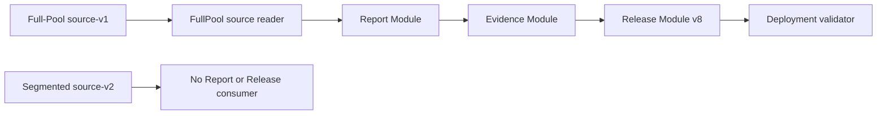
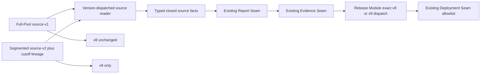
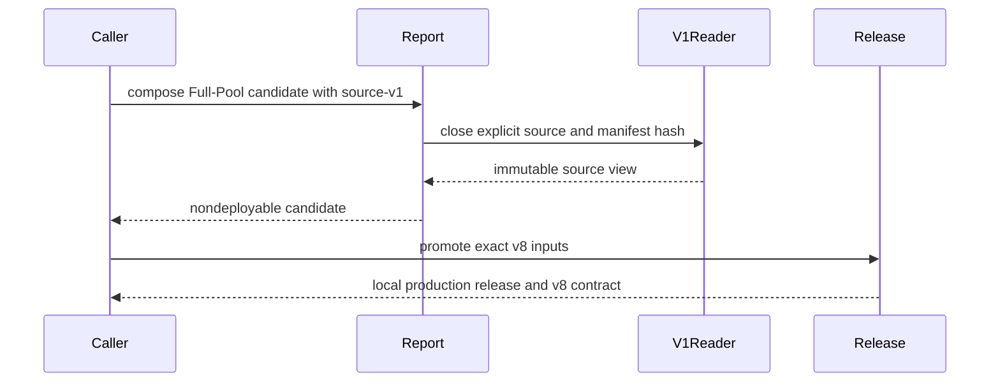
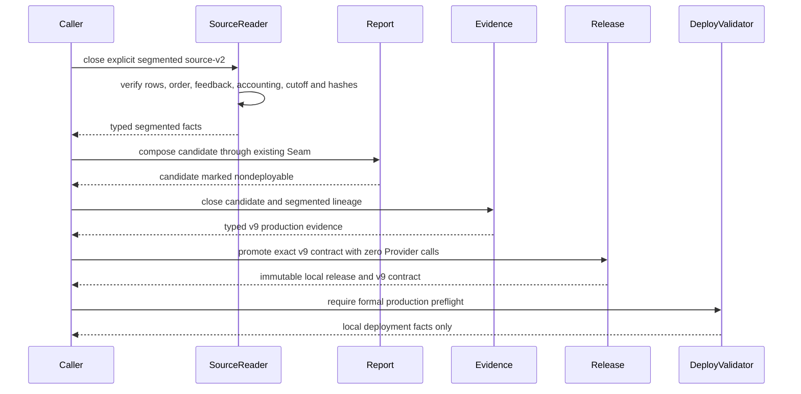
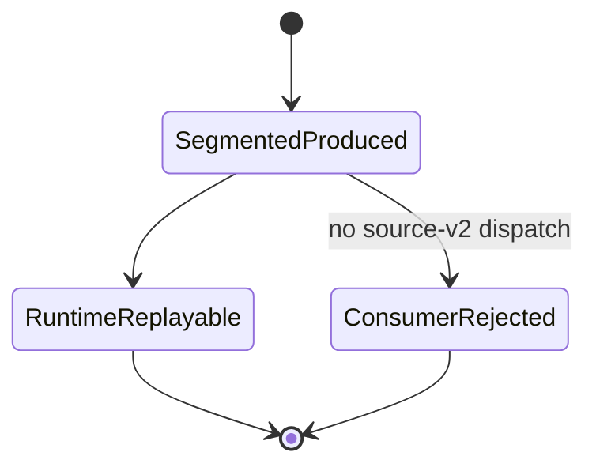
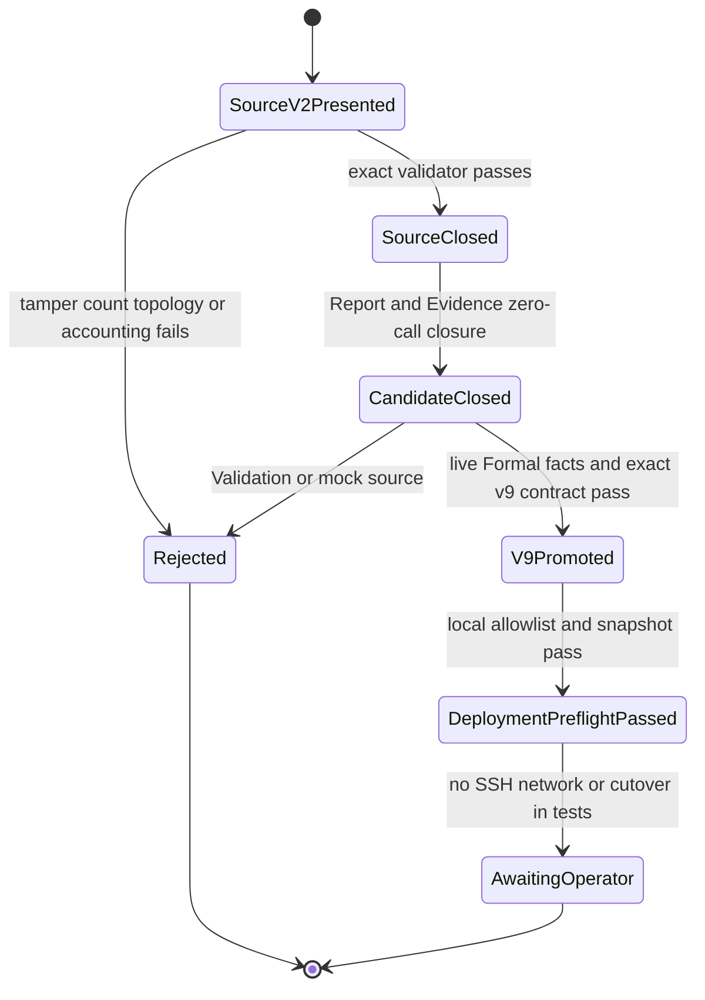
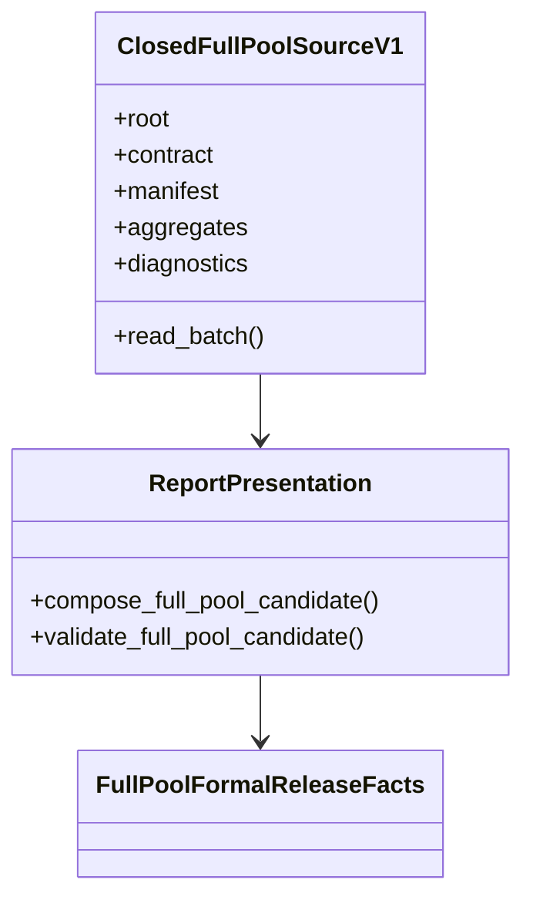
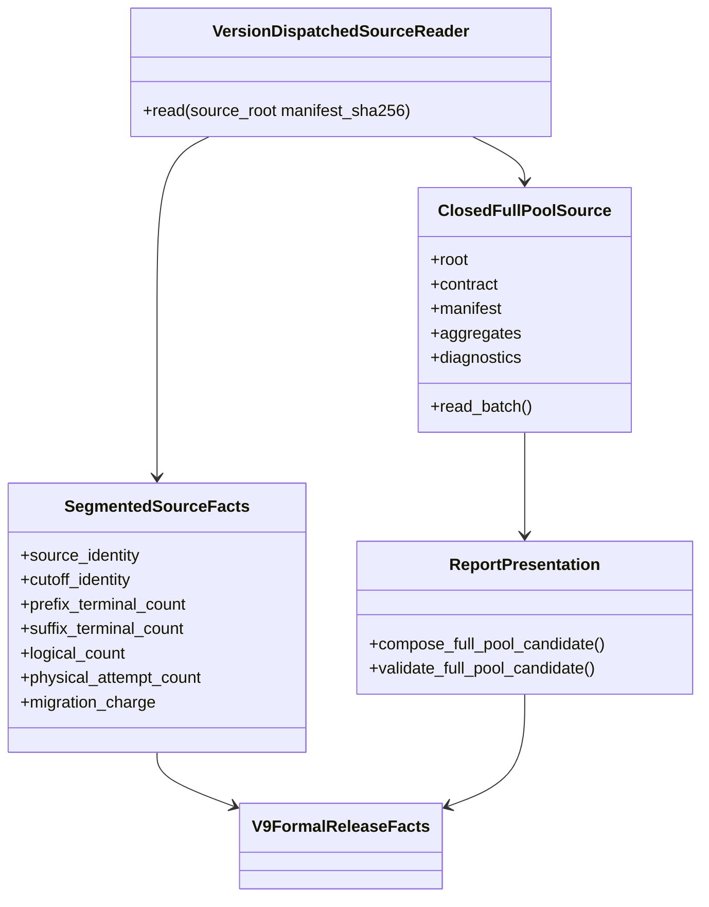

# Segmented Full-Pool source-v2 consumer and release v9

Status: implementation architecture note

This note records the local, offline consumer path for `full-pool-segmented-source-v2`. It does not claim that a live source exists and does not authorize Provider calls, SSH, public-network validation, or canonical cutover. The existing Full-Pool source-v1 and `abm-report-release-contract-v8` paths remain exact compatibility paths.

## Architecture and call relationships — current

## Architecture and call relationships — target

## Sequence — current

## Sequence — target

## State — current

## State — target

## Class and Interface structure — current

## Class and Interface structure — target

## Compatibility and ownership

- The segmented validator owns source-v2 row, accounting, cutoff, continuation identity, and artifact-hash knowledge.
- Report consumes the same closed-source Interface and only adds segmented method/lineage facts; it does not decide production eligibility.
- Evidence re-closes candidate bytes and typed segmented facts; Validation/mock classifications remain non-production.
- Release owns exact v9 eligibility, inventory, release identity, and promotion. v8 fields and dispatch are not widened.
- Deployment continues through the existing standalone validator and shell Seam. The only additive deployment change is the v9 schema allowlist and corresponding public-acceptance contract.
