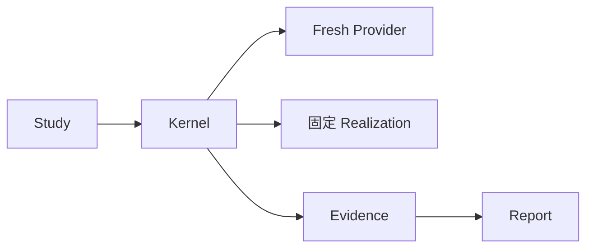
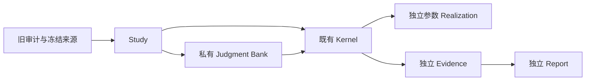
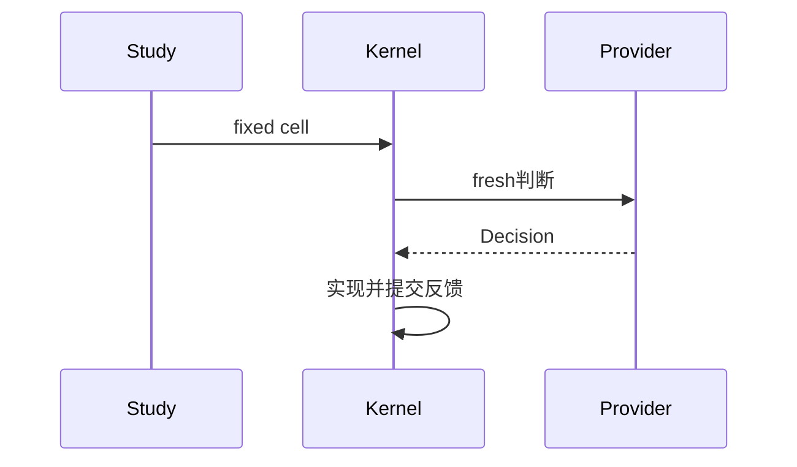
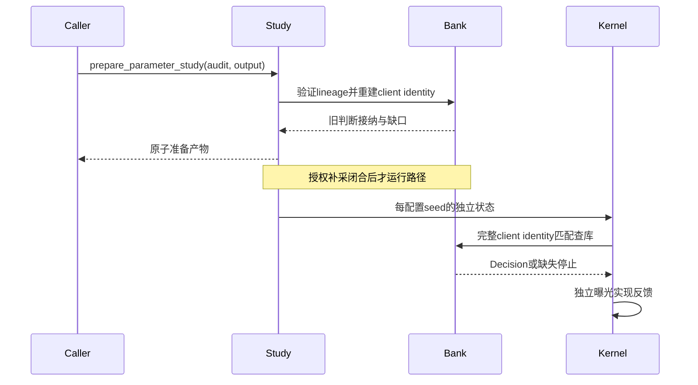
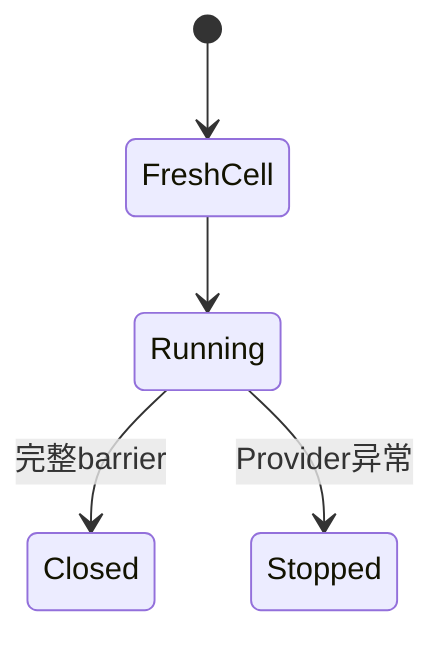
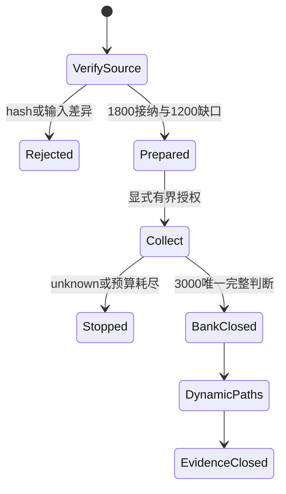
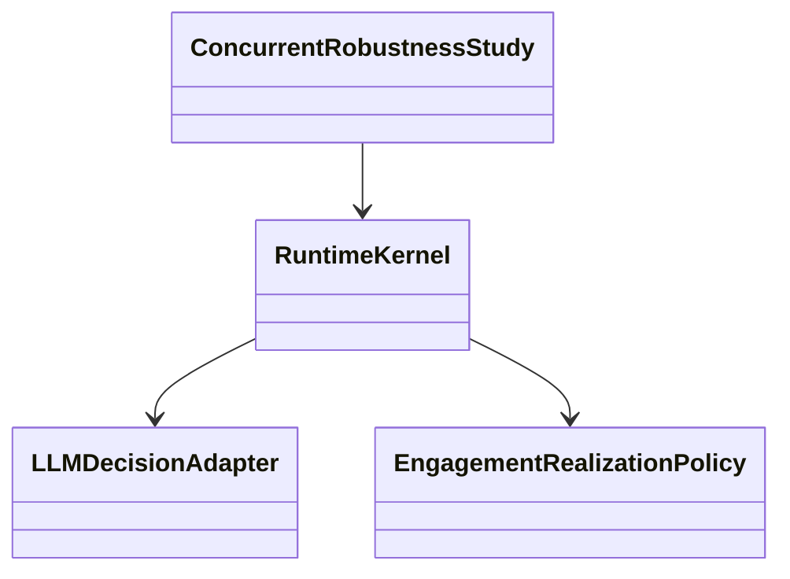
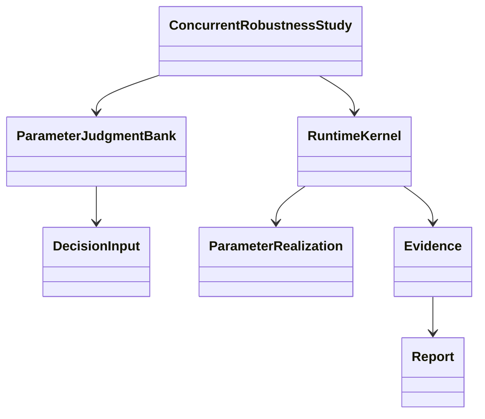

# GPT-P0 固定判断库参数研究

独立研究合同使用既有 ConcurrentRobustnessStudy 高层 Interface；旧 fresh/no-cache、exact topology 和固定 realization seed 合同不变。调用方不协调逐批调度。

## Module 与 Interface

Study 的 `prepare_parameter_study(audit_path, output_dir)` 离线验证显式审计/lineage，重建完整 universe 的客户端消息，对照旧记录，原子生成独立准备目录。无 Provider 参数或隐式 live 行为。审计路径必须匹配已核验 SHA；目标必须不存在，不写 source。输出 bank 的旧判断只引用不可变 origin，不修改旧 audit。准备产物含 manifest、3000 pair 的请求 fingerprint 清单、1800 accepted bank entries、1200 missing pairs 和哈希清单；不保存 raw Prompt/profile。

`_parameter_judgment_bank` Module 拥有输入身份、canonical JSON 和新库记录；复用既有 source closure、P0 profile/renderer、结构化 Decision。完整 client identity 与包含 time_step 的内部 DecisionInput hash分开，不偷用旧cache。全部pair检验0..29批的客户端渲染不变性，runtime仍在每次查库时检查实际完整client identity。接纳来源是用户最新决定而非修改旧审计。

后续 Study 的补采/运行 Interface 将由同一模块合同扩展；集成私有kernel的参数化排序与多seed realization，不建立另一通用调度器。准备目录不具有完整bank或Formal/release资格，直到补齐、校验和路径Evidence闭合。默认零Provider测试。

## 架构：当前

## 架构：目标

## 时序：当前

## 时序：目标

## 状态：当前

## 状态：目标

## 类：当前

## 类：目标

## 有界补采 Interface

`Study.collect_parameter_judgments(prepared_dir, client=...)` 由调用方拥有既有 Pi transport 生命周期，Study拥有 qualification、缺口选择、总预算、重试、resume和闭合。每次调用前持久化intent并fsync，每次响应后持久化settled；intent无结算或unknown永久停止，不自动重发。hash-linked账本和单writer锁阻止并发写入。每pair身份与client输入身份分开：不同用户可有相同LLM可见输入，但仍各有一个判断。

准备哈希及全部缺口input身份在发请求前核对；单次由既有PiOpenAIDecisionAdapter验证实际模型、usage、schema及256 completion ceiling。成功1200条后原子生成3000条closed-bank.jsonl及closure；库字节hash作为未来draw身份。qualification计费单列，不写为bank判断；未知费用保持null，名义已知小计不当成发票。收集过程不接受其他模型或改路由，默认测试注入离线client。caps固定1262/2/60/2/1，重启也不重置。

## 动态路径 Interface 与紧凑证据

`Study.run_parameter_study(bank_dir, output_dir, maximum_paths=None)` 固定21配置、100种子及每路径1800曝光；可选maximum_paths仅限制本次调用新增完整路径数，支持长任务smoke/resume，不改变总实验规模或合同。必须完整3000库才能开始，无Provider资源。

既有私有Kernel增加专用fixed_judgment_path入口，复用相同`_rank_message_candidates`和`_select_batch_candidates`；不另建调度器。该入口拥有独立exposed/positive集合、同批冻结及全批提交。私有ranking helper新增默认保持原值的weights/threshold与预计算静态fit参数，旧路径/manifest保持原合同。新路径不持久化大量未选择候选行，改存全部1800选择终态、30反馈barrier、精确参数和哈希；Evidence独立重算排名与反馈确认此紧凑证据足以还原路径。report不得仅因文件hash通过就宣称动态正确。

新draw明确以bank content hash＋seed＋user＋message绑定，不包含参数、时间步、文件路径或访问顺序。每次曝光仍重新核对完整client identity；任何缺失/漂移停止。旧固定seed与旧RealizationPolicy保持不变。

## Evidence / Report

`Study.report_parameter_study(bank_dir, output_dir)` 先核对2100路径清单及bank身份，再独立于Kernel排序/选择/提交helper逐批重算eligible排名、曝光、draw、实现和反馈，之后生成路径CSV、参数CSV、对比CSV、曲线CSV/静态SVG与HTML。统计以100个seed路径为单位，Student-t df99数值积分求临界值，普通与123均值校正区间同时保留；2pp实际意义界值与0.5pp普通区间半宽目标分开报告。所有表图同源闭合Evidence；Report只呈现，不运行Provider。

Kernel演化不必改变历史客户端输入：准备Module对renderer/transport完整文件仍用原hash检查；对包含新Kernel入口的文件，另从审计绑定历史commit取回原bytes核验hash，并逐个比较输入拥有者定义AST（message class、profile构造、sample准备）相等，随后仍核对全部1800旧输入hash和3000×30新输入不变性。旧审计不变，新runtime不伪称整文件与历史相同。
