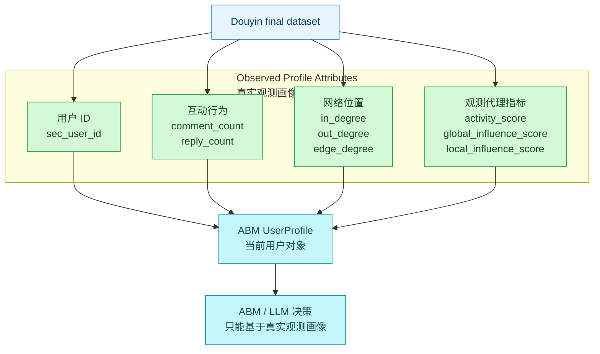
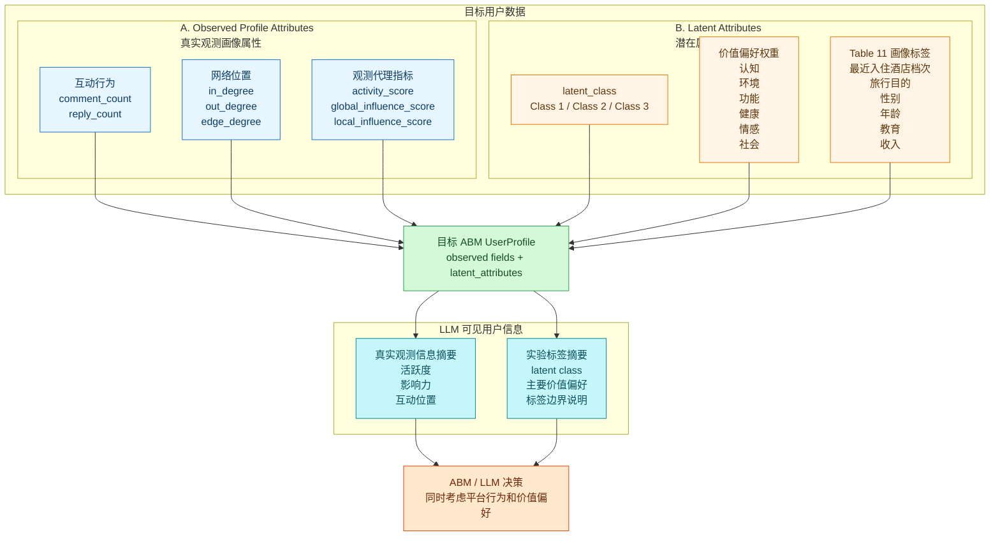

# Architecture Note: 锦江用户数据结构

Status: Architecture Note
Scope: Jinjiang Douyin final dataset profile model and target latent attributes boundary
Implementation status: target architecture documented; structured `UserProfile.latent_attributes` is not implemented
Related PRD: [`../prds/jinjiang-user-latent-attributes-v1.md`](../prds/jinjiang-user-latent-attributes-v1.md)
Related reference: [`../references/jinjiang-user-latent-attributes-reference-zh.md`](../references/jinjiang-user-latent-attributes-reference-zh.md)
Legacy source: `docs/04-开发验证/08-jinjiang-user-data-structure-diagrams.md`（已删除；迁移索引见 [`../04-开发验证/README.md`](../04-开发验证/README.md)）

## 核心理解

锦江用户数据的目标模型是：

```text
UserProfile = Observed Profile Attributes + Latent Attributes
```

这不是用虚拟标签替换真实数据，而是在 Douyin final dataset 的真实观测用户对象上增加一层可复现、可审计的仿真实验标签。

| 部分 | 中文名 | 含义 | 来源 | 用途 | 当前实现状态 |
|---|---|---|---|---|---|
| Observed Profile Attributes | 真实观测画像属性 | 用户在 Douyin 数据中真实出现过的行为和网络指标 | 锦江 Douyin final dataset | 表示用户是否活跃、是否有影响力、处在什么互动位置 | 已可作为 profile columns 进入 `UserProfile` |
| Latent Attributes | 潜在属性 / 虚拟实验标签 | 为仿真实验生成的 latent class、价值偏好权重和 Table 11 画像标签 | 锦江用户潜在属性研究先验 | 表示用户在实验中被设定为何种消费价值偏好类型 | 目标状态；当前没有结构化 `UserProfile.latent_attributes` contract |

当前代码状态要明确区分：

- `UserProfile` 允许保留额外 profile columns，因此 CSV 中未知字段可以留在 Pydantic `model_extra` 中。
- 这只是兼容性能力，不等于已经支持结构化 `latent_attributes`。
- 当前没有 latent attribute spec config、assignment engine、processed variant generator、latent attribute audit、`PostContent.value_dimensions` 或 rule-based latent score。
- 本 Architecture Note 只说明数据结构边界，不修改 Python runtime、loader、schema 或 rule-based decision 行为。

## 当前版本

当前版本只有真实观测画像属性。



当前版本可以表达：

- 用户在 Douyin 锦江语境中是否活跃。
- 用户是否处在互动网络中的中心位置。
- 用户是否具有评论获赞或连接关系体现的局部影响力代理。

当前版本不能表达：

- 用户对锦江酒店秸秆产品或相关绿色服务的价值偏好。
- 用户属于哪个实验 latent class。
- Table 11 中的酒店档次、出行目的、性别、年龄、教育、收入标签。

## 目标版本

目标版本把用户数据分为两部分：真实观测画像属性 + 潜在属性。



目标 `latent_attributes` contract 应至少表达：

```text
latent_attributes:
  spec_id: jinjiang_user_latent_attributes_v1
  method: latent_class_exact_quota_v1
  seed: <integer>
  latent_class: class_1 | class_2 | class_3
  environmental_consciousness_coef: <float>
  value_weights:
    epistemic: <float>
    environmental: <float>
    functional: <float>
    health: <float>
    emotional: <float>
    social: <float>
  class_profile:
    hotel_class: <label>
    travel_purpose: <label>
    gender: <label>
    age: <label>
    education: <label>
    monthly_income: <label>
```

CSV processed variants may flatten these as `latent_` columns, but the runtime contract should not rely on untyped extra columns forever. The target loader boundary should parse known `latent_` columns into structured `UserProfile.latent_attributes` while keeping backward compatibility with existing profile files that only contain observed attributes.

## LLM 视角

LLM 版本和用户数据结构一致，也分成两部分。

| LLM 看到的部分 | 内容 | 注意 |
|---|---|---|
| Observed Profile Attributes | 用户活跃度、互动网络位置、影响力代理指标 | 来自 Douyin 数据，可以描述为观测到的行为和网络代理指标 |
| Latent Attributes | latent class、价值偏好摘要、最近入住锦江酒店类型等 | 是仿真实验设定，不能描述为真实用户身份或真实人口属性 |

示例：

```text
真实观测信息：
该用户在锦江相关评论数据中有一定互动记录，activity_score 较高，处在一定互动网络位置。

新增实验标签解释：
该用户在本次仿真实验中属于 Class 1。
在锦江酒店秸秆产品语境下，该类用户相对更重视环境价值和健康价值。
这些标签是实验设定，不代表真实 Douyin 用户画像。
```

Provider-backed LLM prompt 后续如需接入 latent attributes，应优先使用 compact summary，避免把 raw coefficients、完整 Table 11 标签和本地来源路径直接塞入 prompt。

## Table 11 使用边界

Table 11 profile labels 第一版用于分组分析、审计和结果解释，不直接等同真实人口属性。

- `latent_hotel_class` 和 `latent_travel_purpose` 表示实验标签中的最近入住锦江酒店档次与出行目的，不代表 Douyin final dataset 真实观测字段。
- `latent_gender`、`latent_age`、`latent_education`、`latent_monthly_income` 是 class membership profile 标签，不代表对 Douyin 用户真实身份的推断。
- 第一版 rule-based probability 不应直接使用 Table 11 profile labels；如果后续要让它们影响决策，需要新的 PRD、测试和伦理边界说明。
- 价值偏好权重只适用于锦江酒店秸秆产品或相关绿色服务语境，不应泛化为用户整体人格或长期消费观。

## 相关文档

- PRD：[`../prds/jinjiang-user-latent-attributes-v1.md`](../prds/jinjiang-user-latent-attributes-v1.md)
- Reference：[`../references/jinjiang-user-latent-attributes-reference-zh.md`](../references/jinjiang-user-latent-attributes-reference-zh.md)
- 最终数据集审计：[`../references/jinjiang-final-dataset-audit-20260624.md`](../references/jinjiang-final-dataset-audit-20260624.md)
- 旧入口：`docs/04-开发验证/08-jinjiang-user-data-structure-diagrams.md`（已删除；迁移索引见 [`../04-开发验证/README.md`](../04-开发验证/README.md)）
