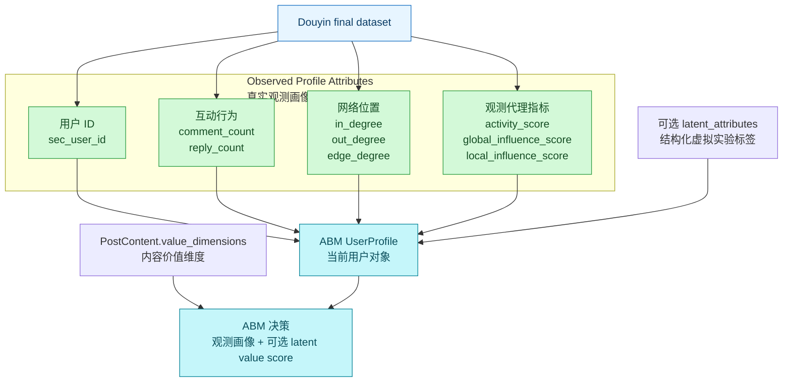
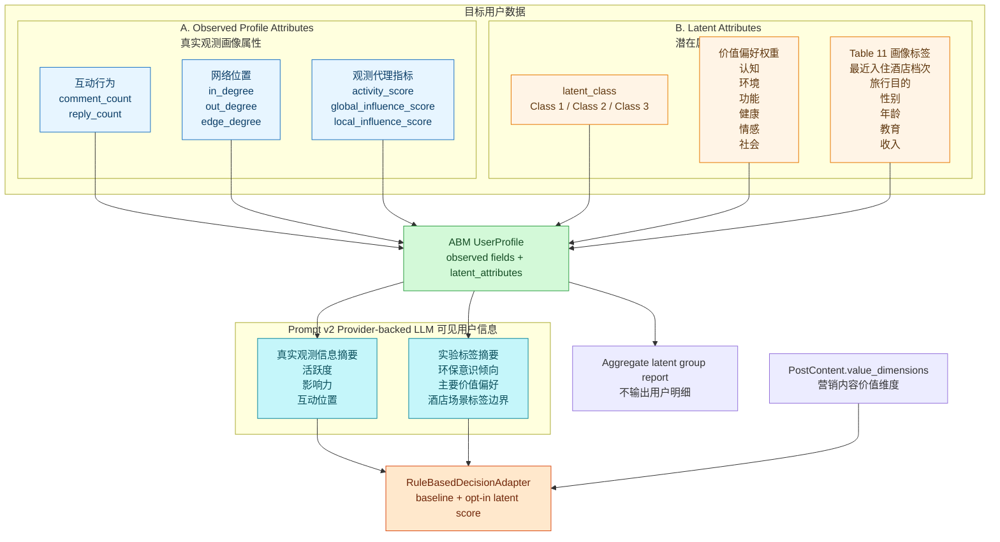

# Architecture Note: 锦江用户数据结构

Status: Architecture Note
Scope: Jinjiang Douyin final dataset profile model and implemented latent attributes boundary
实现状态：`UserProfile.latent_attributes`、processed variant generation、rule-based latent score、Prompt v2 summary/provider boundary、mocked provider E2E 和 aggregate latent group reporting 均已实现
相关 PRD：[`../prds/jinjiang-user-latent-attributes-v1.md`](../prds/jinjiang-user-latent-attributes-v1.md)
相关 Prompt v2 PRD：[`../prds/jinjiang-abm-profile-contract-and-llm-prompt-v2.md`](../prds/jinjiang-abm-profile-contract-and-llm-prompt-v2.md)
相关 reference：[`../references/jinjiang-user-latent-attributes-reference-zh.md`](../references/jinjiang-user-latent-attributes-reference-zh.md)
Prompt v2 mocked 验收：[`../references/jinjiang-prompt-v2-mock-validation-20260708.md`](../references/jinjiang-prompt-v2-mock-validation-20260708.md)
Final dataset 验收：[`../references/jinjiang-final-dataset-latent-v1-validation-20260705.md`](../references/jinjiang-final-dataset-latent-v1-validation-20260705.md)
Legacy source: `docs/04-开发验证/08-jinjiang-user-data-structure-diagrams.md`（已删除；迁移索引见 [`../04-开发验证/README.md`](../04-开发验证/README.md)）

## 核心理解

锦江用户数据的目标模型是：

```text
UserProfile = Observed Profile Attributes + Latent Attributes
```

这不是用虚拟标签替换真实数据，而是在 Douyin final dataset 的真实观测用户对象上增加一层可复现、可审计的仿真实验标签。

| 部分 | 中文名 | 含义 | 来源 | 用途 | 当前实现状态 |
|---|---|---|---|---|---|
| Observed Profile Attributes | 真实观测画像属性 | 用户在 Douyin 数据中真实出现过的行为和网络指标 | 锦江 Douyin final dataset | 表示用户是否活跃、是否有影响力、处在什么互动位置 | 已可作为 profile columns 进入 `UserProfile` |
| Latent Attributes | 潜在属性 / 虚拟实验标签 | 为仿真实验生成的 latent class、价值偏好权重和 Table 11 画像标签 | 结构化 spec；数值来自锦江用户潜在属性研究先验 | 表示用户在实验中被设定为何种消费价值偏好类型 | 已作为结构化 `UserProfile.latent_attributes` contract 接入 runtime |

当前代码状态要明确区分：

- `UserProfile` 仍允许保留额外 profile columns，因此未建模的可观测 CSV 字段可以留在 Pydantic `model_extra` 中。
- 已知 `latent_` 扁平字段不再只作为 unknown extra columns 保留，而是由 `graph_loader` 解析为结构化 `UserProfile.latent_attributes`。
- `src/llm_abm_sim/data_sources/latent_attributes.py` 是离线 latent assignment seam，负责 spec schema、配额分配、spec snapshot 和 aggregate audit。
- `src/llm_abm_sim/data_sources/latent_processed_variant.py` 与 `scripts/generate_jinjiang_latent_attributes.py` 是 processed variant Adapter，不触发 TikHub / Douyin live collection。
- `PostContent.value_dimensions` 是 runtime post content contract；缺省全 0，兼容旧配置。
- `RuleBasedDecisionAdapter` 只消费 `UserProfile.latent_attributes` 和 `PostContent.value_dimensions`，不读取 spec 或 audit 文件。
- Reporting 只输出 aggregate group metrics，不展示用户级 latent 明细。

## 当前版本

当前版本已经支持真实观测画像属性和可选 latent attributes。没有 latent-v1 字段的旧 profile 文件仍按真实观测画像属性加载；包含完整 `latent_` 字段的 profile 文件会解析成结构化 runtime contract。



当前版本可以表达：

- 用户在 Douyin 锦江语境中是否活跃。
- 用户是否处在互动网络中的中心位置。
- 用户是否具有评论获赞或连接关系体现的局部影响力代理。
- 用户在一次指定 latent-v1 实验中的 `latent_class`、6 个消费价值权重和 Table 11 profile labels。
- 营销内容突出哪些消费价值维度，以及这些维度与用户 latent weights 的 opt-in rule-based 匹配分数。

当前版本不能表达：

- Douyin 用户真实人口属性、真实心理画像或第三方认证标签。
- 36,400 用户全量真实 provider-backed LLM 批量决策；当前 Prompt v2 已完成 compact summary、provider contract 和 mocked provider E2E，但 live provider 批量实验需要单独授权。
- Table 11 profile labels 对 rule-based probability 的直接影响；这些标签只用于审计、分组分析和结果解释。

## 实现版本

实现版本把用户数据分为两部分：真实观测画像属性 + 潜在属性。



`latent_attributes` runtime contract 表达：

```text
latent_attributes:
  spec_id: jinjiang_user_latent_attributes_v1
  method: latent_class_exact_quota_v1
  seed: <integer>
  latent_class: class_1 | class_2 | class_3
  environmental_consciousness_coef: <float>
  value_weights:
    epistemic: <float>
    environmental: <float>
    functional: <float>
    health: <float>
    emotional: <float>
    social: <float>
  profile_labels:
    hotel_class: <label>
    travel_purpose: <label>
    gender: <label>
    age: <label>
    education: <label>
    monthly_income: <label>
```

CSV processed variants flatten these as `latent_` columns. Loader boundary parses known complete `latent_` columns into structured `UserProfile.latent_attributes` while keeping backward compatibility with existing profile files that only contain observed attributes. Runtime schema also accepts `class_profile` as an input alias, but serialized runtime objects use `profile_labels`.

## 模块职责

| Module / Interface | 职责 | 不负责 |
|---|---|---|
| `configs/latent_attributes/jinjiang_user_latent_attributes_v1.yaml` | 保存 class probability、value weights 和 Table 11 profile distributions | 动态解析研究参考文档 |
| `src/llm_abm_sim/data_sources/latent_attributes.py` | 离线 assignment seam：spec 校验、最大余数配额、稳定 seed 分配、assignment CSV、aggregate audit 和 spec snapshot | 读取 TikHub / Douyin live API、读取 `.env`、输出用户自由文本明细 |
| `src/llm_abm_sim/data_sources/latent_processed_variant.py` | processed variant Adapter：复制 source processed run，向 `users.csv`、`profiles.csv`、`abm_user_profiles.csv` 合并 `latent_` 字段，写 README/audit | 覆盖 source run、删除历史数据、改变 collector 主流程 |
| `scripts/generate_jinjiang_latent_attributes.py` | CLI 入口：把 spec、source processed dir、output run id 和 seed 绑定到 processed variant generator | 长期持有业务逻辑 |
| `UserProfile.latent_attributes` | runtime profile contract：`spec_id`、`method`、`seed`、`latent_class`、`environmental_consciousness_coef`、`value_weights`、`profile_labels` | 保留原始 CSV 扁平字段作为决策接口 |
| `PostContent.value_dimensions` | runtime post content contract：声明营销内容突出哪些消费价值维度 | 推断用户画像 |
| `RuleBasedDecisionAdapter` | 消费 runtime contracts，按 `latent_value_weight` 显式启用 value score | 读取 spec/audit 文件；使用 Table 11 profile labels 直接改 probability |
| `report_payload` / HTML report | 输出 aggregate latent group metrics 和边界说明 | 展示 nickname、bio、signature、raw payload 或用户级 latent 明细 |

## Prompt v2 LLM 视角

Provider-backed LLM prompt 已通过 `Prompt Field Summary` 接缝接入真实观测画像摘要和有限的合成实验标签摘要。LLM 可见信息和用户数据结构保持一致，分成两部分。

| LLM 看到的部分 | 内容 | 注意 |
|---|---|---|
| Historical Behavioral Evidence / Observed Profile Attributes | `interest_tags` 历史主题代理、活跃度、全平台影响力、锦江酒店社群内的局部影响力 | `interest_tags` 来自历史 hashtags/文本主题派生，不是真实心理画像；其余分数也是可观测代理指标 |
| Latent Attributes | 环保意识倾向、前三个秸秆制品相关价值、最近入住锦江酒店类型、出游目的 | 是仿真实验设定，不能描述为真实用户身份或真实人口属性 |

示例：

```text
【用户可观测特征】
活跃度：中等偏高（0.65）
全平台影响力：较低（0.21）
锦江酒店社群内的局部影响力：中等（0.48）
历史 hashtags 与文本主题派生的兴趣代理：绿色消费、酒店、旅行（不代表真实心理画像）

【用户消费偏好】
环保意识倾向：较强（1.037）
最看重的秸秆制品相关价值：环保价值、健康价值、社会/责任价值
最近一次入住锦江旗下酒店类型：中端酒店
最近一次入住锦江旗下酒店目的：休闲出行
```

Prompt v2 不向 LLM 暴露 `latent_class` 用户类型名称，也默认不暴露性别、年龄、教育、收入。9 个观测分量字段只用于审计和解释，不作为默认 prompt 输入或直接决策变量。`environmental_consciousness` 表示用户整体环保意识倾向；`environmental value` 表示用户是否把“锦江使用秸秆制品”感知为有环保消费价值，两者在 prompt builder 中保持区分。

## Table 11 使用边界

Table 11 profile labels 第一版用于分组分析、审计和结果解释，不直接等同真实人口属性。

- `latent_hotel_class` 和 `latent_travel_purpose` 表示实验标签中的最近入住锦江酒店档次与出行目的，不代表 Douyin final dataset 真实观测字段。
- `latent_gender`、`latent_age`、`latent_education`、`latent_monthly_income` 是 class membership profile 标签，不代表对 Douyin 用户真实身份的推断。
- 第一版 rule-based probability 不应直接使用 Table 11 profile labels；如果后续要让它们影响决策，需要新的 PRD、测试和伦理边界说明。
- 价值偏好权重只适用于锦江酒店秸秆产品或相关绿色服务语境，不应泛化为用户整体人格或长期消费观。

## 相关文档

- PRD：[`../prds/jinjiang-user-latent-attributes-v1.md`](../prds/jinjiang-user-latent-attributes-v1.md)
- Prompt v2 PRD：[`../prds/jinjiang-abm-profile-contract-and-llm-prompt-v2.md`](../prds/jinjiang-abm-profile-contract-and-llm-prompt-v2.md)
- Reference：[`../references/jinjiang-user-latent-attributes-reference-zh.md`](../references/jinjiang-user-latent-attributes-reference-zh.md)
- Prompt v2 mocked provider 验收：[`../references/jinjiang-prompt-v2-mock-validation-20260708.md`](../references/jinjiang-prompt-v2-mock-validation-20260708.md)
- 最终数据集审计：[`../references/jinjiang-final-dataset-audit-20260624.md`](../references/jinjiang-final-dataset-audit-20260624.md)
- Final dataset latent-v1 验收：[`../references/jinjiang-final-dataset-latent-v1-validation-20260705.md`](../references/jinjiang-final-dataset-latent-v1-validation-20260705.md)
- 旧入口：`docs/04-开发验证/08-jinjiang-user-data-structure-diagrams.md`（已删除；迁移索引见 [`../04-开发验证/README.md`](../04-开发验证/README.md)）
