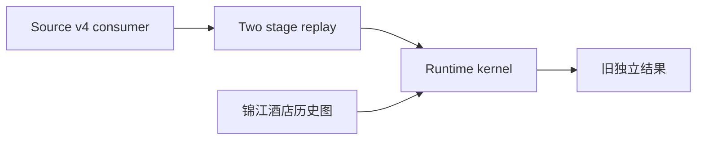
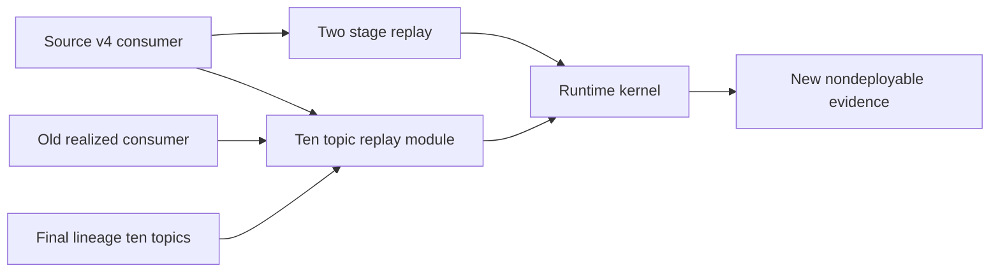
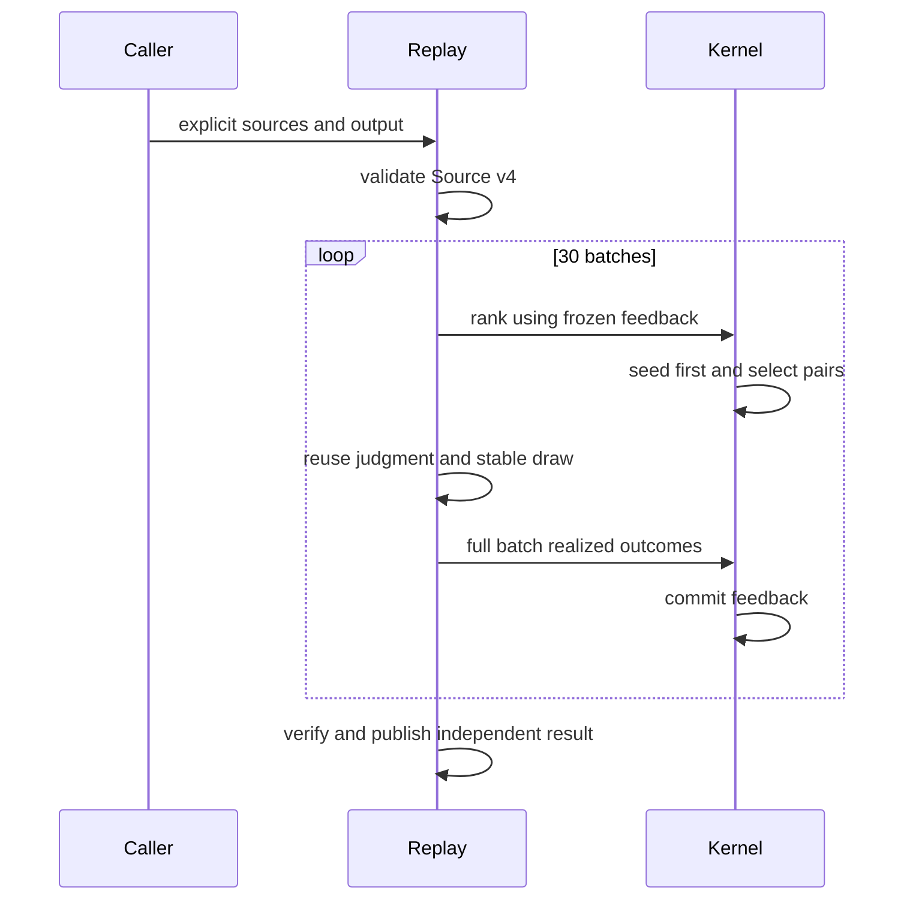
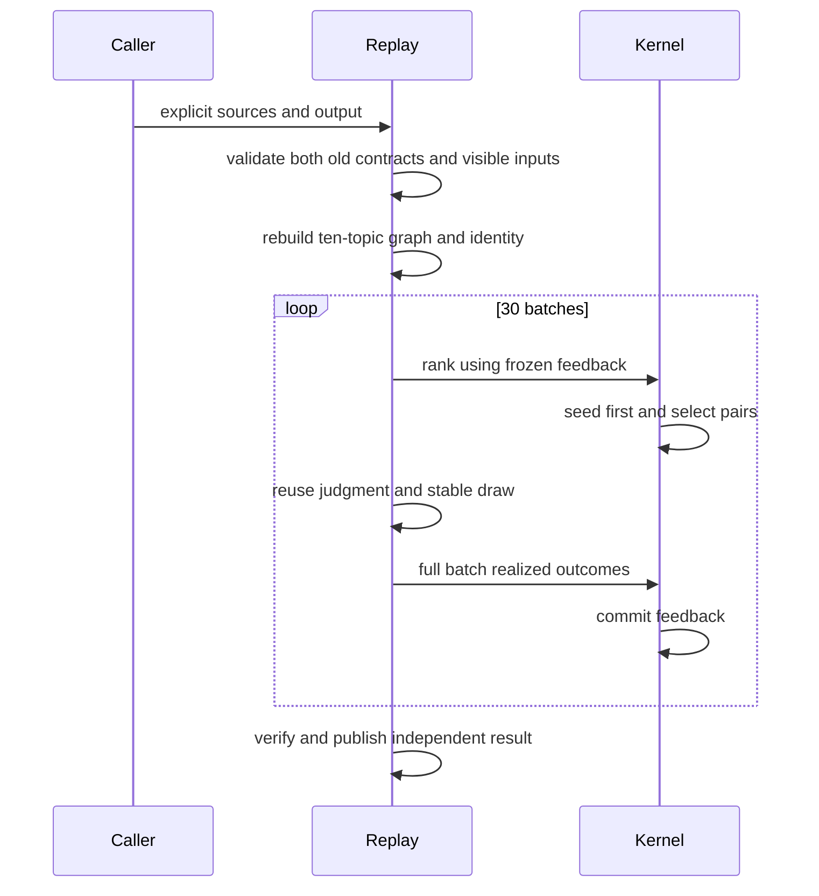
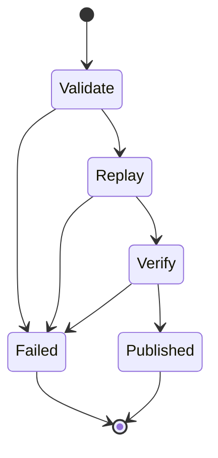
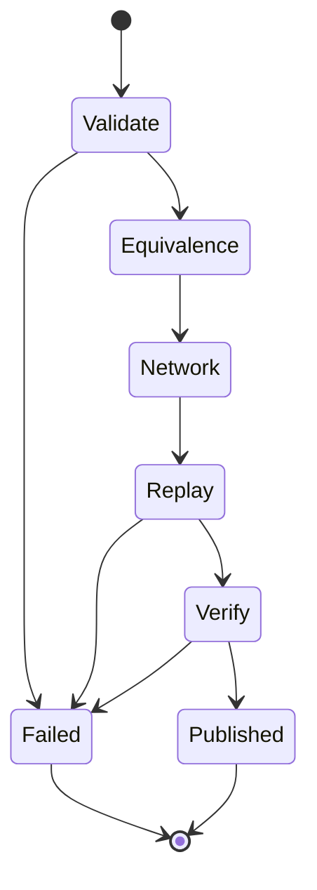
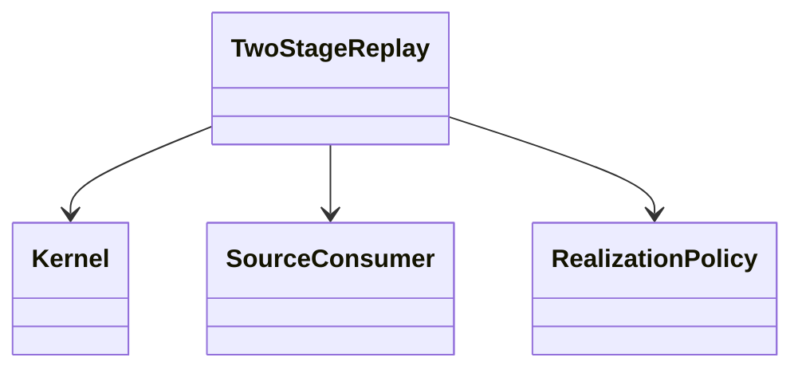
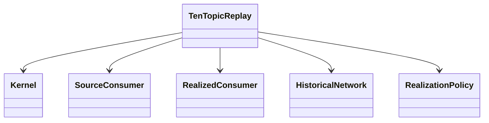

# 十话题全样本离线重放：合同与设计

本轮正式执行仅 Whole sample；当前 runtime、推荐度数归一化、反馈邻居与种子邻居补选默认使用最终实际采集话题合并网络。参数/指标/四模型研究本轮只做输入审计，不执行路径。新增独立 `full-pool-ten-topic-network-replay-v1` 产物，不晋升旧 two-stage schema，不调用 Provider、不发布 canonical。旧 Source-v4 和 realized consumer 原样执行；新 Module 拥有十话题 lineage、可见输入等价、原 draw 校验、网络身份、逐候选重算与对照。Kernel 仍拥有排序、种子和批次 barrier。用户指标与 membership 保持旧计算结果。

调用方提供显式旧判断源、旧实现源、final dataset 与独立 output；失败不发布闭合结果。

## architecture / current

## architecture / target

## sequence / current

## sequence / target

## state / current

## state / target

## class / current

## class / target

## 新旧合同

`network_scope=final_collected_topics` 是新配置默认值，仅指输入 final dataset 实际纳入的采集话题。十话题范围由 final `scope_change_audit.json` 的 corrected 名单与 `videos.csv` 实际 topic ID/name 对齐，不采用早期候选表。历史已持久化合同缺省字段明确重建为 `legacy_target_topic`；旧 schema/bytes 不追溯修改。保留该枚举只服务历史接纳与对照。新结果 schema `full-pool-ten-topic-network-replay-v1` 默认不可部署，不能冒充旧 two-stage 正式源。

旧源 consumer 完整校验后，重建每个 user/message 的 P0 客户端完整消息，对照 persisted profile/neutral peer 与 frozen marketing message。109,200 个 pair 的旧判断、旧抽样均闭合才启动；抽样仍绑定原 Source-v4 identity、user_id、message_id 和 20260823，而不是新网络/run。新 replay identity 同时绑定新网络 hash 与旧两源 identity。

推荐图使用历史一级评论→作者、回复→父评论作者、mention 关系：无向合并，排除空ID/自环，同一互动来源重复关系累计权重；comment_id 去重和历史 holdout 规则复用既有 loader。P95 分母是全部 eligible users，含零度用户；邻居集合去重，推荐度数累计权重。Local Influence 的 degree 本来来自同一全话题历史图；其 P95 与获赞项、Activity、Global 及 latent labels 均不改变。旧内部 `target_scope_*` 字段为兼容的信号槽名称，不表示新图仍受单话题限制。

每批三条 message 都只看批前冻结 campaign-level realized-positive 用户。逐 message 用户最多曝光一次；先强制 seeds，再按完整精度排序与 user_id 升序 tie break 填充。批后才提交正向用户并集。验证重新计算全部 candidate row、selection、逐对抽样和 projection。

## 后续同步清单（本轮不发布）

论文方法中的网络定义、1000人样本构建、网络 P95/source provenance、旧新研究身份；全样本传播曲线/终点表及逐对追踪；参数/指标/四模型研究新图与样本条件；canonical 研究导航、机制图、evidence 和 CSV/JSON/workbook 下载。先按审计缺口确定新判断范围，再授权模型预算与正式实验，最后独立 release，不覆盖历史证据。
