# Multi-Message Editorial UI Design Reference

- 生成日期：2026-07-29
- 生成工具：`openai_imagegen`，`gpt-image-2`
- 目标：Multi-Message 双模式研究报告的 image-first desktop 视觉与交互设计证据
- 状态：Design Reference only；renderer 尚未实现，未发布、未部署
- 画布：全部 `1536 × 1024` PNG
- Accepted set：11 张 desktop section/drawer references + 5 张 text-free mechanism media sources

## 使用规则

这些图片不是截图 golden，也不是 persisted research evidence。它们的职责分为三层：

1. `mechanism-*-desktop.png` 与 `run-*-desktop.png` 约束 section 的信息层级、grid、typography、spacing、controls、color 和 media framing。
2. `trace-drawer-desktop.png` 约束 drawer 的宽度、首屏优先级、tabs 与 modal treatment。
3. `media-mechanism-*.png` 是五个 mechanism anchors 的 text-free production media source。后续实现从它们生成受控 WebP derivatives，由 semantic HTML 提供精确 labels、hotspots、legend、alt text 和双语 copy。

Persisted payload、Spec 和现有 Formal artifact 是术语、数值、authoritative message、Decision reason 与研究语义的 source of truth。图片中的排版性缩写和 message topic preview 不能覆盖这些 source。若图片与 Spec 或 persisted payload 冲突，以后两者为准；实现不得照抄冲突内容。

全局 shell 的 preferred source 是 mechanism refs 的一行 header 与 `run-sample-desktop.png` 的 run-state header：brand、五 anchors、mode switch、language switch 在 desktop 保持单行。部分 section generation 的 header label 或两行 arrangement 只保留 anchor-state 参考，不是全局 shell 合同。实现不得显示字面量 `active`，也不得改名五个 anchors。

## Accepted Manifest

| Reference ID | `(mode, anchor/state)` mapping | SHA-256 |
| --- | --- | --- |
| `mechanism-overview-desktop.png` | `(mechanism, overview)` | `9546c5ea4497d6843b11ef9955e05665e8ae49989c4963df3462211835aba5ad` |
| `mechanism-sample-desktop.png` | `(mechanism, sample)` | `0140dac5eb9086ce3bc715c27ea9c58151827e2844d9e80a9ca99dd70d3851ac` |
| `mechanism-exposure-ranking-desktop.png` | `(mechanism, exposure-ranking)` | `943dc0b9906eacb532ae3620481affe9cf526636668e7086a21e0971eb46761d` |
| `mechanism-llm-decision-desktop.png` | `(mechanism, llm-decision)` | `d030cb06cd7f71dad26ae066f2862b7dfd6848900a619e8e95841c07d41cbe55` |
| `mechanism-network-feedback-desktop.png` | `(mechanism, network-feedback)` | `9c93ea008ef7521f07cbe8ddeab03a8699ffc728edab09bd4126eca2788770f2` |
| `run-overview-desktop.png` | `(run, overview)` | `c0e1e9e0fd945ec8cc93461bd9ca0713d9b11eaf9e69b0ec886bbb8b2c172920` |
| `run-sample-desktop.png` | `(run, sample)` | `c4933494559a3c8fe4e55589b2de56cbaf03067ae6a4f2e6497f466a91ec523d` |
| `run-exposure-ranking-desktop.png` | `(run, exposure-ranking)` | `0ef85b88064e3b41b69db9dc7adac058b531369d0071b08f87333babaeeb5ef9` |
| `run-llm-decision-desktop.png` | `(run, llm-decision)` | `7777666ab39e79583ecf9de409d69e2c62a52e18095f7522fcb0768bce8b9de9` |
| `run-network-feedback-desktop.png` | `(run, network-feedback)` | `bfcdcbae6fad6b3ddee7420751fe454174e529ffee5c40c0081ddc1031fcd4c5` |
| `trace-drawer-desktop.png` | `(run, llm-decision, trace-drawer-open/summary-tab)` | `0a46c0cbc80f788e6e20d7fc45920aa2a694da6b0435b29f208d972a402b843a` |
| `media-mechanism-overview.png` | production source for `(mechanism, overview)` | `fe2843b01e9249c435253f720a9b95d5494726590f7062ea6a355131169308f5` |
| `media-mechanism-sample.png` | production source for `(mechanism, sample)` | `add302631c30897badefe1187f2fadf355c6381e90bef186e55555cbdc1f5cff` |
| `media-mechanism-exposure-ranking.png` | production source for `(mechanism, exposure-ranking)` | `7a17cb52deb1a6a681708a9ffa164ccb08ab31011f8da9e3a90229045b4e6984` |
| `media-mechanism-llm-decision.png` | production source for `(mechanism, llm-decision)` | `1503d4669da9b6d844cb9f674b89b19143a56ff9e8c8132437f4218276a4a337` |
| `media-mechanism-network-feedback.png` | production source for `(mechanism, network-feedback)` | `c136cb0ca5f7cd231f95f7e7c74f6fb3e1ed3ce465fb822ae7e603c41956a951` |

## Editorial Candidate Asset Derivatives

Ticket #118 adds five renderer-private, versioned derivatives from the committed text-free media sources. The source mapping remains explicit in the candidate asset catalog, while package data includes the derivatives through `report_assets/*.webp`.

| Asset key | Source | Versioned derivative | Derivative SHA-256 |
| --- | --- | --- | --- |
| `overview` | `media-mechanism-overview.png` | `editorial-mechanism-overview-v1.webp` | `1ba062f0c8b1dea458c63f4b2eaa1a5c605e7c164051212330cab51c3c6b3806` |
| `sample` | `media-mechanism-sample.png` | `editorial-mechanism-sample-v1.webp` | `d6738cae46fd3925af4f5d4375d978c0e170afd1435b16f0ad0baba4e8a598f8` |
| `exposure-ranking` | `media-mechanism-exposure-ranking.png` | `editorial-mechanism-exposure-ranking-v1.webp` | `76a8361b5ad8e0448275d1b69815408ddac0463bef21f4f4677fbc8e7fd68613` |
| `llm-decision` | `media-mechanism-llm-decision.png` | `editorial-mechanism-llm-decision-v1.webp` | `52f7f62b0a0969055c21fe46fb88ba158664c3e7aeb42ec2ba69db3c5bad4828` |
| `network-feedback` | `media-mechanism-network-feedback.png` | `editorial-mechanism-network-feedback-v1.webp` | `3b15835acc900c446d72636638fcd884159ba0d1103bf014c90587b5cd4e8f37` |

The five existing `multi-message-mechanism-*.webp` compatibility assets remain byte-identical and are owned by the frozen compatibility renderer. The candidate embeds only the new versioned derivatives as data URIs; it does not add a runtime fetch or external media request.

## Visual System

### Typography

- 使用本地 system sans stack；中文优先 `PingFang SC` / `Microsoft YaHei` / system UI，英文和数字使用同一 stack。不得增加外部字体请求。
- Brand：约 18–22px / 600；anchor 与 controls：约 15–18px / 500–600。
- Eyebrow：约 14–16px / 600，以 green 区分 mechanism lineage，而不是做装饰 label。
- Section H1：约 34–44px / 650，desktop 最多两行；不使用 landing-page hero 级字号。
- Lead：约 17–20px，行高 1.55–1.7；正文约 14–17px。
- Metric：约 32–42px / 650；必须紧邻单位或 denominator。
- Table、filter、pagination：约 13–15px；技术字段、formula 与 precision values 可使用本地 monospace stack。
- Letter spacing 固定为 `0`；不随 viewport width 缩放字体。

### Spacing And Grid

- Desktop page inner width 约 1,240–1,320px；左右 gutter 约 24–40px。
- Sticky header 约 64–72px，单行；header border 与 active underline 是主要定位信号。
- Section 使用开放 band 和水平 rule，不把整个 section 包成 floating card。
- 推荐 spacing scale：`4 / 8 / 12 / 16 / 24 / 32 / 48 / 64 / 96`。
- H1 与 summary strip 间约 32–48px；section 内 major evidence groups 间约 32–56px。
- Repeated evidence item 可以有 `0–6px` radius 的轻 frame；禁止 card-inside-card。
- Tables 使用稳定列宽、thin row rules 和紧凑 vertical padding。工具行、table 与 pagination 不能改变 section width。

### Color

Reference 使用近似语义 palette；实现应通过 CSS variables 固定，而不是逐图取色：

| Role | Suggested value | Use |
| --- | --- | --- |
| Paper | `#FFFFFF` | 主背景 |
| Cool paper | `#F5F7FA` | table/tool/drawer 次级平面 |
| Ink | `#081A3A` | 标题与正文 |
| Muted | `#667085` | 次级 labels 与 source notes |
| Rule | `#D7DEE8` | section/table/control border |
| Cobalt | `#0B57D0` | active navigation、message/exposure、focus |
| Signal green | `#087A55` | sample/network/provider success/feedback |
| Amber | `#C86F00` | caveat、stop path、descriptive-only boundary |
| Backdrop | `rgba(8, 26, 58, .58)` | modal drawer overlay |

- 禁止 gradients、glass、purple-blue wash、beige/brown dominant palette 和无语义 decoration。
- Cobalt、green、amber 必须与 label/icon/pattern 共同表达含义；颜色不是唯一 carrier。

### Controls

- 五 anchors 使用 text navigation + underline；mode 使用 two-tab segmented control；language 使用 `中文 / English` compact text control。
- Mode 与 language 是真正的 controls，不使用不可交互 badge 或假 pill。
- Message、batch、page size 等 option set 使用 native/select-style menus 或 segmented controls；binary only 使用 checkbox/toggle。
- Trace filters 保持一行 desktop toolbar；最长 label 不能把 input 挤成不可用窄列。
- Pagination 使用首尾、当前附近和省略号。Default `25`，可选 `25/50/100`。
- Unfamiliar icons 必须有 tooltip 和 accessible name；关闭使用 X icon，previous/next 使用 chevrons。

## Section Analysis

### Mechanism Overview

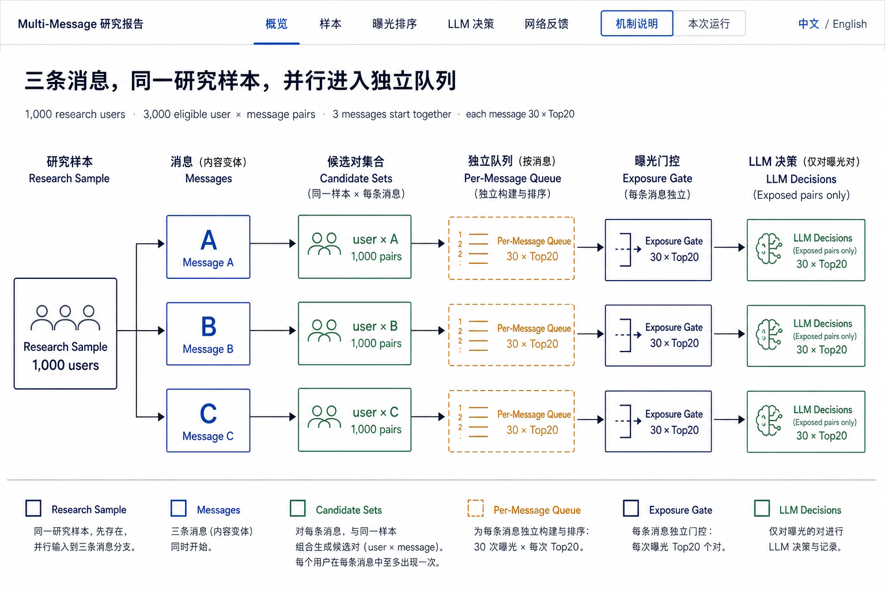

- Layout：稳定 facts 紧随标题，主体是严格 left-to-right 的 Research Sample → Messages → three candidate sets → independent queues → exposure gates → exposed-pair Decisions。
- Reading order：同一个 1,000-user sample 先存在，再分别与 A/B/C 组合；queue 不创建 sample。
- Media frame：`media-mechanism-overview.png` 适合置于开放的 16:9-ish figure band，周围由 HTML 加 labels/hotspots。
- Desktop behavior：主流程宽度足够时保持六列；不能缩成含不可读标注的 thumbnail。较窄 desktop 可以将 stable facts 与 figure 分两行。
- Boundary：3,000 是 eligible pairs，不是 exposures；`30 × Top20` 是每条 message 的稳定容量，不是共享 quota。

### Mechanism Sample

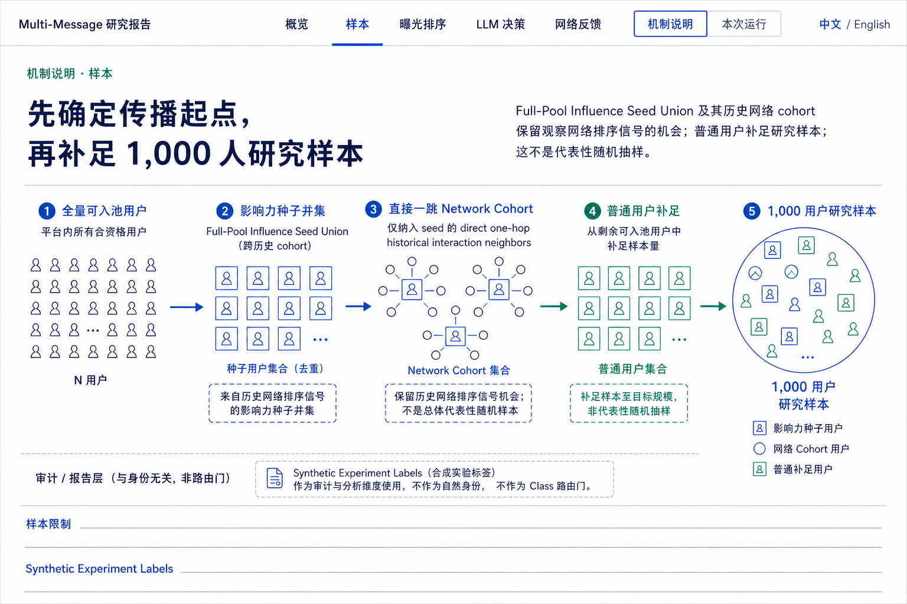

- Layout：五阶段横向流程，从全池、seed union、direct one-hop Network Cohort、ordinary fill 到 1,000-user sample；audit/report layer 独立放在流程下方。
- Network treatment：seed 使用 blue square；direct neighbors 使用 green outline；每个 neighbor 只通过一条 direct spoke 连到 seed，不画第二层或 neighbor-to-neighbor propagation。
- Limitation：ordinary fill 保证规模，不构成 representative random sample；Synthetic Experiment Labels 只用于 audit/report，不成为 Class routing gate。
- Media frame：`media-mechanism-sample.png` 保留同一 visual grammar，HTML 负责把各 group 精确命名。
- Desktop behavior：五阶段可以在 1440/1600 同行；若内容增多，宁可增加 section height，也不压缩 node labels。

### Mechanism Exposure Ranking

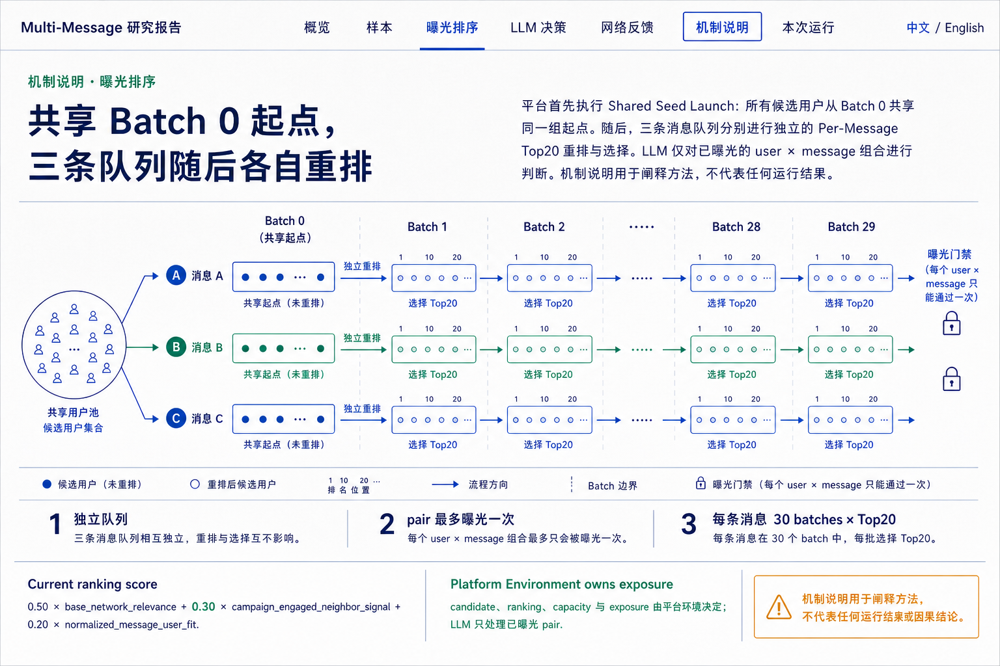

- Layout：Batch 0 shared launch 位于第一列；A/B/C 三 lane 在 Batch 1–29 各自 rerank；右侧 gate 显示 same pair once。
- Formula：底部只使用当前 `0.50 base_network_relevance + 0.30 campaign_engaged_neighbor_signal + 0.20 normalized_message_user_fit`。
- Ownership：Platform Environment 拥有 candidate、ranking、capacity 与 exposure；LLM 在 gate 后出现。
- Media frame：`media-mechanism-exposure-ranking.png` 使用反复重排的 vertical lists 表示 batches，不编码具体容量数字；精确 `30 × Top20` 由 HTML 提供。
- Desktop behavior：三 lane 共享 batch vertical rhythm。不要让 batch 90-row evidence 混入 mechanism view。

### Mechanism LLM Decision

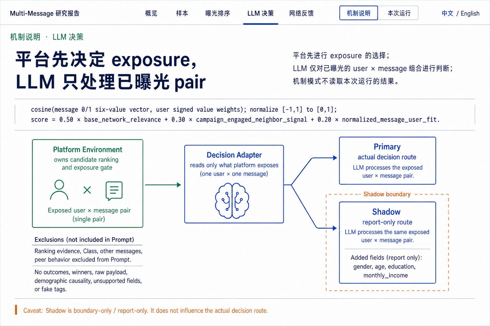

- Layout：formula band 在标题下，随后是 Platform Environment、Decision Adapter、Primary 与 dashed Shadow boundary。
- Prompt boundary：ranking evidence、Class、other messages 和 peer behavior 明确置于 Prompt exclusions；raw Prompt 不展示。
- Primary/Shadow：从同一个 exposed user × message pair 分叉；Shadow 是 report-only，并只增加四个人口学 Synthetic Experiment Labels。
- Media frame：`media-mechanism-llm-decision.png` 用 ranking plane 与 gate、single exposed pair、decision core、solid/dashed outputs 表达职责边界。
- Desktop behavior：Primary/Shadow 对照保持同屏；不能把 Shadow 放到完全独立 section 造成“第二次曝光”误解。

### Mechanism Network Feedback

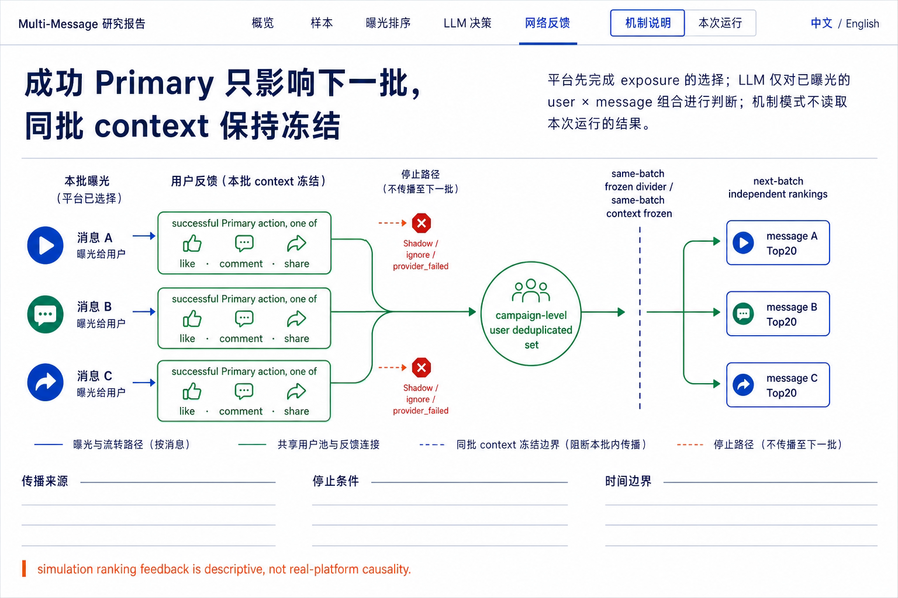

- Layout：三条 message 的 successful Primary action choice 合流到唯一 campaign-level user deduplicated set；随后跨过 same-batch frozen divider，再 fan out 到三条 next-batch Top20 queues。
- Action grammar：`like / comment / share` 是互斥的 successful action set，不是连续动作。
- Stop paths：Shadow、ignore、provider_failed 不进入共享 dedup node；red dashed path 只表达停止。
- Media frame：`media-mechanism-network-feedback.png` 是最精简的 production source：三条 success 输入、一个 green hub、冻结边界、三条输出，另有三条 amber stop paths。
- Desktop behavior：唯一 green hub 必须是第一视觉焦点；禁止改成三个 per-message sets。

### Run Overview

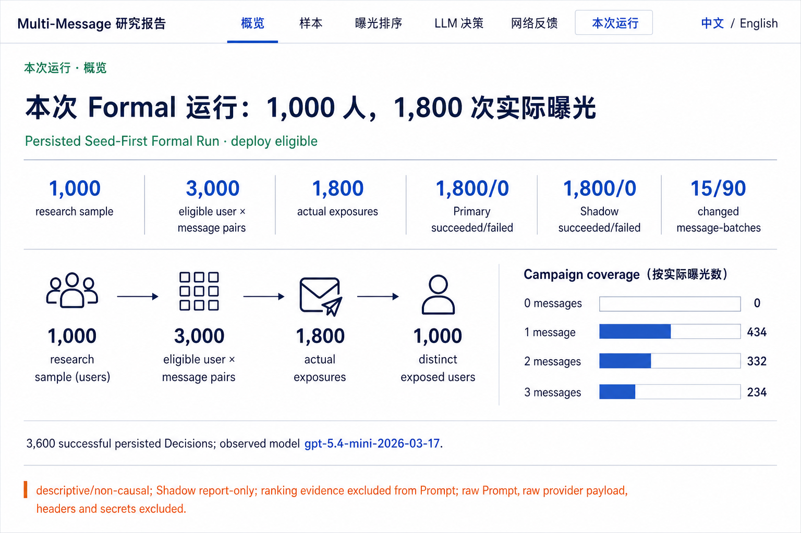

- Layout：一个开放 metric strip 替代七个等权 cards；下方 Campaign Funnel 与 coverage distribution 并排；Provider/model 与一个研究边界占单独 band。
- Exact evidence：1,000 users、3,000 eligible pairs、1,800 exposures、Primary 1,800/0、Shadow 1,800/0、15/90 changed message-batches；coverage `0/434/332/234`。
- Hierarchy：title 与 deployment/run status 是 run identity；主要分母先于任何 descriptive rate。
- Desktop behavior：metric strip 使用稳定六列；窄 desktop 可以两行 3×2，但不能退化成等权 card wall。

### Run Sample

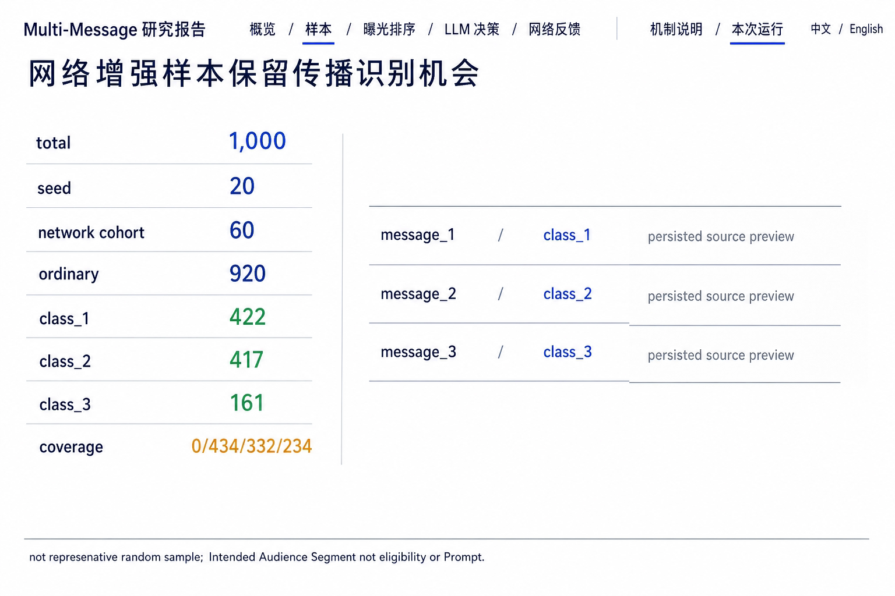

- Layout：左侧是 roles、Class 和 coverage 的 vertically ruled facts；右侧是三条 authoritative message rows；最下方只有一个 sample/intended-audience caveat。
- Exact evidence：`20 seed / 60 network cohort / 920 ordinary`、Class `422 / 417 / 161`、coverage `0 / 434 / 332 / 234`。
- Message treatment：图片只保留 `persisted source preview` 的中性 frame，不包含 message topic 或正文。实现必须从 persisted `messages` 渲染 authoritative body/title/profile。
- Desktop behavior：三条 message 作为 open rows，不做三个 nested cards；长中文 body 在行内只显示 approved preview，完整原文按需展开。

### Run Exposure Ranking

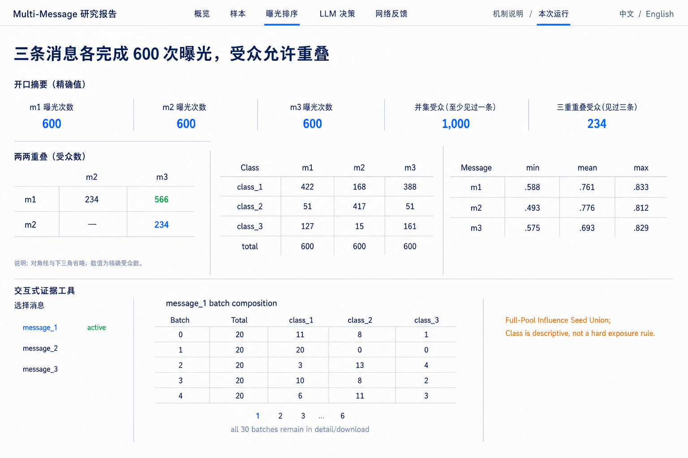

- Layout：顶部 exact summary strip；中部依次是 pairwise overlap、Class × Message exact matrix、fit min/mean/max；底部是 message selector 与 paged batch composition。
- Exact evidence：每条 600、union 1,000、three-way 234；matrix `[422,168,388] / [51,417,51] / [127,15,161]`；fit m1 `.588/.761/.833`、m2 `.493/.776/.812`、m3 `.575/.693/.829`。
- Detail pattern：message_1 sample rows使用 persisted batch composition；所有 30 batches 留在分页/detail/download，不默认渲染 90 rows。
- Boundary：Class 是 descriptive Synthetic Experiment Label，不是 hard exposure rule。

### Run LLM Decision

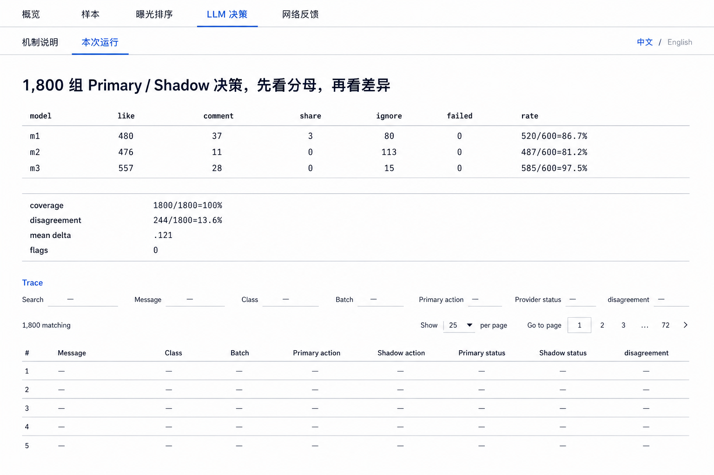

- Layout：三条 response rows 在第一屏同表比较；Sensitivity 是开放 key/value strip；Exposure Trace filters/table 只占下半屏。
- Exact evidence：m1 `480/37/3/80/0` 与 `520/600=86.7%`；m2 `476/11/0/113/0` 与 `487/600=81.2%`；m3 `557/28/0/15/0` 与 `585/600=97.5%`。
- Sensitivity：coverage `1,800/1,800=100%`、disagreement `244/1,800=13.6%`、mean absolute probability delta `.121`、flags `0`。
- Trace controls：Search、Message、Class、Batch、Primary action、Provider status、disagreement；`1,800 matching`；25 rows；pages `1 2 3 … 72`。
- Boundary：rate comparison 是 descriptive，不形成 winner ranking。

### Run Network Feedback

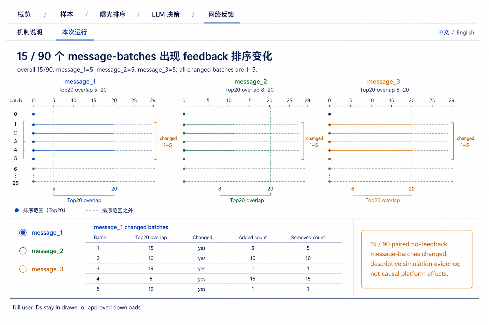

- Layout：三个 message timelines 共享 Batch 0–29 x-axis；changed range 1–5 用 bracket；下方 selector + exact detail table + one caveat。
- Exact evidence：overall `15/90`，每条 5；Top20 overlap ranges m1 `5–20`、m2 `8–20`、m3 `6–20`。
- Example detail：message_1 batch 1–5 的 overlap/add/remove 是 `15/5/5`、`10/10/10`、`19/1/1`、`5/15/15`、`19/1/1`。
- Disclosure：full user-id added/removed lists 不在默认 page surface；只进入 drawer/detail 与 approved downloads。
- Boundary：paired no-feedback diagnostics 是 descriptive simulation evidence，不是 causal platform effect。

### Trace Drawer

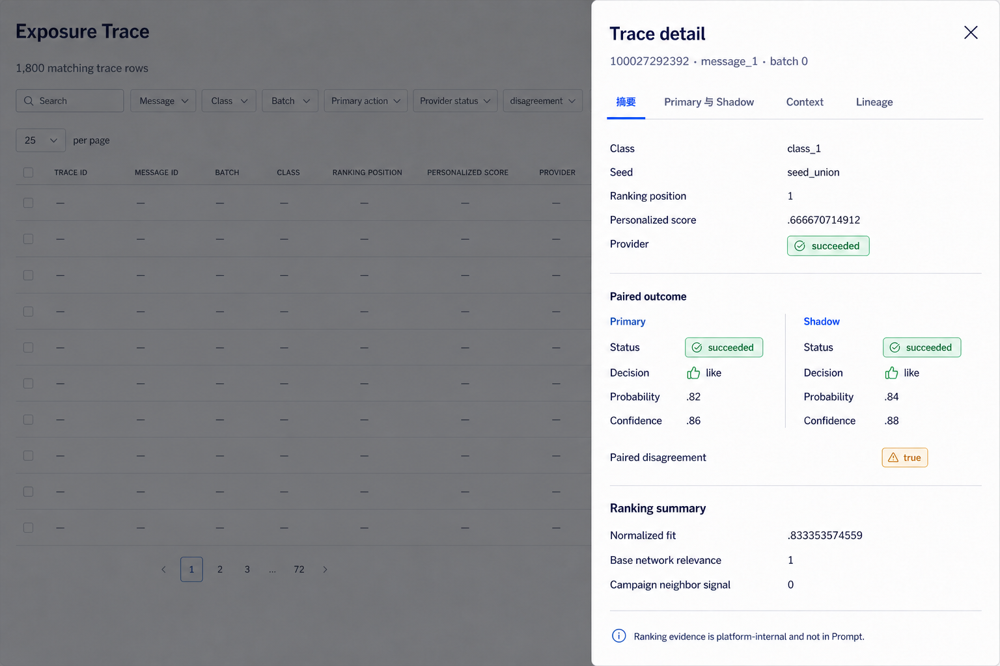

- Frame：desktop 右侧 drawer 约 560–620px，full viewport height；underlay 保持可识别但通过 ink backdrop 降权。
- Header：identity 与 X close 固定；四 tabs 为“摘要 / Primary 与 Shadow / Context / Lineage”。
- First viewport：只显示 identity、provider terminal、paired outcome、disagreement、ranking summary 与 Prompt visibility boundary；完整 authoritative message body 不占第一屏。
- Tabs：Context 承载 message body、persisted reasons 与 visible contexts；Lineage 承载 field differences、provenance、usage stage 与 aggregate source。
- Interaction：dialog semantics、focus trap、Escape、close button、restore row focus、body scroll lock。Tab change 不重置 selected trace。
- Precision：summary 可做适度显示格式化；persisted/full-precision 值在 Context/Lineage 或 downloads 可访问。

## Text-Free Media Analysis

### Overview Media

`media-mechanism-overview.png` 使用左侧同一候选池、三条 message identity、三条长 queue 与三个 gate/output，适合说明同一 sample 并行进入三条独立路径。图中没有容量文字；HTML overlay 必须提供 `1,000 / 3,000 / 30 × Top20` 和 pair-once 规则。

### Sample Media

`media-mechanism-sample.png` 使用全池、seed selection、direct-neighbor star clusters、ordinary pool 与 final mixed sample。实现 overlay 必须明确 direct one-hop，不能把图中 network node 解释为多跳传播或好友关系。

### Exposure Ranking Media

`media-mechanism-exposure-ranking.png` 使用三 lane 中多次 list reorder 与 terminal gate。它不表示只有六个 batches；重复列只是时间压缩。HTML 必须明确 Batch 0–29、Shared Seed Launch 和每条 message 独立 Top20。

### LLM Decision Media

`media-mechanism-llm-decision.png` 把 network/ranking plane、vertical exposure gate、single pair、decision core 和 solid Primary/dashed Shadow output 串联。gate 下方被 X 阻断的 paths 适合承载 Prompt exclusions。

### Network Feedback Media

`media-mechanism-network-feedback.png` 使用三个 successful inputs 合流到一个 green dedup hub，跨过 vertical frozen divider 后再 fan out 到三条 outputs；三条 amber dashed paths 在合流前停止。这张图是 campaign-level dedup 与 next-batch-only effect 的最小视觉合同。

## Desktop Behavior

- 视觉 refs 只覆盖 desktop。Implementation acceptance 目标是 `1440×1000` 与 `1600×1000`。
- Header sticky 时必须共享一个可测 offset；anchor heading top 大于等于 header bottom + 16px。
- Main content、tables、toolbars、pagination 和 media figure 不能因 dynamic text 改变 fixed control dimensions。
- Long tables 使用 summary-first、message selector、windowed pagination 和 drawer，不通过无限增长 section 解决。
- Chart 或 figure 的 text equivalent 与 source note 紧邻 figure；不把重要 labels 烧进 bitmap。
- Hover 只增强信息，不能成为唯一访问路径。任何可点击 row/hotspot 都有键盘等价和 focus-visible。

## Minimum Narrow-Viewport Gate

没有生成 mobile visual reference；`390×844` 仅保留基础可用性 gate：

- 无 page-level horizontal overflow、重叠、裁切或不可读 text。
- Header 可以按实现需要 reflow，但 offset 必须随实际高度计算，anchor 不能被遮挡。
- Section grid 变为单列；table 可在拥有容器内滚动，但 body 不横向滚动。
- Drawer 可以占满 viewport width；close、tabs 与 summary 保持第一屏可见。
- Language、mode、anchor、filters、pagination 和 selected trace 不因 reflow 丢失。

## Accessibility And Semantics

- Initial `<html lang="zh-CN">`；英文切换为 `en-US`。图片 alt、ARIA labels、table caption、filter labels 同步切换。
- Authoritative message、persisted Decision reason、ID、schema、model 和技术 token 保持 source language/value。
- 每个 visual media 具有简短 alt 和邻近的 structured text/table alternative；复杂 mechanism 使用 HTML caption/legend，不依赖 bitmap OCR。
- Mode 使用 tab/tabpanel；drawer 使用 dialog；tables 使用 caption、thead、scope；filters 有显式 label。
- Cobalt/green/amber 之外仍使用 icon、pattern、label 与 status text。
- 支持 `prefers-reduced-motion`；scroll/focus 与 drawer 不依赖动画完成状态变化。

## Rejection Record

Generation 中曾拒绝并移出 Reference 的 variants 包括：

- 把 sample 画成 multi-hop network；
- 把 queue 画在 Research Sample 之前，暗示 queue 形成 sample；
- 引入不支持的“账号历史曝光”或旧 `historical_tag_affinity`；
- 把 feedback 画成三个 per-message dedup sets；
- 把 `like → comment → share` 画成连续动作；
- 虚构 Run ID、日期、版本、message 文案、user IDs、batch counts 或 trace totals；
- 错误声称 no-feedback 对照的所有 batches 都一致；
- 把 Class × Message matrix 误标为 coverage，或把 fit `min/mean/max` 改成其他指标。

Rejected/intermediate generations 不在仓库 Reference 目录。Accepted 图片均经过 persisted payload 与当前机制合同复核。

## Delivery Boundary

本 Reference 的创建没有修改 renderer、schemas、tests、release artifacts、Formal source、current two-mode destination 或 canonical endpoint；没有重跑 Decisions，没有调用 live Provider/TikHub/Douyin/profile API，也没有读取、打印或写入 secrets、raw Prompt、raw provider request/response、headers 或 raw payload。
