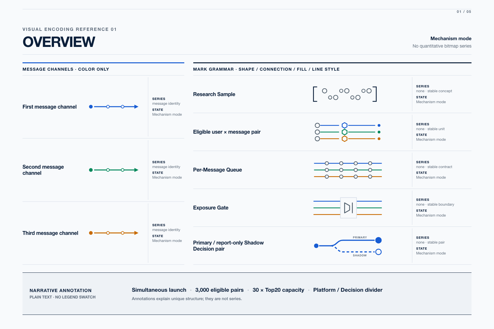
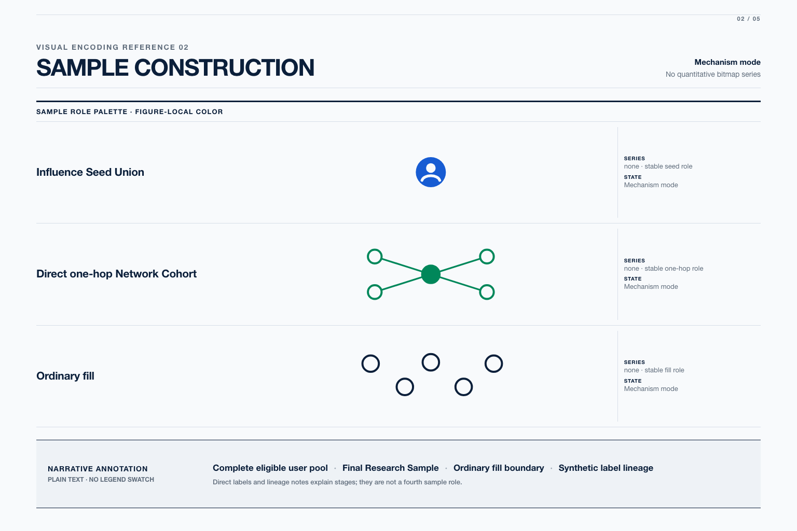
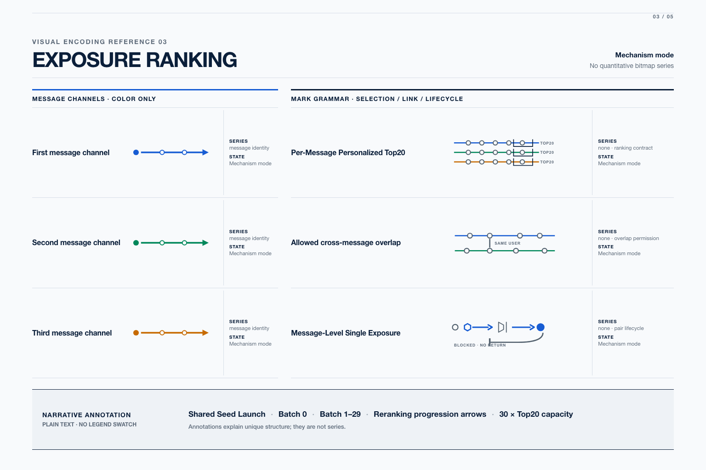
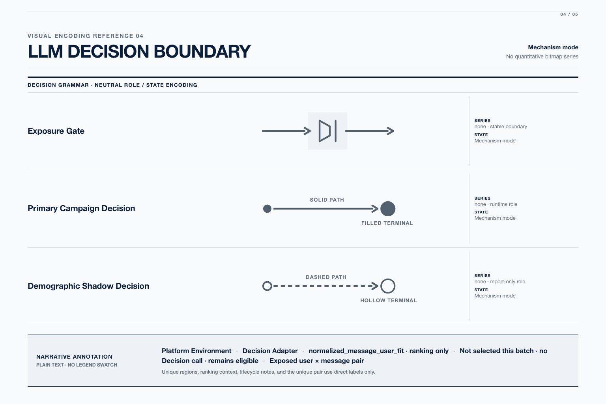
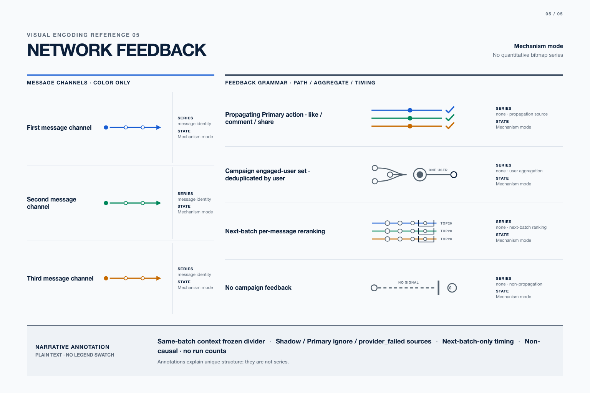

# Editorial v2 Visual Encoding References

- Ticket: [#149](https://github.com/liu-qingyuan/llm-abm-marketing-sim/issues/149)
- Source of truth: [Concurrent Message Legend and Visual Semantics Audit](../concurrent-message-legend-visual-semantics-audit-20260803.md)
- Generated at: `2026-08-06T15:27:50Z`
- Canvas: five independent `1536 × 1024` (3:2) RGB PNG files
- Generation tool: local deterministic HTML/SVG render with Playwright `1.60.0` and Chromium `148.0.7778.96`
- Generation model: none; exact vector marks and typography were rendered without a generative model
- 统一批准状态：**等待用户一次性确认全部五张 Reference**
- 批准证据：尚无；批准后应记录为 issue #149 的单条全套确认评论，不建立逐图状态

本目录是完整机制图生成前的 Reference 审批包。五张图片分别固定一个 Mechanism section 的 message color、figure-local role palette、shape、connection、fill、line style，以及 Legend item 与 Narrative annotation 的边界。它们不是完整机制图、运行数据图、renderer asset 或 deployment artifact。

## Manifest

| Section | File | SHA-256 | Audit target items |
|---|---|---|---:|
| Overview | [`visual-encoding-reference-overview-v2.png`](visual-encoding-reference-overview-v2.png) | `67a0444523475bcc198e2fe0b5005f72d97149228e00d074f045a95c3aca54ee` | 8 |
| Sample Construction | [`visual-encoding-reference-sample-v2.png`](visual-encoding-reference-sample-v2.png) | `b5f66ad6c378657acbee7d70e3408ff9eb9808c55aa1c97330ffdd41d0571d5c` | 3 |
| Exposure Ranking | [`visual-encoding-reference-exposure-ranking-v2.png`](visual-encoding-reference-exposure-ranking-v2.png) | `9960f63d90255212cea8dbb41239deec853f1935330147c89205f99075f4822e` | 6 |
| LLM Decision Boundary | [`visual-encoding-reference-llm-decision-v2.png`](visual-encoding-reference-llm-decision-v2.png) | `a116891f063fd3249e58ef00c96a15aacf8942a932d499232d52414fdd671574` | 3 |
| Network Feedback | [`visual-encoding-reference-network-feedback-v2.png`](visual-encoding-reference-network-feedback-v2.png) | `2b95f0f0ed14d30a884cacf6e24f96c9f15129d1e859843ce54f8cf4b69fdae0` | 7 |
| **Total** | **5 files** | — | **27** |

每个文件都是一次完整的独立渲染；没有 compressed board、旧图裁片或逐图批准状态。Manifest 中的 SHA-256 共同定义本次一次性批准的固定集合。

## Audit Correspondence

| Reference | Audit section | Encoding boundary |
|---|---|---|
| Overview | [`Figure Audit / 1. Overview`](../concurrent-message-legend-visual-semantics-audit-20260803.md#1-overview) | cobalt / green / amber 只表示三条 message；sample、pair、queue、gate、Primary/Shadow pair 使用 boundary、connection、shape、fill 与 line style |
| Sample Construction | [`Figure Audit / 2. Sample Construction`](../concurrent-message-legend-visual-semantics-audit-20260803.md#2-sample-construction) | figure-local palette 只表示 seed、direct one-hop cohort、ordinary fill；Synthetic label lineage 是 annotation |
| Exposure Ranking | [`Figure Audit / 3. Exposure Ranking`](../concurrent-message-legend-visual-semantics-audit-20260803.md#3-exposure-ranking) | message color 与 Top20 selection、same-user link、single-exposure lifecycle 正交 |
| LLM Decision Boundary | [`Figure Audit / 4. LLM Decision Boundary`](../concurrent-message-legend-visual-semantics-audit-20260803.md#4-llm-decision-boundary) | Exposure Gate、solid/filled Primary、dashed/hollow Shadow 使用 neutral role/state grammar |
| Network Feedback | [`Figure Audit / 5. Network Feedback`](../concurrent-message-legend-visual-semantics-audit-20260803.md#5-network-feedback) | message color 只保留 identity；positive action、dedup aggregate、next-batch Top20 与 no-feedback boundary 使用不同 mark grammar |

三条跨图 message colors 固定为 cobalt `#175CD3`、green `#00875A`、amber `#C76A00`。除 Sample 的 figure-local role palette 外，candidate/user、gate、aggregate、role、state 与 timing 均使用 neutral navy/gray marks。每个 strict Legend item 行都显示 mark specimen、Data field/series 和 `Mechanism mode`；每张图底部的灰色 plain-text band 明确标为 `NARRATIVE ANNOTATION` 与 `NO LEGEND SWATCH`。

## Approval Readback

人工确认应在同一次检查中完成以下事项：

1. 逐张对照 audit 的五个 `Approved target legend` 表，确认 8 + 3 + 6 + 3 + 7 = 27 个目标项全部可见且只有一个含义。
2. 确认 Overview、Exposure Ranking、Network Feedback 的三色仅编码 message identity；Sample 使用独立 role palette。
3. 确认 annotations 没有 swatch，也没有被误画为 quantitative series。
4. 以 issue #149 的一条评论批准上述五个文件及 Manifest hashes；随后只更新本 README 的统一批准状态和证据链接。

若任一 Reference 被拒绝，只 fresh regenerate 被拒绝的整张 `1536 × 1024` 图片并更新 Manifest；不得裁切旧图，也不得保留旧 hash 作为并行状态。

## Inspection Images

### 1. Overview

### 2. Sample Construction

### 3. Exposure Ranking

### 4. LLM Decision Boundary

### 5. Network Feedback

## Delivery Boundary

本次只生成本地 presentation reference assets 和审批说明。`openai_imagegen` 在缺少本地 API credential 时于调用前失败，没有产生 accepted asset，也没有完成 Provider 请求；随后使用确定性本地渲染保证文字与 mark 精确。未修改或生成完整机制图、renderer、runtime、persisted evidence、release contract、Formal destination 或 canonical webpage；未调用 research Provider、TikHub、Douyin 或 profile API，未读取、打印或写入 secret、`.env`、raw Prompt、raw Provider payload 或用户级 raw records。
