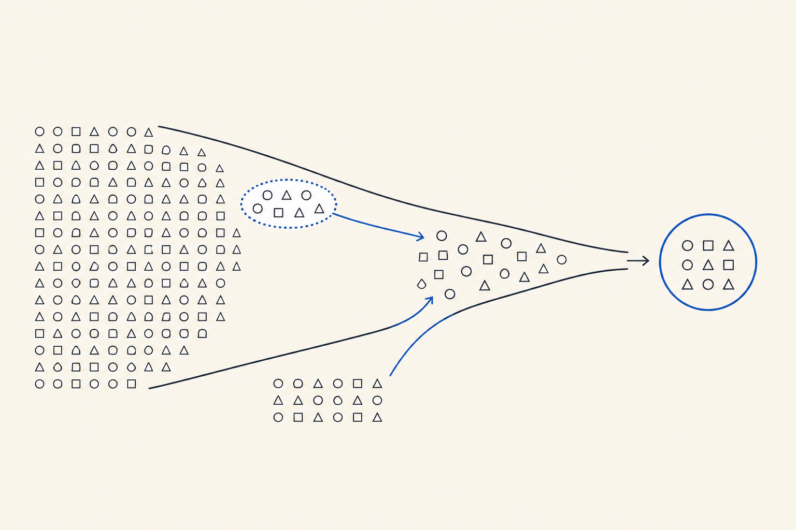
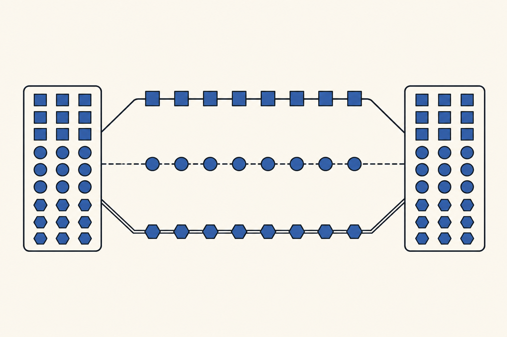
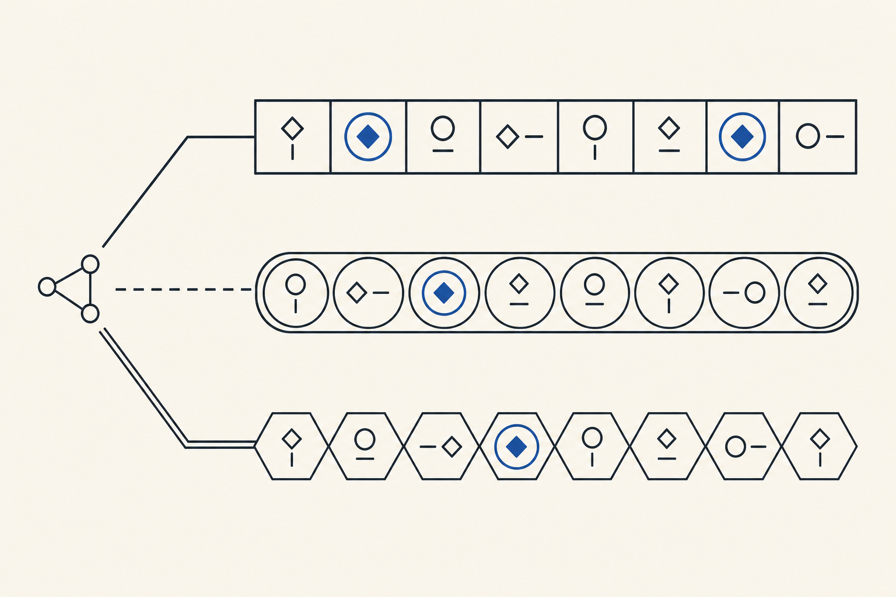
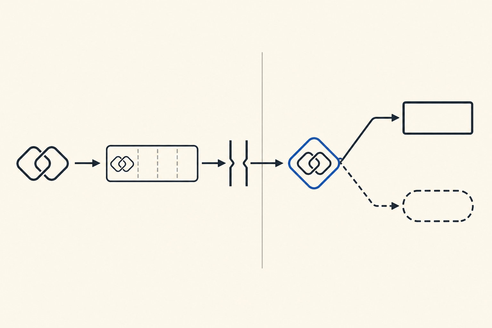
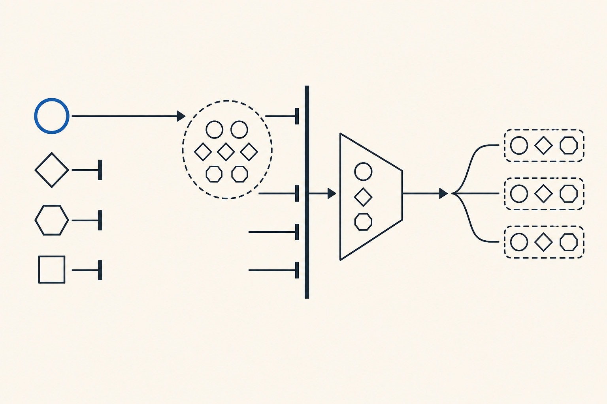

# Concurrent Message v4 机制图整组视觉审批集

Status: Rejected for v7; retained as historical pre-release audit

本文件是 canonical Final Research 网页之外的历史视觉审阅包。五张 PNG 均消费 #185 已批准且 byte-frozen 的 Mermaid semantic set，但该整组图像未获视觉批准；依据 [Spec #183 的 Mermaid-first amendment](https://github.com/liu-qingyuan/llm-abm-marketing-sim/issues/183#issuecomment-5278560487)，它们及 generation audit 均不是 payload v2、closure v2、release v7、approved downloads 或 canonical deployment 的输入。当前 v1/v6 presentation、旧 v1–v3 assets、Formal evidence 与 persisted research evidence 也未被这组图像改写。

- Canonical visual set identity: `6e3f6db6290e8f01c1f9763e9c297db426d1ed54a95014e1940fd43db7079c8b`
- Identity schema: `mechanism-visual-set-v1`
- Semantic approval: [#185 comment 5276313349](https://github.com/liu-qingyuan/llm-abm-marketing-sim/issues/185#issuecomment-5276313349)
- Generation audit: `src/llm_abm_sim/report_assets/mechanism-image-generation-audit.json`
- Generation Adapter: ChatGPT-authenticated Codex official `$imagegen` built-in path, `gpt-image-2`, `1536x1024`, `high`
- Built-in image-generation calls: `6`（五次初始生成；Independent Delivery 因出现人物 pictogram 定向重生一次）
- Research LLM Provider / TikHub / Douyin / profile API calls: `0`
- Secrets read, printed, or written: `0`

## 已终止的整组审批合同

下列内容只记录当时计划的审批合同：批准原本必须来自一个 GitHub issue comment，并在同一 comment 中绑定批准人、批准时间、comment URL、上述 canonical visual set identity，以及下表五个完整 PNG filename/SHA-256。该审批没有发生，`visual_approval` 保持 `null`；这些 hashes 只能用于历史核验，不能拼装为 v7 approved set。

| 顺序 | Accepted PNG | SHA-256 | Deterministic WebP | SHA-256 |
|---:|---|---|---|---|
| 1 | `mechanism-sample-first-v4.png` | `a3f74f6b393ef6aa505ee968d3303c92aadc37a899de9c077556f2f402fdc61e` | `mechanism-sample-first-v4.webp` | `124c926833ca21827d0b71858142570e3489a607f00a184185f9d4704c090377` |
| 2 | `mechanism-pair-formation-v4.png` | `fa251e8af0e7205e0072c1b545f77430db7e5834b6528959dfbaf393ad5a5d04` | `mechanism-pair-formation-v4.webp` | `13328a619b119c8a997ce276cbbbb1593d0fb48e048ae0b80a0c0c7591c9bd4f` |
| 3 | `mechanism-independent-delivery-v4.png` | `a2d973a30855b54d03d23bfb6b6bb3e6ad174cb7d1e2fc733ca8441b48c55330` | `mechanism-independent-delivery-v4.webp` | `b729ca8503a1d471d8d4fef402229617a1fbbebed4f92e73e5e991ee1b3b18ba` |
| 4 | `mechanism-exposure-decisions-v4.png` | `0d721fbeae68e939f1946d0349042112adc7e22b989a00d99e5b4e23ed45e620` | `mechanism-exposure-decisions-v4.webp` | `5f09565ca64847d771c8acb3494cc358503010853bac1dda6b469eaaf634375a` |
| 5 | `mechanism-feedback-boundary-v4.png` | `299311aef8d5042e34d1ab0b0966348d215411cd967a2937c738848e03e8fccd` | `mechanism-feedback-boundary-v4.webp` | `0eb19a5b41c2ba1eb42b630e470b557670df1cbd22ad688a8fc7e622fc886bec` |

## 五图视觉审阅

### 1. 样本先存在 / Sample First

一条历史数据选择路径从完整合格池收窄，种子邻域与按配额补足路径汇入一个固定样本终点；图中不出现 message、queue 或 Decision。



### 2. 用户与消息配对 / Pair Formation

同一个已存在样本分别形成三条完整 pair 路径；三路使用不同形状与线型并汇总到一个 eligible-pair 分母，不把 sample 切成三份。



### 3. 三条消息独立投放 / Independent Delivery

共同 launch token 分别进入三条等长、独立封闭的 queue tracks；矩形／实线、圆形／虚线、六边形／双线共同编码，重复的 cobalt token 表示允许跨消息重叠，不形成共享 quota。



### 4. 曝光与配对决策 / Exposure & Decisions

Eligible pair 依次通过 per-message queue 和唯一 Exposure Gate；同一个 exposed-pair junction 才分叉为实线 Primary 与虚线 report-only Shadow，不产生第二次 exposure。



### 5. 反馈边界 / Feedback Boundary

四个 terminal 中只有 cobalt positive Primary 路径继续，其余三路明确封口；pending marks 经过 full-batch barrier、跨消息去重 funnel 后，只进入右侧三条 next-batch contexts。



## 审计与 gate

`mechanism-image-generation-audit.json` 顶层 exact fields 仅为 `schema_version`、`semantic_approval`、`calls`、`visual_approval`、`derivatives`。当前 `visual_approval` 为 `null`，因此默认 validator 必须失败；仅 pre-approval 校验允许显式运行：

```bash
python scripts/validate_mechanism_image_generation_audit.py \
  --allow-pending-visual-approval \
  --verify-derivatives
```

该 visual set 已退出 v7 路径，不再通过补写 approval comment 进入本次 release。未来外部设计师 artwork 由 follow-up #192 以新的 immutable release 处理；本审阅包不授权 renderer integration、candidate composition、research Provider 调用或 canonical deployment。
