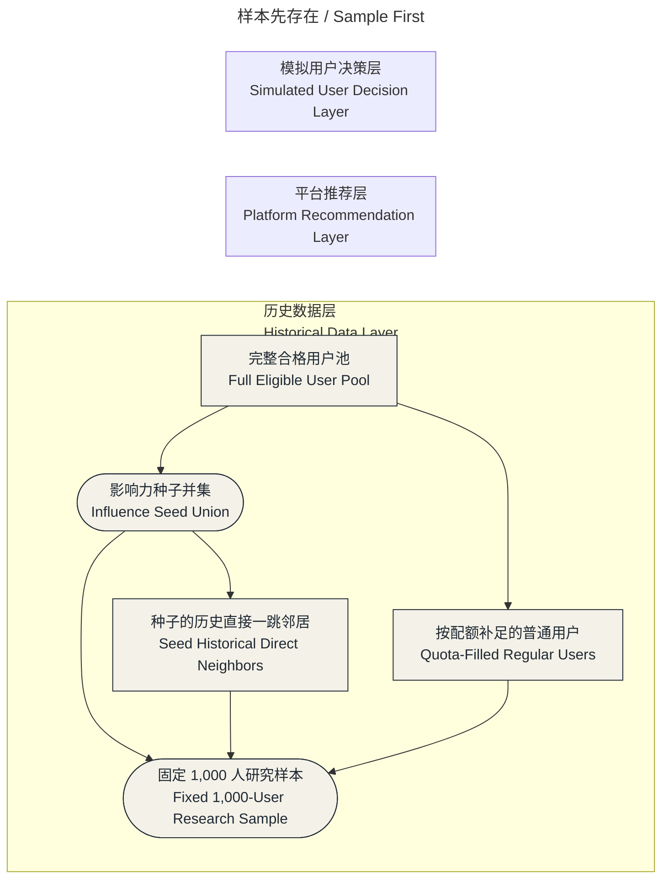
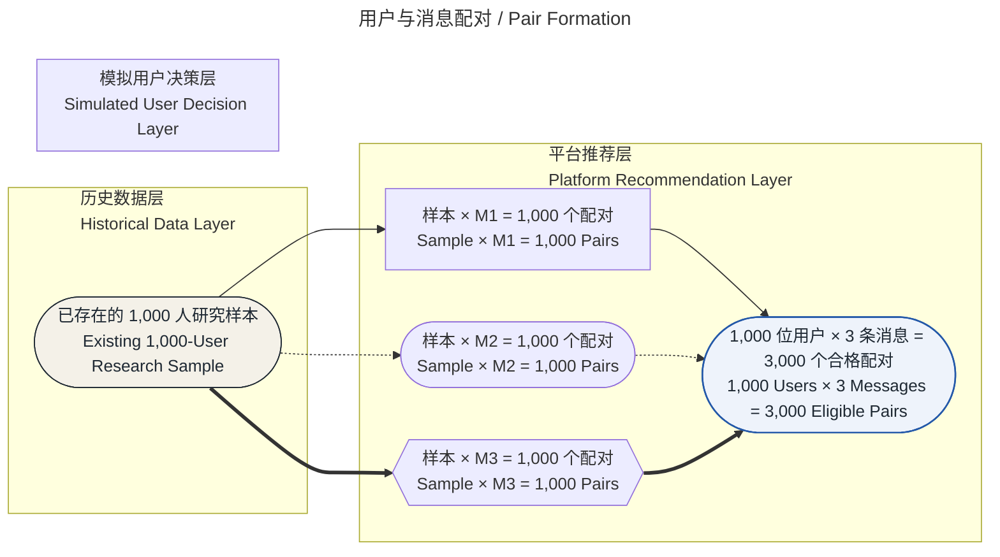
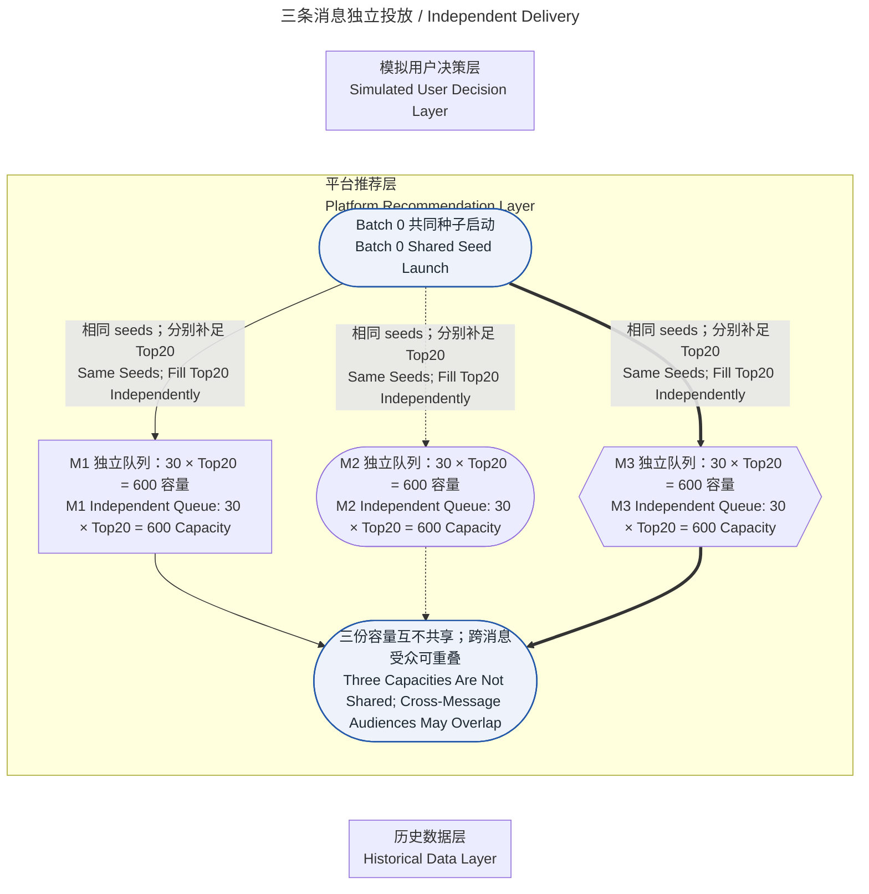

# Concurrent Message v4 机制语义母版低保真审批集

Status: Awaiting whole-set human approval

本文件是 canonical Final Research 网页之外的低保真审阅包。六图全部由 package-internal `concurrent_message_mechanism_presentation` Module 的唯一 Interface 确定性生成；当前 v1/v6 presentation 不读取本文件。

- Canonical semantic set identity: `c93dccf1a502e94484ad0db7a2abd9a8d5b2c16dd47c918825401da55ef170bf`
- Identity schema: `mechanism-semantic-set-v1`
- Provider/API/image-generation calls: `0`
- Review issue: [#185](https://github.com/liu-qingyuan/llm-abm-marketing-sim/issues/185)

## 整组审批合同

批准必须来自一个 GitHub issue comment，并在同一 comment 中绑定批准人、批准时间、comment URL、上述 canonical semantic set identity，以及下表六个完整 filename/SHA-256。缺图、部分 hash、跨 comment 拼接或任一 `.mmd` 后续 byte mutation 均不构成 approved set。在合法整组批准前，不得调用 image generation。

| 顺序 | Mermaid master | SHA-256 |
|---:|---|---|
| 1 | `mechanism-sample-first.mmd` | `30786e0b98a576ab299b51e0aebceedb6b6d8fc03a7955ba56bc782bde594b81` |
| 2 | `mechanism-pair-formation.mmd` | `567859f204eed780ec8196aa1b23d6ed120e29a45161a442efa53fcf6431fb2e` |
| 3 | `mechanism-independent-delivery.mmd` | `a4c933e87ff25132434e8c890449d3c38326bf17b5da93309ab4f199513d3f87` |
| 4 | `mechanism-exposure-decisions.mmd` | `02ef23e190bb5fe5bbb313c3ac902201da8e44239f026189c529d75a0687bed8` |
| 5 | `mechanism-feedback-boundary.mmd` | `536a4de2b120e19a19b930c458ae481580541a8bc301a47cd7413a14b9e15675` |
| 6 | `real-batch-mechanism.mmd` | `73ea8c840faa315b0a5ee70b2958723fcf0fe140bfc000964a3d04c8f65bd907` |

## 六图低保真预览

### 1. 样本先存在 / Sample First

Master: `mechanism-sample-first.mmd` · SHA-256: `30786e0b98a576ab299b51e0aebceedb6b6d8fc03a7955ba56bc782bde594b81`

研究样本在消息配对、平台队列和模拟决策之前，由既有 processed 数据确定。 
The Research Sample is fixed from existing processed data before message pairing, platform queues, or simulated decisions.

完整文本 fallback / Complete text fallback

- 完整合格用户池来自既有采集、清洗和派生的历史数据，不是 runtime live database。 / The full eligible pool comes from existing collected, cleaned, and derived historical data, not a runtime live database.
- 先确定影响力种子并集和其历史直接邻居，再按来源配额补足普通用户。 / The influence seed union and its historical direct neighbors are selected before regular users fill source quotas.
- 固定 1,000 人研究样本先存在；合成标签不创建样本，分层补足也不表示总体代表性。 / The fixed 1,000-user Research Sample exists first; synthetic labels do not create it, and quota filling does not imply population representativeness.

**Image brief**

- Raster generation required: `yes`
- Visual system: Horizontal flat 2D scientific-editorial composition on light paper, with dark ink lines and one restrained cobalt-blue accent.
- Purpose: Show that the Research Sample exists before any message or queue.
- Composition: A left-to-right narrowing funnel in the historical-data lane, ending in one emphatic 1,000-user sample mark.
- Required marks: full eligible pool; seed union; historical direct neighbors; quota-filled regular users; one fixed Research Sample endpoint
- Forbidden marks: people or character illustrations; 3D, glow, photorealistic devices, or decorative nodes; any text, letters, numerals, or labels rendered inside the image; color-only encoding

### 2. 用户与消息配对 / Pair Formation

Master: `mechanism-pair-formation.mmd` · SHA-256: `567859f204eed780ec8196aa1b23d6ed120e29a45161a442efa53fcf6431fb2e`

同一固定研究样本分别与 M1、M2、M3 形成三条 pair 路径。 
The same fixed Research Sample forms three separate pair paths with M1, M2, and M3.

完整文本 fallback / Complete text fallback

- 配对只消费已经固定的研究样本，不生成或筛选新的用户。 / Pairing consumes the already fixed Research Sample; it does not create or select new users.
- 每位用户分别与三条消息形成 pair，因此合格分母是 3,000 个 user × message pair。 / Every user pairs separately with all three messages, so the eligible denominator is 3,000 user × message pairs.
- 本图不表示 queue、exposure、Decision、消息正文或设计受众。 / This view does not represent queues, exposures, Decisions, message copy, or intended audiences.

**Image brief**

- Raster generation required: `yes`
- Visual system: Horizontal flat 2D scientific-editorial composition on light paper, with dark ink lines and one restrained cobalt-blue accent.
- Purpose: Make the 3,000-pair denominator obvious without implying that pairing creates users.
- Composition: One stable sample mark fans into three visually distinct M1/M2/M3 paths and reconverges at the denominator.
- Required marks: one pre-existing 1,000-user sample; three 1,000-pair paths; M1/M2/M3 distinguished by shape and line style; one 3,000 eligible-pair total
- Forbidden marks: people or character illustrations; 3D, glow, photorealistic devices, or decorative nodes; any text, letters, numerals, or labels rendered inside the image; color-only encoding

### 3. 三条消息独立投放 / Independent Delivery

Master: `mechanism-independent-delivery.mmd` · SHA-256: `a4c933e87ff25132434e8c890449d3c38326bf17b5da93309ab4f199513d3f87`

Batch 0 共享同一 seeds，但三条消息各自维护 30 × Top20 的投放容量。 
Batch 0 shares the same seeds, while each message maintains its own 30 × Top20 delivery capacity.

完整文本 fallback / Complete text fallback

- Batch 0 为三条消息使用相同的种子并集；不足 Top20 时，各消息按自己的排序分别补足。 / Batch 0 uses the same seed union for all three messages; when it is below Top20, each message fills independently from its own ranking.
- M1、M2、M3 各有 30 批 × Top20 = 600 的独立容量，不共享一个 20-slot quota。 / M1, M2, and M3 each have an independent 30 batches × Top20 = 600 capacity; they do not share one 20-slot quota.
- 同一用户可以跨消息进入多个队列，但同一 user × message pair 最多曝光一次。 / A user may enter multiple message queues, but the same user × message pair can be exposed at most once.
- 0.50 / 0.30 / 0.20 权重、完整精度与 user_id tie-break 属于方法说明，不改变三份独立容量。 / The 0.50 / 0.30 / 0.20 weights, full precision, and user_id tie-break belong to the method disclosure and do not alter the three independent capacities.

**Image brief**

- Raster generation required: `yes`
- Visual system: Horizontal flat 2D scientific-editorial composition on light paper, with dark ink lines and one restrained cobalt-blue accent.
- Purpose: Show three independent delivery capacities without suggesting a shared 20-slot quota.
- Composition: A compact shared-seed launch fans into three equal M1/M2/M3 queue tracks, then ends in one overlap boundary note.
- Required marks: shared Batch 0 seed launch; three independent 600-capacity tracks; M1/M2/M3 distinguished by shape and line style; cross-message overlap allowed
- Forbidden marks: people or character illustrations; 3D, glow, photorealistic devices, or decorative nodes; any text, letters, numerals, or labels rendered inside the image; color-only encoding

### 4. 曝光与配对决策 / Exposure & Decisions

Master: `mechanism-exposure-decisions.mmd` · SHA-256: `02ef23e190bb5fe5bbb313c3ac902201da8e44239f026189c529d75a0687bed8`

只有通过曝光门的 pair 才形成 Primary 与仅报告 Shadow；两者来自同一次曝光。 
Only a pair that passes the Exposure Gate forms Primary and report-only Shadow Decisions; both come from the same exposure.

```mermaid
---
title: 曝光与配对决策 / Exposure & Decisions
---
flowchart LR
  %% diagram-id: exposure_decisions
  %% dom-title-key: exposure_decisions.title
  %% dom-description-key: exposure_decisions.description
  %% dom-node-key: eligible_pair=exposure_decisions.node.eligible_pair
  %% dom-node-key: per_message_queue=exposure_decisions.node.per_message_queue
  %% dom-node-key: exposure_gate=exposure_decisions.node.exposure_gate
  %% dom-node-key: exposed_pair=exposure_decisions.node.exposed_pair
  %% dom-node-key: primary_campaign_decision=exposure_decisions.node.primary_campaign_decision
  %% dom-node-key: report_only_shadow_decision=exposure_decisions.node.report_only_shadow_decision
  %% dom-edge-key: exposed_pair_to_primary=exposure_decisions.edge.same_exposure
  %% dom-edge-key: exposed_pair_to_shadow=exposure_decisions.edge.same_exposure
  %% fallback-key: exposure_decisions.fallback.no_pre_exposure_decision
  %% fallback-key: exposure_decisions.fallback.same_exposure
  %% fallback-key: exposure_decisions.fallback.shadow_boundary
  %% image-raster-generation-required: true
  %% image-visual-system: Horizontal flat 2D scientific-editorial composition on light paper, with dark ink lines and one restrained cobalt-blue accent.
  %% image-purpose: Make exposure visibly precede both paired Decisions and prevent Shadow from looking like a second exposure.
  %% image-composition: A five-stage chain crosses from the platform lane into the simulated-user lane and ends in a solid Primary / dashed Shadow fork.
  %% image-required-mark: eligible pair
  %% image-required-mark: per-message queue
  %% image-required-mark: Exposure Gate
  %% image-required-mark: one exposed-pair mark
  %% image-required-mark: same-exposure Primary and report-only Shadow fork
  %% image-forbidden-mark: people or character illustrations
  %% image-forbidden-mark: 3D, glow, photorealistic devices, or decorative nodes
  %% image-forbidden-mark: any text, letters, numerals, or labels rendered inside the image
  %% image-forbidden-mark: color-only encoding
  classDef historical_data fill:#f4f1e8,stroke:#1f2933,color:#1f2933,stroke-width:1px;
  classDef platform_recommendation fill:#eef3fb,stroke:#2459a9,color:#1f2933,stroke-width:1.5px;
  classDef simulated_user_decision fill:#ffffff,stroke:#1f2933,color:#1f2933,stroke-width:1.5px;
  classDef message_m1 fill:#eef3fb,stroke:#2459a9,stroke-width:2px;
  classDef message_m2 fill:#ffffff,stroke:#2459a9,stroke-width:2px,stroke-dasharray:6 4;
  classDef message_m3 fill:#f4f1e8,stroke:#2459a9,stroke-width:3px;
  subgraph historical_data_lane["历史数据层<br/>Historical Data Layer"]
    direction TB
  end
  subgraph platform_recommendation_lane["平台推荐层<br/>Platform Recommendation Layer"]
    direction TB
    eligible_pair["合格的用户 × 消息配对<br/>Eligible User × Message Pair"]
    per_message_queue["对应消息的独立队列<br/>Per-Message Queue"]
    exposure_gate{"曝光门<br/>Exposure Gate"}
  end
  subgraph simulated_user_decision_lane["模拟用户决策层<br/>Simulated User Decision Layer"]
    direction TB
    exposed_pair(["已曝光配对<br/>Exposed Pair"])
    primary_campaign_decision["主要活动决策<br/>Primary Campaign Decision"]
    report_only_shadow_decision(["仅报告的人口属性影子决策<br/>Report-Only Demographic Shadow Decision"])
  end
  %% semantic-edge: eligible_pair_to_queue
  eligible_pair --> per_message_queue
  %% semantic-edge: queue_to_exposure_gate
  per_message_queue --> exposure_gate
  %% semantic-edge: exposure_gate_to_exposed_pair
  exposure_gate --> exposed_pair
  %% semantic-edge: exposed_pair_to_primary
  exposed_pair -->|"同一次曝光<br/>Same Exposure"| primary_campaign_decision
  %% semantic-edge: exposed_pair_to_shadow
  exposed_pair -.->|"同一次曝光<br/>Same Exposure"| report_only_shadow_decision
  class eligible_pair platform_recommendation;
  class per_message_queue platform_recommendation;
  class exposure_gate platform_recommendation;
  class exposed_pair simulated_user_decision;
  class primary_campaign_decision simulated_user_decision;
  class report_only_shadow_decision simulated_user_decision;
```

完整文本 fallback / Complete text fallback

- 没有获得曝光的 pair 不调用 Decision Adapter。 / A pair that is not exposed does not call the Decision Adapter.
- Primary 与 Demographic Shadow 是同一次实际曝光后的配对决策，不是第二次曝光。 / Primary and Demographic Shadow are paired Decisions after the same actual exposure, not a second exposure.
- Shadow 只进入报告，不写入 action、ranking、feedback 或 runtime state。 / Shadow is report-only and does not write action, ranking, feedback, or runtime state.

**Image brief**

- Raster generation required: `yes`
- Visual system: Horizontal flat 2D scientific-editorial composition on light paper, with dark ink lines and one restrained cobalt-blue accent.
- Purpose: Make exposure visibly precede both paired Decisions and prevent Shadow from looking like a second exposure.
- Composition: A five-stage chain crosses from the platform lane into the simulated-user lane and ends in a solid Primary / dashed Shadow fork.
- Required marks: eligible pair; per-message queue; Exposure Gate; one exposed-pair mark; same-exposure Primary and report-only Shadow fork
- Forbidden marks: people or character illustrations; 3D, glow, photorealistic devices, or decorative nodes; any text, letters, numerals, or labels rendered inside the image; color-only encoding

### 5. 反馈边界 / Feedback Boundary

Master: `mechanism-feedback-boundary.mmd` · SHA-256: `536a4de2b120e19a19b930c458ae481580541a8bc301a47cd7413a14b9e15675`

只有成功 Primary 的正向行为在 full-batch barrier 后按 user_id 去重，并只进入下一批排序上下文。 
Only positive actions from succeeded Primary Decisions cross the full-batch barrier, deduplicate by user_id, and enter next-batch ranking contexts.

```mermaid
---
title: 反馈边界 / Feedback Boundary
---
flowchart LR
  %% diagram-id: feedback_boundary
  %% dom-title-key: feedback_boundary.title
  %% dom-description-key: feedback_boundary.description
  %% dom-node-key: primary_succeeded_positive=feedback_boundary.node.primary_succeeded_positive
  %% dom-node-key: shadow_terminal_no_feedback=feedback_boundary.node.shadow_terminal_no_feedback
  %% dom-node-key: ignore_terminal_no_feedback=feedback_boundary.node.ignore_terminal_no_feedback
  %% dom-node-key: provider_failed_terminal_no_feedback=feedback_boundary.node.provider_failed_terminal_no_feedback
  %% dom-node-key: pending_positive_user_ids=feedback_boundary.node.pending_positive_user_ids
  %% dom-node-key: full_batch_barrier=feedback_boundary.node.full_batch_barrier
  %% dom-node-key: campaign_user_id_commit=feedback_boundary.node.campaign_user_id_commit
  %% dom-node-key: next_batch_ranking_contexts=feedback_boundary.node.next_batch_ranking_contexts
  %% dom-edge-key: positive_primary_to_pending=feedback_boundary.edge.positive_only
  %% dom-edge-key: commit_to_next_batch_contexts=feedback_boundary.edge.next_batch_only
  %% fallback-key: feedback_boundary.fallback.eligible_feedback
  %% fallback-key: feedback_boundary.fallback.stop_paths
  %% fallback-key: feedback_boundary.fallback.barrier
  %% fallback-key: feedback_boundary.fallback.commit
  %% image-raster-generation-required: true
  %% image-visual-system: Horizontal flat 2D scientific-editorial composition on light paper, with dark ink lines and one restrained cobalt-blue accent.
  %% image-purpose: Show the exact positive-Primary feedback boundary and make all non-propagating terminals visibly stop.
  %% image-composition: A split terminal row has one positive path and three capped stop paths; the positive path joins a full-batch barrier before one deduplicated next-batch arrow.
  %% image-required-mark: succeeded positive Primary path
  %% image-required-mark: capped Shadow, ignore, and provider_failed stop marks
  %% image-required-mark: full-batch barrier
  %% image-required-mark: cross-message user_id deduplication
  %% image-required-mark: next-batch-only ranking context
  %% image-forbidden-mark: people or character illustrations
  %% image-forbidden-mark: 3D, glow, photorealistic devices, or decorative nodes
  %% image-forbidden-mark: any text, letters, numerals, or labels rendered inside the image
  %% image-forbidden-mark: color-only encoding
  classDef historical_data fill:#f4f1e8,stroke:#1f2933,color:#1f2933,stroke-width:1px;
  classDef platform_recommendation fill:#eef3fb,stroke:#2459a9,color:#1f2933,stroke-width:1.5px;
  classDef simulated_user_decision fill:#ffffff,stroke:#1f2933,color:#1f2933,stroke-width:1.5px;
  classDef message_m1 fill:#eef3fb,stroke:#2459a9,stroke-width:2px;
  classDef message_m2 fill:#ffffff,stroke:#2459a9,stroke-width:2px,stroke-dasharray:6 4;
  classDef message_m3 fill:#f4f1e8,stroke:#2459a9,stroke-width:3px;
  subgraph historical_data_lane["历史数据层<br/>Historical Data Layer"]
    direction TB
  end
  subgraph platform_recommendation_lane["平台推荐层<br/>Platform Recommendation Layer"]
    direction TB
    pending_positive_user_ids["待提交的正向 user_id 集合<br/>Pending Positive user_id Set"]
    full_batch_barrier{"全部已选配对到达必需终态<br/>All Selected Pairs Reach Required Terminals"}
    campaign_user_id_commit(["关闭整批屏障后，跨消息按 user_id 去重提交<br/>After Full-Batch Barrier: Deduplicate by user_id Across Messages and Commit"])
    next_batch_ranking_contexts["仅成为下一批的三条排序上下文<br/>Next Batch's Three Ranking Contexts Only"]
  end
  subgraph simulated_user_decision_lane["模拟用户决策层<br/>Simulated User Decision Layer"]
    direction TB
    primary_succeeded_positive(["成功的主要决策：like / comment / share<br/>Succeeded Primary: Like / Comment / Share"])
    shadow_terminal_no_feedback(["影子决策：无反馈出口<br/>Shadow: No Feedback Exit"])
    ignore_terminal_no_feedback(["ignore：无反馈出口<br/>Ignore: No Feedback Exit"])
    provider_failed_terminal_no_feedback(["provider_failed：无反馈出口<br/>provider_failed: No Feedback Exit"])
  end
  %% semantic-edge: positive_primary_to_pending
  primary_succeeded_positive -->|"仅成功 Primary 正向行为<br/>Succeeded Positive Primary Only"| pending_positive_user_ids
  %% semantic-edge: pending_to_commit
  pending_positive_user_ids --> campaign_user_id_commit
  %% semantic-edge: barrier_to_commit
  full_batch_barrier --> campaign_user_id_commit
  %% semantic-edge: commit_to_next_batch_contexts
  campaign_user_id_commit -->|"下一批生效<br/>Effective Next Batch Only"| next_batch_ranking_contexts
  class primary_succeeded_positive simulated_user_decision;
  class shadow_terminal_no_feedback simulated_user_decision;
  class ignore_terminal_no_feedback simulated_user_decision;
  class provider_failed_terminal_no_feedback simulated_user_decision;
  class pending_positive_user_ids platform_recommendation;
  class full_batch_barrier platform_recommendation;
  class campaign_user_id_commit platform_recommendation;
  class next_batch_ranking_contexts platform_recommendation;
```

完整文本 fallback / Complete text fallback

- 只有 terminal status 为 succeeded 且 action 为 like、comment 或 share 的 Primary 可以进入 pending set。 / Only a Primary with terminal status succeeded and action like, comment, or share may enter the pending set.
- Shadow、ignore 与 provider_failed 没有 outgoing feedback edge。 / Shadow, ignore, and provider_failed have no outgoing feedback edge.
- 全部 selected pairs 达到 required terminals 后才关闭 full-batch barrier。 / The full-batch barrier closes only after all selected pairs reach their required terminals.
- barrier 关闭后跨消息按 user_id 去重提交；结果只改变下一批 ranking contexts，不注入 queue，也不回写同批排序。 / After the barrier closes, user_id values deduplicate across messages and commit only to next-batch ranking contexts; they do not inject queues or rewrite the same batch.

**Image brief**

- Raster generation required: `yes`
- Visual system: Horizontal flat 2D scientific-editorial composition on light paper, with dark ink lines and one restrained cobalt-blue accent.
- Purpose: Show the exact positive-Primary feedback boundary and make all non-propagating terminals visibly stop.
- Composition: A split terminal row has one positive path and three capped stop paths; the positive path joins a full-batch barrier before one deduplicated next-batch arrow.
- Required marks: succeeded positive Primary path; capped Shadow, ignore, and provider_failed stop marks; full-batch barrier; cross-message user_id deduplication; next-batch-only ranking context
- Forbidden marks: people or character illustrations; 3D, glow, photorealistic devices, or decorative nodes; any text, letters, numerals, or labels rendered inside the image; color-only encoding

### 6. 真实批次机制 / Real-Batch Mechanism

Master: `real-batch-mechanism.mmd` · SHA-256: `73ea8c840faa315b0a5ee70b2958723fcf0fe140bfc000964a3d04c8f65bd907`

八个节点概括固定输入、三条独立 Top20、同次曝光决策、barrier 后提交和下一批上下文。 
Eight nodes summarize fixed inputs, three independent Top20 selections, same-exposure Decisions, post-barrier commit, and next-batch contexts.

```mermaid
---
title: 真实批次机制 / Real-Batch Mechanism
---
flowchart LR
  %% diagram-id: real_batch
  %% dom-title-key: real_batch.title
  %% dom-description-key: real_batch.description
  %% dom-node-key: fixed_research_inputs=real_batch.node.fixed_research_inputs
  %% dom-node-key: remaining_eligible_pairs=real_batch.node.remaining_eligible_pairs
  %% dom-node-key: batch_start_snapshot=real_batch.node.batch_start_snapshot
  %% dom-node-key: per_message_top20_selection=real_batch.node.per_message_top20_selection
  %% dom-node-key: exposure_gate=real_batch.node.exposure_gate
  %% dom-node-key: same_exposure_decision_pair=real_batch.node.same_exposure_decision_pair
  %% dom-node-key: barrier_deduplicated_commit=real_batch.node.barrier_deduplicated_commit
  %% dom-node-key: next_batch_ranking_contexts=real_batch.node.next_batch_ranking_contexts
  %% dom-edge-key: positive_primary_to_barrier_commit=real_batch.edge.positive_primary_only
  %% dom-edge-key: barrier_commit_to_next_contexts=real_batch.edge.next_batch_only
  %% fallback-key: real_batch.fallback.batch_zero
  %% fallback-key: real_batch.fallback.stop_paths
  %% fallback-key: real_batch.fallback.robustness
  %% fallback-key: real_batch.fallback.next_batch
  %% image-raster-generation-required: false
  %% image-visual-system: Horizontal flat 2D scientific-editorial composition on light paper, with dark ink lines and one restrained cobalt-blue accent.
  %% image-purpose: Provide the deterministic eight-node real-batch reader path without creating another raster asset.
  %% image-composition: One compact three-lane semantic flow from fixed inputs to next-batch contexts.
  %% image-required-mark: exactly eight semantic nodes
  %% image-required-mark: one grouped three-message Top20 node
  %% image-required-mark: same-exposure Primary plus report-only Shadow
  %% image-required-mark: post-barrier user_id-deduplicated commit
  %% image-forbidden-mark: people or character illustrations
  %% image-forbidden-mark: 3D, glow, photorealistic devices, or decorative nodes
  %% image-forbidden-mark: any text, letters, numerals, or labels rendered inside the image
  %% image-forbidden-mark: color-only encoding
  classDef historical_data fill:#f4f1e8,stroke:#1f2933,color:#1f2933,stroke-width:1px;
  classDef platform_recommendation fill:#eef3fb,stroke:#2459a9,color:#1f2933,stroke-width:1.5px;
  classDef simulated_user_decision fill:#ffffff,stroke:#1f2933,color:#1f2933,stroke-width:1.5px;
  classDef message_m1 fill:#eef3fb,stroke:#2459a9,stroke-width:2px;
  classDef message_m2 fill:#ffffff,stroke:#2459a9,stroke-width:2px,stroke-dasharray:6 4;
  classDef message_m3 fill:#f4f1e8,stroke:#2459a9,stroke-width:3px;
  subgraph historical_data_lane["历史数据层<br/>Historical Data Layer"]
    direction TB
    fixed_research_inputs["固定研究输入<br/>Fixed Research Inputs"]
  end
  subgraph platform_recommendation_lane["平台推荐层<br/>Platform Recommendation Layer"]
    direction TB
    remaining_eligible_pairs["剩余合格配对<br/>Remaining Eligible Pairs"]
    batch_start_snapshot["批次开始快照<br/>Batch-Start Snapshot"]
    per_message_top20_selection(["M1 / M2 / M3 各自 Top20<br/>Independent M1 / M2 / M3 Top20"])
    exposure_gate{"曝光门<br/>Exposure Gate"}
    barrier_deduplicated_commit(["整批屏障后按 user_id 去重提交<br/>Post-Barrier user_id-Deduplicated Commit"])
    next_batch_ranking_contexts["下一批排序上下文<br/>Next-Batch Ranking Contexts"]
  end
  subgraph simulated_user_decision_lane["模拟用户决策层<br/>Simulated User Decision Layer"]
    direction TB
    same_exposure_decision_pair["同次曝光：主要决策 + 仅报告影子决策<br/>Same Exposure: Primary + Report-Only Shadow"]
  end
  %% semantic-edge: fixed_inputs_to_remaining_pairs
  fixed_research_inputs --> remaining_eligible_pairs
  %% semantic-edge: remaining_pairs_to_snapshot
  remaining_eligible_pairs --> batch_start_snapshot
  %% semantic-edge: snapshot_to_top20
  batch_start_snapshot --> per_message_top20_selection
  %% semantic-edge: top20_to_exposure_gate
  per_message_top20_selection --> exposure_gate
  %% semantic-edge: exposure_gate_to_decisions
  exposure_gate --> same_exposure_decision_pair
  %% semantic-edge: positive_primary_to_barrier_commit
  same_exposure_decision_pair -->|"仅成功 Primary 正向行为<br/>Succeeded Positive Primary Only"| barrier_deduplicated_commit
  %% semantic-edge: barrier_commit_to_next_contexts
  barrier_deduplicated_commit -->|"仅下一批<br/>Next Batch Only"| next_batch_ranking_contexts
  class fixed_research_inputs historical_data;
  class remaining_eligible_pairs platform_recommendation;
  class batch_start_snapshot platform_recommendation;
  class per_message_top20_selection platform_recommendation;
  class exposure_gate platform_recommendation;
  class same_exposure_decision_pair simulated_user_decision;
  class barrier_deduplicated_commit platform_recommendation;
  class next_batch_ranking_contexts platform_recommendation;
```

完整文本 fallback / Complete text fallback

- Batch 0 使用共同 seeds，并为每条消息分别补足 Top20。 / Batch 0 uses shared seeds and fills each message to Top20 independently.
- 只有成功 Primary 正向行为进入 pending feedback；Shadow、ignore 和 provider_failed 停止。 / Only succeeded positive Primary actions enter pending feedback; Shadow, ignore, and provider_failed stop.
- Historical Formal 使用 Primary + Shadow；Robustness factorial 为 Primary-only，这一差异不建立第二条并行主流程。 / Historical Formal uses Primary + Shadow, while the Robustness factorial is Primary-only; this difference does not create a second parallel main flow.
- full-batch barrier 后的去重集合只影响下一批 ranking contexts。 / The deduplicated set after the full-batch barrier affects next-batch ranking contexts only.

**Image brief**

- Raster generation required: `no`
- Visual system: Horizontal flat 2D scientific-editorial composition on light paper, with dark ink lines and one restrained cobalt-blue accent.
- Purpose: Provide the deterministic eight-node real-batch reader path without creating another raster asset.
- Composition: One compact three-lane semantic flow from fixed inputs to next-batch contexts.
- Required marks: exactly eight semantic nodes; one grouped three-message Top20 node; same-exposure Primary plus report-only Shadow; post-barrier user_id-deduplicated commit
- Forbidden marks: people or character illustrations; 3D, glow, photorealistic devices, or decorative nodes; any text, letters, numerals, or labels rendered inside the image; color-only encoding
