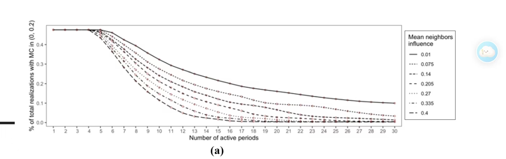

# Concurrent Message Sensitivity Curve Visual Reference

- Status: User-provided presentation-only design reference; not research evidence, an implementation Spec, or deployment authorization
- Reference date: 2026-08-03
- Source provenance: User-provided image; original publication metadata is not recorded
- Asset: [`concurrent-message-sensitivity-curve-visual-reference-20260803.jpg`](concurrent-message-sensitivity-curve-visual-reference-20260803.jpg)
- Asset dimensions: `2560 × 810`
- Asset SHA-256: `d0887c75470c85f23dfa122d8f36b616b443453064c445ec4df2b8d1fed20dff`

## Design Direction To Reuse

- 使用宽幅、低高度的 longitudinal plot，让横轴完整呈现 batch、active period 或累计 exposure milestone。
- 在同一坐标系内比较 baseline 与少量同类 variants，读者可以直接观察重合、分叉、收敛或次序变化。
- baseline 使用更明确的视觉重量；variants 使用 line dash、marker 和无障碍颜色共同编码，不能只依赖颜色。
- 图例放在绘图区外侧，并让每个 Legend item 对应真实可见的 series mark。
- 坐标轴、刻度和单位保持克制；tooltip、direct label 或 companion table 提供 exact value。
- 只有实际结果出现 divergence 时才呈现 divergence，不为了匹配参考图而制造曲线形状。

## Concurrent Message Adaptation

该参考图用于 #147 所定义 sensitivity artifacts 的后续呈现设计，不改变其研究合同：

1. **Weight view**：固定 `20 × 30` schedule，比较 baseline 与 6 个 pairwise simplex-transfer variants；最多 7 条曲线，可沿用参考图的多线型结构。
2. **Schedule view**：固定同一组 weights，比较 `20 × 30`、`30 × 20`、`40 × 15`；使用预声明的每-message cumulative exposure milestones `120/240/360/480/600`，而不是把含义不同的 batch index 强行对齐。
3. **Twenty-one rollouts**：不把全部 `7 × 3` series 堆进一个 panel。使用 weight/schedule small multiples、filter 或 companion table，保持单图可辨认。
4. **Static versus rollout**：Frozen-Batch Ranking Sensitivity 与 policy-conditioned fixed-Decision-Bank rollout 必须分成不同图或明确分面，不能共享一个含糊标题。
5. **Evidence wording**：纵轴只能绑定真实 artifact field，并继续标注 reconstructed graph、model-imputed、non-causal、one fixed sample/graph/Bank 等限制。

## Do Not Copy

- 不复用原图的 `Mean neighbors influence`、`% of total realizations with MC in (0, 0.2)`、数值、曲线或统计解释。
- 不把截图、水印、低清文字或原图像素直接作为 production report chart。
- 不从参考图推导新参数、调整预声明 scenarios，或声称 causal、robust、significant、真实平台效果。
- 不让图例项目指向不存在或不可辨认的 mark；无 series 的说明继续使用 Narrative annotation。

生产图必须由 Concurrent Message sensitivity structured artifacts 渲染；本 JPG 只提供 composition 和 visual grammar 参考。
