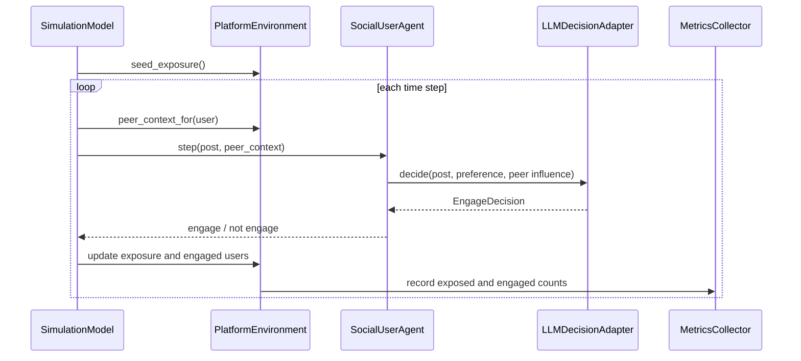

# Simulation Flow

```mermaid
sequenceDiagram
    participant M as SimulationModel
    participant E as PlatformEnvironment
    participant A as SocialUserAgent
    participant L as LLMDecisionAdapter
    participant R as MetricsCollector

    M->>E: seed_exposure()
    loop each time step
        M->>E: peer_context_for(user)
        M->>A: step(post, peer_context)
        A->>L: decide(post, preference, peer influence)
        L-->>A: EngageDecision
        A-->>M: engage / not engage
        M->>E: update exposure and engaged users
        E->>R: record exposed and engaged counts
    end
```
