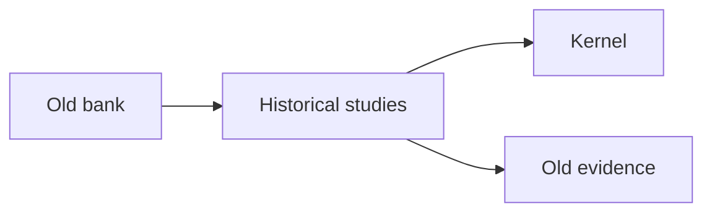
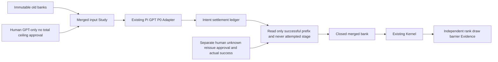
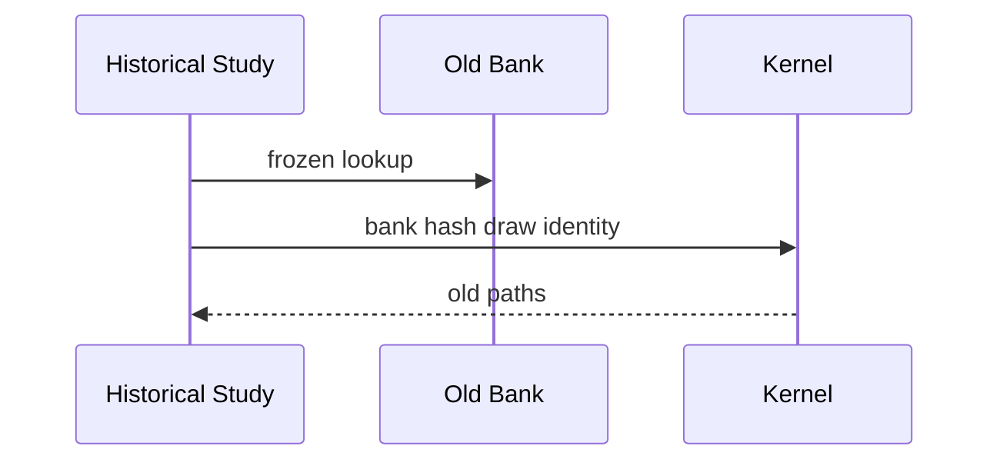
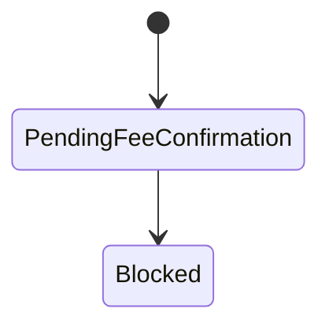
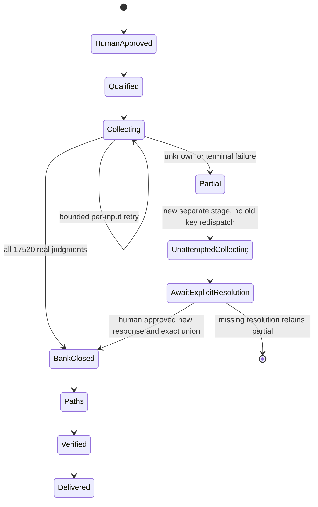
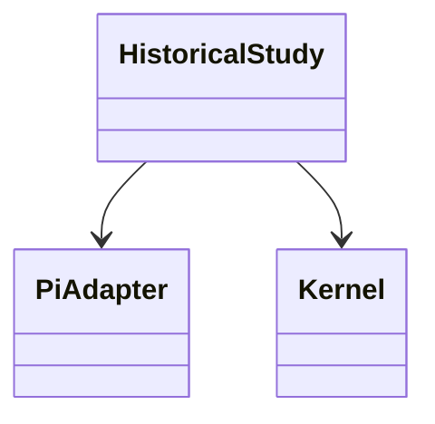
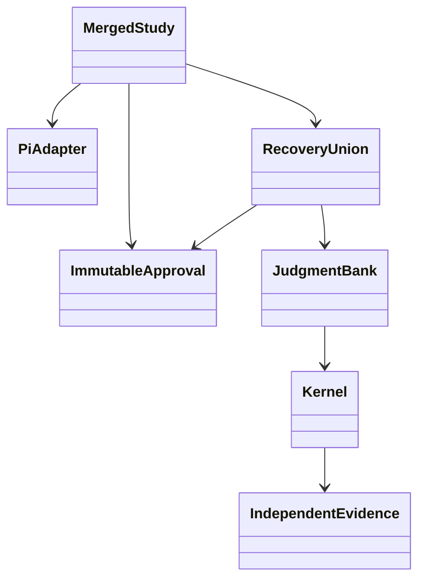

# GPT-only merged bank collection and offline research

Study Module owns exact input/provenance, approved scope and ledger closure. Existing Pi Adapter owns the frozen GPT/P0 transport and observed response contract. Existing Kernel owns propagation. The run-local offline engine owns explicit historical draw anchoring and independent evidence. No public production Interface, paper, or canonical release changes.

## Architecture current

## Architecture target

## Sequence current

## Sequence target
```mermaid
sequenceDiagram
  participant S as Study
  participant P as Pi Adapter
  participant B as Bank
  participant K as Kernel
  S->>S: verify human scope and exact source hashes
  loop missing unique inputs
    S->>S: fsync intent before dispatch
    S->>P: same GPT P0 request condition
    P-->>S: observed response and accounting
    S->>S: fsync settlement, stop unknown
  end
  S->>S: retain unknown, collect only never-attempted inputs
  opt separate explicit human reissue approval
    S->>P: one independently labeled new request
    P-->>S: verified new response; old unknown remains
  end
  S->>B: publish only complete exact bank
  loop 2800 paths
    S->>K: original seeds and explicit old draw anchor
    K-->>S: terminals and full batch barriers
  end
  S->>S: independent verification and old-new report
```
## State current

## State target

## Class current

## Class target


Total financial/physical limits are explicitly unset by the user on 2026-10-06. This does not waive the original exact request condition, two retry limit per logical input, five in-flight transports, fsync ledger, unknown-stop rule, or response/model validation. Nominal accounting and unknown cash fees remain distinct.
