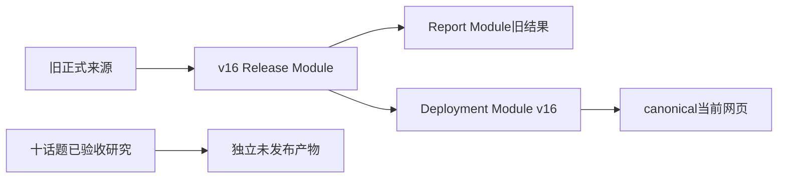
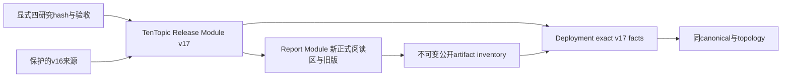
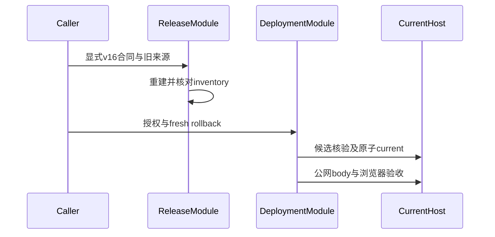
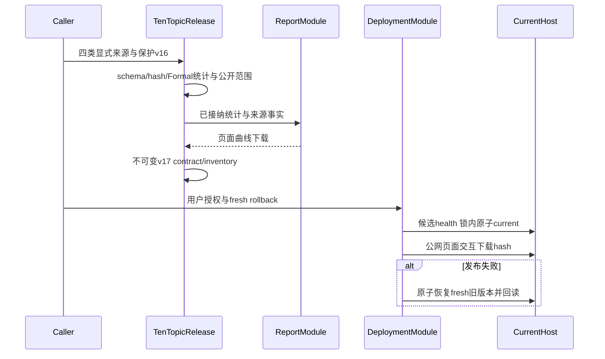
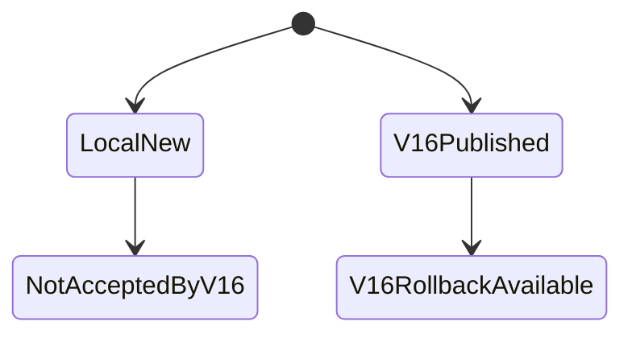
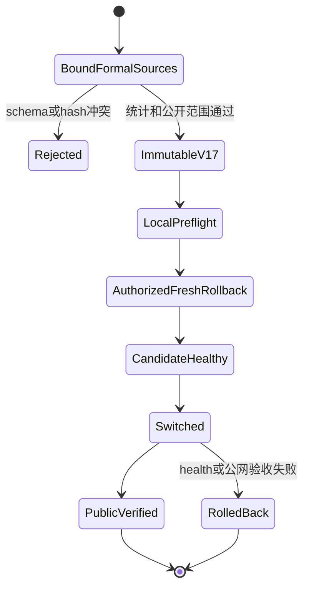
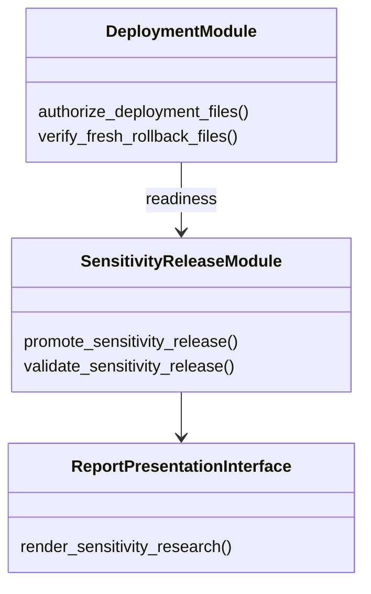
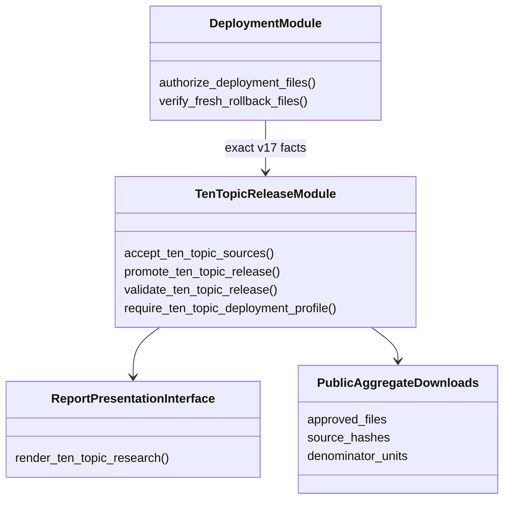

# 十话题正式研究统一发布：v17

用户已明确授权发布原 canonical：https://abm.q1ngyuan.top/。零Provider，不重跑研究，不改论文/匿名仓库。起点00906d2，现有worktree/分支保留，原 `.venv` 未提交项不处理。

## Interface与知识归属

- TenTopic Release Module接纳四类显式来源的hash/正式验收、新schema/公开aggregate allowlist与不可变发布inventory。旧eligibility/来源contract保留，不伪装v15/v16 schema兼容；验证器从绑定源重建发布，失败不晋升。
- Report Module从已接纳的类型化统计/下载事实更新四个相关研究阅读区，保留现有设计、语言/导航、无关内容。保留并清楚标识旧单话题页/下载；新主页不混旧数字或旧结论。
- Deployment Module仅消费v17最小readiness facts，沿原目标/topology/fresh rollback/锁/候选health/原子current/失败回退/公网验收事务；不理解研究统计。
- 下载只新增聚合CSV/JSON、曲线SVG、工作簿及现有公开类型，不暴露新的raw响应、凭证或用户判断库。

## 绑定来源与已执行检查

参见preflight/SOURCE_BINDINGS.json：全样本9份artifact、GPT2800路径及验收/16个最终对象、四模型80份最终文件、保护v16的215份文件hash已实查通过。49项旧相关模块基线测试通过。仅新v17合同可接纳本次不同schema的Formal来源，旧contract逻辑不删除。

## 当前/目标 Mermaid Gate

本Ticket改变跨Module调用/新adapter contract/schema dispatch，需要8图。四个Seam不改变研究执行、不另建通用框架。

### 架构 当前

### 架构 目标

### 时序 当前

### 时序 目标

### 状态 当前

### 状态 目标

### 类/Interface 当前

### 类/Interface 目标

## 验收清单

- [ ] v17公开Interface通过真实hash来源、分母/均值/区间/曲线/工作簿一致性接纳；拒绝Validation/mock/缺源/额外字段/篡改。
- [ ] 不可变source与contract及可重复重建；旧版/无关内容保留。
- [ ] 本地页面功能/下载/移动端检查，参数终点不再全同、Local p99重建23/1000等文案正确。
- [ ] 原域名/主机/远程根目录/容器/端口，不漂移；fresh rollback、candidate health、atomic switch、失败回退、最终current回读。
- [ ] 公网HTML、交互、CSV/JSON/XLSX/SVG等body/hash与inventory一致；未通过不宣称发布。
- [ ] Provider0，不改论文，实际命令/测试/未执行项与源码双轴review、GitNexus更新。
